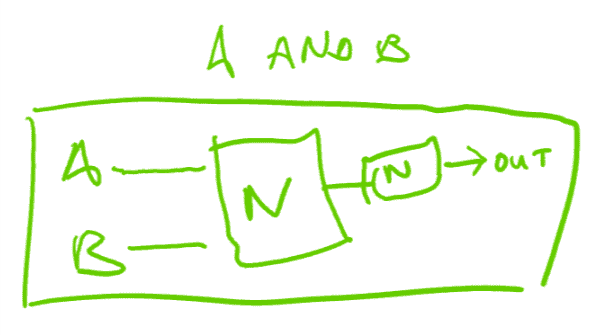
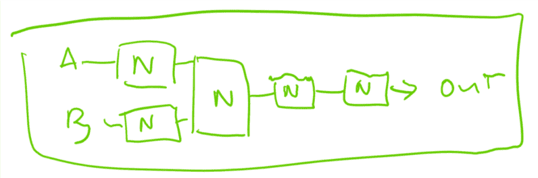
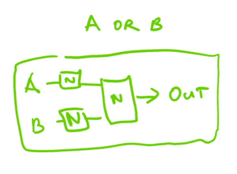

# NAND 2 Tetris:NAND 的魔力

> 原文：<https://dev.to/tttaaannnggg/nand2tetris-the-magic-of-nand-4lj5>

于是，我踏上了 [nand2tetris](https://www.nand2tetris.org/) 的旅程。

什么是 nand2tetris？这基本上是一门关于计算机科学的纵向综合课程。从 0 和 1 开始，我们建立一个完整的模拟计算机，在其上建立一个操作系统，在该操作系统上建立一个编译器，最后在整个塔上建立一个游戏。

这是一项相当艰巨的任务。我们如何开始？

## NAND 的魔力

在计算机中(或者，至少在我们正在实现的计算机中)，有一个我们基本上用于所有事情的单一电路。叫`NAND`。如果你熟悉布尔逻辑，它是这样定义的:`NOT(A AND B))`。

`NAND`的真值表是这样的:

```
 A B | OUTPUT
==============
 0 0 |   1
 0 1 |   1
 1 0 |   1
 1 1 |   0 
```

虽然这可能看起来不起眼，但我们的`NAND`门包含了其中的行为，因此我们可以从仅仅`NAND`门的一些组合中创建几乎任何其他逻辑门。我们不会进入正式的证明，但是我们将演示如何从`NAND`开始构建`NOT`、`AND`和`OR`。(以`NAND`为给定)

## 不

我们将从`NOT`开始，因为它是最简单的操作。`NOT`的秘密与`AND`的一个属性有关。任何东西`AND`本身就是单纯的输出自己。看一看:`0 AND 0`是`0`，而`1 AND 1`是`1`。

如果我们认为`NAND`是`NOT`和`AND`的组合，值`NAND`本身将抵消`AND`，留下`NOT`操作。如果我们回头参考我们的真值表，`0 NAND 0`就是`1`，`1 NAND 1`就是`0`。所以，`NOT A`就是`A NAND A`

逻辑门大概是这样的。我将把`NAND`表示为一个写有`N`的盒子。如果我们只有一个输入，我们将假设它连接到两个输入。

[](https://res.cloudinary.com/practicaldev/image/fetch/s--W_iyRgBP--/c_limit%2Cf_auto%2Cfl_progressive%2Cq_auto%2Cw_880/https://thepracticaldev.s3.amazonaws.com/i/adl8mn3i7ec25c0ae4pa.png)

## 和

既然我们已经有了一个`NOT`，那么就很容易到达`AND`，原因不言而喻。一个`NOT`反转一个值，所以`NOT` ing 一个`NOT`会抵消`NOT`，留下原来的值。`~~0`输出`0`，而`~~1`输出`1`。

`NAND`是将`NOT`应用于`AND`的结果，所以如果我们取消`NOT`，就剩下`AND`操作了。我们已经构建了一个`NOT`，可以简单地将它添加到我们的`NAND`的输出中

操作看起来是这样的:`(A NAND B) NAND (A NAND B)`，但是画个图更容易。

[](https://res.cloudinary.com/practicaldev/image/fetch/s--JOZkvfL4--/c_limit%2Cf_auto%2Cfl_progressive%2Cq_auto%2Cw_880/https://thepracticaldev.s3.amazonaws.com/i/vznifwgz881bjzfym4p0.png)

如果我们有`AND`和`NOT`，推导出`OR`就不会太难了。

## 或

可以通过德摩根定律建立，几个月前我很幸运地[推导出了自己的](https://dev.to/tttaaannnggg/a-couple-of-beautiful-things-i-learned-today-3864)。基本上，我们可以将`A OR B`表示为`NOT ( NOT(A) AND NOT(B))`。

如果我们的`NOT`是`A NAND A`，我们的`AND`是由`(A NAND B) NAND (A NAND B)`组成的，我们实际上有足够的东西来构建一个`OR`，把它们代入它们的相关项。

这将是一个混乱的开始，但我们会简化它。

首先，让我们替换我们的`NOT` s，因为它们最容易做到。`NOT(A)`是`A NAND A`，`NOT(B)`是`B NAND B`。

`NOT( (A NAND A) AND (B NAND B) )`

总体`NOT`将把它的项`(A NAND A) AND (B NAND B)`和`NAND`作为两个输入。结果会是这样的:

`((A NAND A) AND (B NAND B)) NAND ((A NAND A) AND (B NAND B))`

现在，`AND`翻译如下:`A AND B` = `(A NAND B) NAND (A NAND B)`。如果我们在`A` = `(A NAND B)`和`B` = `(B NAND B)`处进行替换，就会发生这种情况:

`(((A NAND A) NAND (B NAND B)) NAND ((A NAND A) NAND (B NAND B))) NAND (((A NAND A) NAND (B NAND B)) NAND ((A NAND A) NAND (B NAND B)))`

当然，这是完全不可读的。我们还是用视觉来表现吧。

[](https://res.cloudinary.com/practicaldev/image/fetch/s--q9DVYmud--/c_limit%2Cf_auto%2Cfl_progressive%2Cq_auto%2Cw_880/https://thepracticaldev.s3.amazonaws.com/i/1epcqm2ixb58s9htmzn3.png)

这在这个逻辑门实现的书面版本中很难看到，但是我们的最后两个`NAND`只是充当`NOT`操作符，翻转我们的输出值，然后再翻转回来。我们可以通过移除它们来简化我们的逻辑门，因为`~~A`就是`A`，不管值是多少。

[](https://res.cloudinary.com/practicaldev/image/fetch/s--5Nhv3jGz--/c_limit%2Cf_auto%2Cfl_progressive%2Cq_auto%2Cw_880/https://thepracticaldev.s3.amazonaws.com/i/sqzpe9gwsvd30zqcnwn5.png)

现在，如果我们从我们的图表往回走，我们可以把它翻译成一个语句。

`(A NAND A) NAND (B NAND B)`

还不错。

我们将在未来构建更复杂的系统，但这无疑是一个开始！