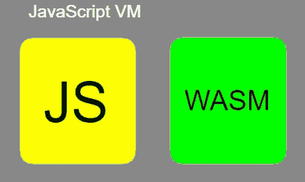
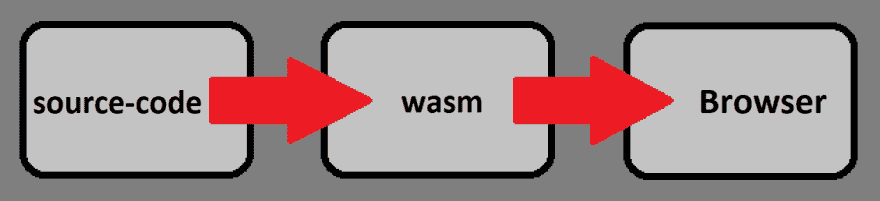
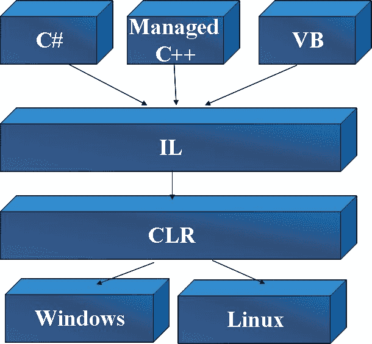
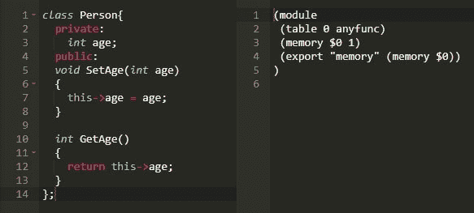

# 浏览器中的本机代码

> 原文：<https://dev.to/xhevoibraimi/native-code-in-browser-1knc>

今天我们要讲一个故事。一个关于小型软件开发公司的故事。

## 故事

一天，经理召集了一次会议，会上她提出了需要开发的新项目的想法。这个想法是创建一个移动应用程序，将滤镜应用到你的图像上。简单到打开应用程序，从手机图库中选择一张图片，然后对其应用滤镜。

开发团队决定创建一个 Web API，它将允许开发人员上传图像和下载应用了过滤器的图像。在他们开发了网络服务和移动应用程序之后，他们需要一种能够对图像应用滤镜的超快速算法。当时他们所有可用的开发资源是一个具有强大算法开发背景的 C++忍者，所以他们指派他开发那个特性。

...三个月过去了，一切都像瑞士表一样运转。

在移动平台上取得第一次成功后，该公司的 C-Suite 决定也在 web 上使用，这类似于一个用 HTML、CSS 和 javascript 等前端技术构建的“图像转换器”Web 应用程序。
...不用多说，开发人员在 24 小时内将一个简单的网站与图像转换 API 集成在一起，一切都毫无疑问地完美运行。

...直到客户扩展太多，服务器无法执行足够的计算来满足每个客户的需求，所以应用程序暂时水平扩展。

与此同时，该公司正在寻找解决问题的方法。他们决定将转换逻辑移到前端。这意味着，Android 和 IOS 应用程序会在应用程序内转换图像，而不会将其发送到 Web API。

这太棒了，直到他们发现他们忘记了 Web 版本，在那里他们必须将所有的 c++库移植到 JavaScript。是的，JavaScript。
这是什么意思？-这意味着用 JavaScript 从头开始编写转换算法，再次编写单元测试，编写更多的单元测试，因为 JavaScript 的数据类型很奇怪，在所有浏览器上测试它。

好吧，说实话。在您的一生中，至少有一次，您想象在 web 浏览器中运行一些非 JavaScirpt 编程语言。猜猜看，他们希望这样的技术存在，因为他们必须尽快推出新的网络版本。

## 成为现实的“不可思议”

那么，这一切是如何开始的...？这一切开始于一个阳光明媚的日子，三个朋友，微软、谷歌和 Mozilla，决定喝一杯咖啡，讨论“浏览器”这个话题。

他们谈到了每个 javascript 开发人员都面临的共同问题，比如使用现代 ECMAScript 版本时的向后兼容性和跨浏览器问题，因为我们开发了一个 JavaScript 代码，但每个 JavaScript 引擎对它的解释和执行都不同，这意味着您可能会遇到一些错误。

在讨论的最后，他们决定通过创建一种称为 WebAssembly 的新技术来结束这种混乱，它将与 JavaScript 在同一个虚拟机中运行，这意味着它将很容易与 JavaScript 交互，反之亦然。

[](https://res.cloudinary.com/practicaldev/image/fetch/s--8gmBkOJW--/c_limit%2Cf_auto%2Cfl_progressive%2Cq_auto%2Cw_880/https://thepracticaldev.s3.amazonaws.com/i/jid3cb5q6sgp4pvof13u.jpg)

## 标准

此外，他们决定创建一个标准，在每个浏览器中都是平等的。

[](https://res.cloudinary.com/practicaldev/image/fetch/s--dF7s-xcG--/c_limit%2Cf_auto%2Cfl_progressive%2Cq_auto%2Cw_880/https://thepracticaldev.s3.amazonaws.com/i/rkbnocov8niyizocfik3.png)

那么，新标准是关于什么的呢？这是关于浏览器如何看待我们的代码。想象一下，有一个静态的 HTML5 网站，你必须加载你的 JavaScript 来添加一些交互。大多数开发人员做的一件很自然的事情是放置一个带有“href”属性的“script”标签，该标签指向互联网上某个地方的 JavaScript。

这些都没问题，但是我们如何在浏览器中加载我们的本地代码呢？重点是，我们根本不会在浏览器中加载我们的本地代码，相反，我们会加载一些保存了。wasm”(web assembly)文件扩展名。

## 二进制文件

我们将加载二进制文件，而不是文本文件。现在，你可能会问自己，那个文件中的二进制内容是什么，我们如何生成它。答案很简单。我们将使用魔法。我们用来将源代码转换成二进制文件的魔法叫做。dll“和”。exe”，而这种神奇就叫做编译器。

如果你试图打开一个生成的”。wasm”文件中，除了一大堆非人类可读的字符之外，你什么也看不到。那是因为”。wasm”文件是预编译文件，它们不包含任何源代码。

至于在浏览器中加载这些二进制文件，在我们的网站中没有直接使用它们的方法，例如添加一个“script”元素，但是有一种方法可以使用 JavaScript 加载它们。这就是所谓的“胶水代码”。这种粘合代码从给定的端点异步加载二进制文件，这里值得一提的是。wasm”文件不能作为静态文件加载，但出于一些安全原因，它们应该由服务器提供服务。

[](https://res.cloudinary.com/practicaldev/image/fetch/s--4Duuajit--/c_limit%2Cf_auto%2Cfl_progressive%2Cq_auto%2Cw_880/https://thepracticaldev.s3.amazonaws.com/i/415l2o49824dbrllqy1f.png)

让我们通过简单的步骤来看看 javascript 加载是如何工作的。JavaScript 代码被加载，然后被多次解析/标记/解释和优化，最后一些字节码被加载到 VM 中。
另一方面，WebAssembly 已经在编译时进行了优化，浏览器会在预编译时获取它。了解了这一点，我们现在比 JavaScript 领先了几步。

如果你是有 dotnet 背景的开发者，你大概知道中间语言(IL)代表什么。它允许多种技术在同一个运行时中运行并相互交互。例如，可能有一个桌面应用程序，它的一些插件是用 VisualBasic 或 C++开发的。首先，编译器将源代码转换成中间语言，然后运行时执行中间语言。换句话说，它是一个编译目标。

[](https://res.cloudinary.com/practicaldev/image/fetch/s--1kWhe1IL--/c_limit%2Cf_auto%2Cfl_progressive%2Cq_auto%2Cw_880/https://thepracticaldev.s3.amazonaws.com/i/z7069tp01qohdo6ekp5c.jpg)

了解了这一点，我们现在可以将 WebAssembly 视为一个编译目标。这意味着我们可以将本机代码编译到 wasm 中，并允许 JavaScript 与之交互。

此外，WebAssembly 只不过是打包到一个模块中的一组指令。wasm 文件也有一个文本表示，人类可读的，它被称为 WebAssembly Text(" .wat”)。的”。“wat”由 AST(抽象语法树)和所谓的 S 表达式组成。您可以在此[链接](https://developer.mozilla.org/en-US/docs/WebAssembly/Understanding_the_text_format)上找到有关 AST 的更多信息

[](https://res.cloudinary.com/practicaldev/image/fetch/s--1Vr2scZN--/c_limit%2Cf_auto%2Cfl_progressive%2Cq_auto%2Cw_880/https://thepracticaldev.s3.amazonaws.com/i/nyzfohvz5phlsppannhc.jpg)

## 表现

WebAssembly 作为技术提供的最好的东西之一是性能。当我们有繁重的 CPU 计算时，如游戏、视频编辑、图像处理等，最好使用 WebAssembly。

但是等一下！-如果 wasm 比 JavaScript 更有性能，为什么我们不把 JavaScript 编译成 wasm？当我们编译像 C/C++/Rust 这样的中级编程语言时，WebAssembly 作为一种技术工作得更快。
为什么？因为它们不需要特殊的运行时。与 C/C++不同，像 C#和 Java 这样的高级语言有特殊的要求，也就是说，你需要提供它们的整个运行时才能运行它们。
所以答案是否定的，如果不首先发布整个运行时，我们就无法将 JavaScript 编译到 wasm 中。

## 优化

我们提到了一些编译时优化。没有一个普通的编译器不会在编译时优化 2 个或更多常量之间的简单加法运算。

```
var result = 1 + 2;

//will be optimized into

var result = 3; 
```

## 
  
把 C++变成 JavaScript。

与此同时，当企业公司正在发明 WebAssembly 的时候，一些家伙已经想出了一个“某种”解决方案。他们创建了 Emscripten，一个开源的 LLVM 到 JavaScript 编译器。它的主要目的是将 C 和 C++代码编译成 JavaScript，此外，它还可以将任何其他可以翻译成 LLVM 位代码的代码编译成 JavaScript。
Emscripten 输出快速优化的代码。它的默认格式是“asm.js”，这是一个高度优化的 JavaScript 子集，在许多情况下可以以接近本机的速度执行。

后来，当 WebAssembly 技术发布其蓝图时，Binaryen 被创建来充当将“asm.js”转换为 wasm 的编译器。

## 回到故事

我们需要的只是一种在浏览器中使用 C++代码的方法。现在有了 WebAssembly，这就不仅仅是可能的了。以 WebAssembly 为编译目标，我们可以很容易地使用 Emscripten 和 Binaryen 来编译我们的 C++库。猜猜看！这正是许多大型代码库发生的事情，比如 [Unity3D 游戏引擎](https://blogs.unity3d.com/2018/08/15/webassembly-is-here/)、[虚幻引擎 4](https://blog.mozilla.org/blog/2014/03/12/mozilla-and-epic-preview-unreal-engine-4-running-in-firefox/) 和[还有更多](https://github.com/emscripten-core/emscripten/wiki/Porting-Examples-and-Demos)

## 失踪的东西

目前，WebAssembly 作为技术已经足够成熟，可以使用它了，但是使用一些浏览器 API 呢？像“控制台”、“窗口”一样，我们如何访问“DOM 元素”？到目前为止，还没有关于这些主题的具体实现，垃圾收集和多线程(接下来的最佳选择)也是如此。

缺少垃圾收集意味着我们必须关心它。在我们发布运行时的情况下，例如用 C#我们也发布 mono 运行时，并且运行时已经实现了垃圾收集。多线程的情况也是如此。如果运行时已经实现了它，它就是可用的。

## JavaScript 互操作

让框架实现浏览器 API 是很棒的，但是它们是如何真正实现的，或者如果它们中的一些缺失了，我们如何给 WebAssembly 添加一个还不可用的功能呢？

还记得我们之前提到的“胶水代码”吗？它是从服务器获取 wasm 文件并将其加载到浏览器中的代码。“粘合代码”也可以做一些额外的事情，比如为方法实现向模块添加一些信息。

起初这可能会令人困惑，但我们将通过一个示例来尝试理解它。假设我们的网站上有一个按钮，里面有一个简单的点击计数器。
点击计数器的行为如下:
当我们点击按钮时，我们想在代码中增加一个值。接下来，将使用新值填充一个段落。

实现将会很简单。在按钮上绑定一个“OnClick”事件，这样当按钮被点击时，就会调用 WebAssembly 模块中一个名为“incrementCounter”的方法。我们将把我们的“反值”存储在 C++代码的一个全局变量中。
实现“incrementCounter”方法将会递增全局变量“counterValue”。接下来，我们需要用新增加的值更新段落。
因为我们没有垃圾收集，所以我们无法跟踪 DOM 元素的引用。
我们需要通过调用一个标记为“extern”的方法来制定另一个变通办法，这意味着该方法的实现将由外部提供(这在每种编程语言中都有所不同)。
当使用“粘合代码”加载 WebAssembly 模块时，我们可以为模块提供缺失方法的实现(标记为“extern”的方法)。在我们的例子中，我们可以将更新段落值的实现传递给 WebAssembly 模块。

点击计数器示例的源代码在这里[提供](https://github.com/xhevatibraimi/c-wasm)

我希望你喜欢这篇文章。
如有意见，欢迎分享:)