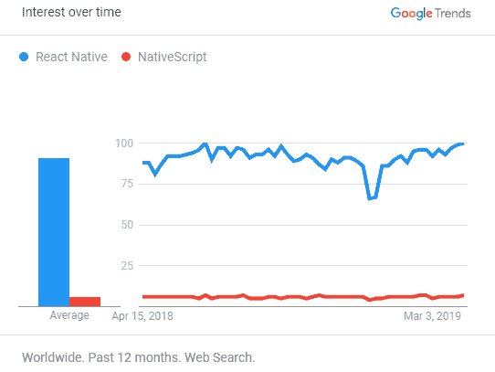

# NativeScript V/s React Native:跨平台应用开发选择什么

> 原文：<https://dev.to/ronakpatel70/nativescript-v-s-react-native-what-to-choose-for-cross-platform-app-development-d20>

当谈到为移动设备构建混合应用程序时，你可以在市场上找到几种可用的框架。有了这样的框架，你只需编写一次代码，构建的应用程序就可以在 iOS 和 Android 上运行。当谈到这种混合框架时，您将面临的最大问题是您无法访问本机组件，它们利用 web 视图进行呈现。正是在这种情况下，NativeScript 和 React Native 被证明是更好的解决方案。你可以用它们编写一次代码，然后在 Android 和 iOS 平台上运行，同时确保可以访问本地组件。首先，让我们看看这些混合应用程序开发平台是什么…

## 什么是 NativeScript？

NativeScript 是一个 JavaScript 框架，用于使用单一代码库为 Android 和 iOS 平台开发本地移动应用程序。通过使用该框架，可以访问 Android 和 iOS 的用户界面、原生 API 和渲染引擎。因此，您所要做的就是构建一个项目，它将在两个平台上运行，同时提供完整的原生用户体验。

## **什么是 React Native？**

React Native 是一个 JavaScript 框架，用于为 Android 和 iOS 平台构建本地应用程序。它基于 React 的 JavaScript 库，React 由脸书开发，用于构建接口。这个 JavaScript 库专注于移动平台，而不是用户界面。这意味着开发人员可以利用这个 JavaScript 库，轻松构建具有本机特性和外观的移动应用程序。此外，在开发应用程序时，您可以轻松地在 iOS 和 Android 平台之间共享相同的代码。

## **关于特征的比较**

### **学习曲线:**

有了 NativeScript，你将能够创建基于 JavaScript、AngularJS 和 TypeScript 的应用。它还支持声明性编码风格。这意味着如果你对用一种语言开发的特性不满意，你可以很容易地转换到另一种语言。而在 React Native 的情况下，您只需使用 JavaScript 进行编码。

无论您为项目选择什么选项，您都需要确保根据您的开发经验做出选择。

### **应用规模:**

如果你计划[开发一个具有复杂业务逻辑的跨平台移动应用](https://aglowiditsolutions.com/blog/cross-platform-app-development-analysis/)，那么选择 React Native 可能是你的应用项目的最佳选择。这是因为如果您为任务选择 NativeScript，那么最终的解决方案将会非常大。由于高速互联网连接并非随处可用，开发这样的应用程序并不明智。当涉及到更广泛的目标群体时，应用程序的大小总是起着关键作用。

### **插件&第三方解决方案支持:**

基于任何特定的开发需求，NativeScript 为您提供了一个完整的 web 资源，它带有适用于任何解决方案的插件。这使得拥有任何第三方解决方案的需求变得完全没有必要。当谈到 React Native 时，你不会找到这样一个提供插件的专用网站，但是，在许多社区中，你可以找到易于使用的插件。

### **性能:**

说到性能，React Native 不给 NativeScript 任何机会。通过使用虚拟 DOM，您可以轻松地呈现动态元素，就像您通常可以在使用原生 SDK 编写的应用程序中找到的一样。在一个需要更好的响应能力的时代，NativeScript 渲染非常慢，这是不可接受的。

### **与本地 API 的交互:**

使用 NativeScript 时，您可以轻松访问原生 Android 和 iOS APIs。这意味着您不需要任何关于本地开发语言的知识。在 React Native 的情况下，您无法享受这些功能。为了连接本地 API，React Native 使用了特殊的桥。所以出于同样的原因，了解相应的母语变得很重要。必须注意的是，React 原生社区中的开发人员已经方便地提供了现成的 API 桥。

### **在线社区:**

尽管 React Native 和 NativeScript 几乎是同时出现的，但与 NativeScript 相比，React Native 拥有更大的社区 **[React Native 开发者](https://aglowiditsolutions.com/hire-react-native-developers/)** 。其中一个主要原因可能是 React Native 是由世界闻名的脸书开发人员开发的。这使得 React Native 非常受欢迎，与任何其他跨平台框架相比，它拥有广泛的粉丝基础。

## **React Native 和 NativeScript 的优缺点对比**

### **编程语言的差异**

NativeScript 利用 Angular 和 TypeScript 进行编程。这里，本机 API 首先被包装在 TypeScript 友好 equal 中，然后被包装在 Angular 友好 equal 中，因为社区在这两种技术之间划分。另一方面，JSX 被用于 [React Native 开发](https://aglowiditsolutions.com/react-native-development/)。当 React 创建单个文件时，NativeScript 会将每个组件分开。您可以在旧的 JS 上运行这两种技术，也可以在平台的首选语言中运行。

### **性能差异**

React Native 为应用程序提供了惊人的本地体验。它还提供了本地贡献，使事情更快。NativeScript 还通过使用 Angular 提供了本地贡献，但与 React Native 相比，它的速度较慢。

### **基于第三方库的差异**

React Native 是由脸书的开发者开发的一种技术。最近，一旦 React Native 达到成熟水平，开发人员就开始使用它了。今天，一些第三方应用程序已经出现，为 React Native 提供 API。NativeScript 拥有大量第三方插件，可用于提高应用程序的性能。从数量上看，React Native 与它并不匹配，但这些插件并没有得到完全验证。

### **目标差异**

React Native 专注于“一次学习，随处书写”。它旨在开发具有吸引人的用户界面的高性能应用程序。使用 React，您可以为每个平台创建令人惊叹的 UI。NativeScript 专注于“一次编写，随处使用”。这意味着代码只需编写一次，然后你就可以在不同的平台上运行。此时，NativeScript 战胜了 React Native。

## **应用 React Native 和 NativeScript**

<colgroup><col> <col></colgroup> 
| React Native 制作的应用程序 | 由本地脚本构成的应用程序 |
| 网络电话 | Strudel(约会应用) |
| 照片墙 | 比特币钱包 |
| 特斯拉 | 日常保姆 |
| 光亮，光泽；发光，照耀 | Regelneef(监控能耗) |
| 优步吃饭 | 送餐服务 |

### **React Native 适用于:**

*   你想开发在 iOS 和 Android 上运行良好的原生应用
*   你想使用本地接口进行本地表演
*   不使用任何第三方插件，您可以使用特定平台访问硬件功能

### **NativeScript 适用于:**

*   JavaScript 或 Typescript 随处可用
*   当您为应用程序开发需求规划跨平台方法时
*   当您想要使用 Angular 来访问 web 组件时
*   当您希望通过完整的本地体验访问本地 API 时

## **两种技术的谷歌趋势对比**

这表明随着时间的推移，人们对这些技术表现出了兴趣。React Native 的图表显示，随着时间的推移，对 React Native 的兴趣有所波动，而对 NativeScript 的兴趣几乎保持不变。

## **一些要提到的统计数据**

*   React Native 的周下载量为 285096；Github 星星是 75963 颗
*   NativeScript 的周下载量为 33650；Github 明星 16619

这清楚地指出了一个事实，React Native 在享受社区支持方面非常强大，并且它很容易超过 NativeScript。

## **查看 AirBnB 对比 React Native 与 NativeScript**

AirBnB 用 NativeScript 会比 React Native 做得更好吗？T3】

几个月前，AirBnB 发布了一个关于他们决定离开 React Native 的 5 集系列。

AirBnB 的宣布引起了 IT 专家的兴趣，并提出了一个问题:如果他们更喜欢使用 NativeScript，会发生什么？AirBnB 在 React Native 方面的反馈完全是技术性的，它涵盖了 NativeScript 在应用开发方面发生不同转变的领域。因此，在这里我们将看看 AirBnB 对 React Native 的投诉，并通过选择 NativeScript 来寻找解决方案。

在那里，AirBnB 谈论了很多关于他们选择 React for web 的决定如何有助于为原生应用选择相同的技术。其中，他们还谈到了在使用 React Native 进行初步开发后，他们如何开始研究本地应用程序和 web 之间的代码共享方面。通过他们的调查，他们发现 Redux 用于 web 时，无需在本地平台和 web 之间做任何改变就可以共享大量代码。

对于一个应用程序开发公司来说，框架整合非常重要。在最初版本的开始，即使 NativeScript 在体验一些使用时也没有提供对框架的支持，但在它开始提供角度支持后，NativeScript 的使用量有了巨大的增长。

很高兴知道，当您对数据绑定、导航和其他关键功能以及在本地和 web 应用程序之间直接共享代码的能力有了想法时，开发人员会变得更有效率。

然而，NativeScript 没有为 React 提供任何支持，对于像 AirBnB 这样在该技术上进行了大量投资的公司来说，并不觉得它有什么好处。当涉及到支持框架时，有很多工作要做，尤其是当你必须考虑模板、工具、文档等的时候。

### **热重装**

利用 JavaScript 开发原生应用程序的主要好处之一是它加快了开发周期。这里的源代码是用 JavaScript 写的，所以不需要每次修改都要编译代码，这样可以极大地提高生产率。

基于 JavaScript 带来的生产率提高，React Native 和 NativeScript 可以利用这种情况。

尽管 NativeScript 和 React Native 可以从 JavaScript 的优势中获益，但 React Native 可以通过使用热重新加载的特性走在前面。这是 React Native 附带的一个功能，在不丢失应用程序状态的情况下，每当发生更改时，您都可以重新加载应用程序。现在这个特性非常好，你可以在很短的时间内看到 JavaScript 的变化。

类似地，NativeScript 带有 LiveSync，速度很快，在开发过程中，您可以在任意多的设备上使用它。每当您对 NativeScript 进行更改时，您将能够在一秒钟内看到更改，对于任何本机应用程序，这通常需要 15-20 秒。

诚然，NativeScript 不具备热重新加载功能，但这是 NativeScript 团队正在努力的事情，当您发现在几毫秒内重新加载的更新版本时，时间不会太长。

### **集成到本地应用**

如果你的企业有一个庞大的基于 Android 和 iOS 技术的现有应用，那么用新技术重写它将不是一件容易的事情。现在，NativeScript 确实提供了在现有应用程序中运行的功能，其支持服务仍处于试验阶段。这意味着他们还没有正式准备好工作。

与此同时，当我们谈到 React Native 时，他们的团队在这一领域进行了大量投资，并在该场景中运行了许多应用程序用于生产。同样，对于脸书来说，他们未来的重新架构计划就是要与本地应用建立更好的集成。

同样，React Native 的架构也存在问题。当你谈论将 NativeScript 或 React Native 与现有应用程序集成时，这可能会导致复杂性。现在，随着 iOS 和 Android 平台以及 React Native 和 NativeScript 等 JavaScript 框架不断发展，这些复杂性可能会引发问题。

这意味着可以说 AirBnB 面临的一部分问题来自于他们决定将 React Native 集成到他们现有的复杂应用程序中，而不是计划使用 NativeScript 或 React Native 开发一个新的应用程序。

关于同一的最后想法…

AirBnB 项目通过 NativeScript 获得了什么？

现在，这是没有人知道的事情。不过，可以说 NativeScript 本可以帮助 AirBnB 解决 React Native 面临的几个问题，如处理类型、使用原生 API 和构建快速列表。同样，必须补充的是，NativeScript 不提供对 React 的支持，当涉及到与复杂的现有应用程序集成时，它不会提供与 React 相同的服务级别。

因此，就像在任何其他大型技术方面做出决定一样，在你真正投入到一个全面的项目之前，你最好拿出一个概念验证应用程序，无论你有什么选择。

**包装完毕**

那么，在 React Native V/s NativeScript 方面，我们的情况如何？根据这篇文章，我们可以看到这两个框架都可以被企业用来开发具有广泛功能的商业移动应用解决方案。因此，如果你正在考虑为你的项目选择哪一个更强大和更合理，那么答案完全取决于特定的需求和所述项目的所有方面。当我们从性能的角度来看时，会对本地销售线索做出反应，是的，它在全球范围内非常受欢迎，是企业的首选。另一方面，NativeScript 为开发人员提供了对第三方库和原生 API 的轻松访问，这是在选择灵活的应用开发框架时非常重要的标准。