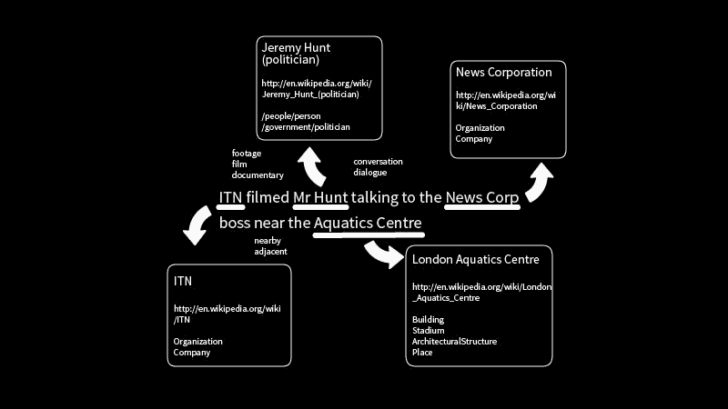
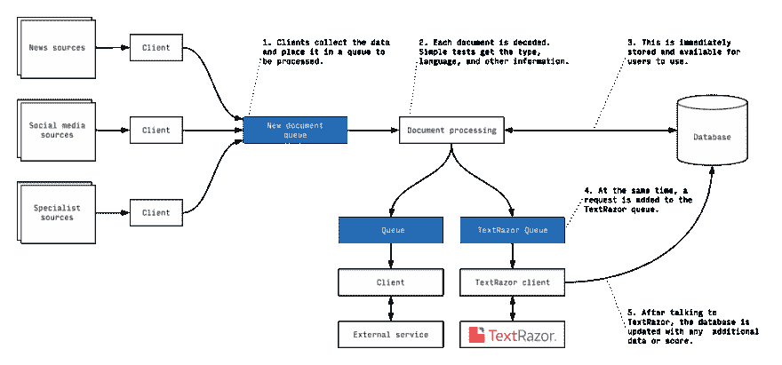
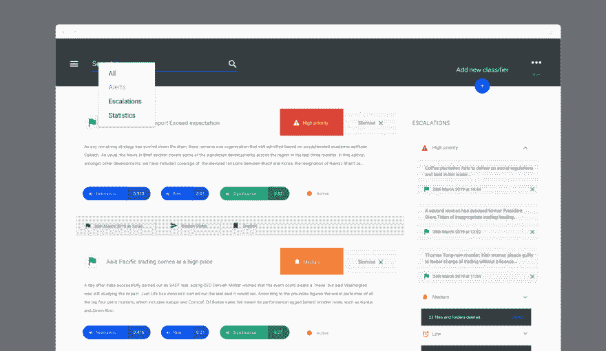

# 自然语言处理。下面是它的工作原理，以及它如何为我们的客户节省时间和金钱

> 原文：<https://dev.to/browserlondon/natural-language-processing-here-s-how-it-works-and-how-it-saved-our-client-time-and-money-5e9g>

数据从未像今天这样对业务至关重要，也从未像今天这样丰富。事实上，我们遇到的许多组织都被信息淹没，需要帮助开发更智能、更有效的方法来管理、分类和使用他们的数据，以取得最大效果。

最近的一个客户就是这种情况，他的员工通过手动搜索、分类和综合来自[多个数据流](https://www.browserlondon.com/blog/2017/07/13/divide-conquer-manage-multiple-data-streams/)的数字文章和警报，为客户创建定制报告。客户认为这一过程既不可扩展也不高效，因此希望尽可能多地自动化搜索和分类过程，让员工有更多时间来创建高质量的报告。

## 短暂

当我们进行过程的第一步时——战略&研究阶段——很明显，客户需要一个强大而细致的文本搜索和分类解决方案。简而言之，这项技术必须能够做得和人类一样好(如果不是更好的话)，这就排除了早期愚蠢(但易于实现)的关键字过滤方法。

因此，我们转向了基于人工智能(AI)的自然语言处理(NLP)世界，它提供了一种更强大的方法来从长格式文本文章中筛选含义。

## 什么是自然语言处理？

NLP 是机器学习的一个分支，旨在让计算机阅读和理解书面语言，书面语言是一种复杂的非结构化数据集，计算机不容易解析。

拿下面这句话来说:

> “哈泽德昨晚着火了；他摧毁了布莱顿的防御。”

对于一个人来说，这很简单，可以理解这个句子可能与一场体育比赛有关，在这场比赛中，一个名叫哈扎德的球员发挥出色，帮助他的球队击败了布莱顿。

然而，对于一个基于计算机的人工智能来说，这句话带来了一些问题。例如，它需要知道 hazard 是一个人，而不是字面上的 Hazard，它需要明白着火是表现良好的口语表达。如果计算机不知道这一点，它很有可能会得出结论，昨晚布莱顿地区的一些危险的东西着火了，结果，城市的防御结构被摧毁了。

你可以想象，如果你试图使用人工智能对一段文本的主题、内容或情感进行分类，这些微妙之处是必不可少的。如果你是布莱顿队的球迷，这句话应该归类为与体育有关，还是与灾难有关，或者两者都有？

## text razor NLP 的工作原理

为了将自然语言处理添加到门户中，我们与总部位于伦敦的机器学习 NLP 平台专家 [TextRazor](https://www.textrazor.com/) 合作。

TextRazor 平台通过一个 API 接收文本文章或文档(也称为记录)，检查它们，并返回一个[实体](https://www.textrazor.com/named_entity_recognition)(即人、地点等)的列表。)的特征，这些实体之间的关系，以及分级的[文档分类列表](https://www.textrazor.com/classification)。

这一切都是通过所谓的“集成方法”来实现的，平台通过使用多种技术来分析文档，从基于深度学习的神经网络到更简单的线性模型和规则，来建立对文档的理解。

### 在艾的罩下

首先，识别实体；相对简单的一步。例如，在单词前使用“Mr”通常表示一个人，在大写单词后使用“corporation”通常表示一家公司。

之后，更复杂的消歧和实体链接工作就开始了。这是每个 NLP 平台最专有的领域，每个平台都使用自己的方法和人工智能算法。在这里，平台基于所使用的单词和系统从先前的训练中已经知道的关于实体的信息，在记录中的实体之间建立上下文链接。

我们希望这个机器学习训练过程是一个持续的过程，每处理一个新文档都会增加平台的理解。然而，在最近与 TextRazor 创始人托比·克雷斯顿的一次聊天中，他解释说情况并非如此，因为该算法检查的许多记录都包含敏感的客户信息。相反，TextRazor AI 使用一个自定义数据集进行训练，该数据集包含维基百科、网页和社交数据等来源，由工程师使用最新的学术 NLP 研究不断进行更新和改进。

<figure> 

<figcaption id="caption-attachment-9617">消歧是将一个句子分解成可以理解的信息块的过程。</figcaption>

</figure>

完成消歧后，平台“理解”文档，这意味着可以进行主题标记和分类。默认情况下，使用媒体行业标准 [IPTC 新闻代码](https://iptc.org/standards/newscodes/)和 [IAB 类别](https://support.aerserv.com/hc/en-us/articles/207148516-List-of-IAB-Categories)进行分类，每条记录都有一个 0 到 1 之间的分数，以表示内容与每个类别的相关程度。

然后，数据被打包并发送给提供源文档的客户机。所有这些处理都发生在一秒钟之内。

事实上，克雷斯顿强调延迟和停机时间是该平台最大的威胁之一。“我们的技术通常是我们客户运营的关键路径的一部分，这意味着如果我们下降，甚至下降，他们也会下降。”

### 有没有 NLP 专用的硬件？

为了保持一切顺利运行，TextRazor 混合使用专用服务器和亚马逊 EC2 实例，如果需求激增，这些实例可以在短时间内启动。“所有的硬件都相当标准，”克雷斯顿说，“处理相当密集，但我们不使用任何专业硬件。我们每天处理的数千万条记录都要经过标准服务器 CPU。”

如果你想了解更多关于 NLP 的复杂性，TextRazor 的博客非常值得一读。

## NLP 中自定义分类的威力

TextRazor 用于分类的 IPTC 新闻代码和 IAB 代码很有用。然而，该平台最强大的功能之一，尤其是对我们的客户来说，是能够定义定制的分类。这个过程利用了平台中已经存在的实体链接和语义理解的巨大网络。

自定义分类很容易建立——给平台几个关键词，人工智能将根据它在训练期间建立的联系建立对分类的理解。让我们用一个贴近我们内心的例子；早餐。

如果我们用“早餐”这个关键词创建一个新的分类，系统将开始评估记录与这个概念的紧密程度。作为这个过程的一部分，该平台寻找简单的关键词匹配，但更重要的是，寻找它已经知道以某种方式与早餐相关的事物之间的联系。因此，简单地提到鸡蛋可能不会得到很高的评分，但一篇同时提到鸡蛋、培根、麦片、煎饼、早餐和咖啡的文章会得到很高的评分。

当然，这是一个愚蠢的例子，但是这个特性对我们的客户来说尤其重要，因为它允许基于自然语言链接，根据新的概念智能地对记录进行分类。

## 实现 TextRazor API

我们客户的系统以高吞吐量从多个来源获取并组织记录。这促使我们考虑在数据管道中的什么位置集成对 TextRazor API 的调用，因为我们需要避免任何潜在的连接丢失，阻止平台采取的其他数据处理步骤。

为此，我们构建了异步运行的系统——一旦获得记录，平台上的最终用户就可以立即获得。同时，该平台独立地将对其他服务的请求排队，比如 TextRazor。对这个请求的响应可能在几秒钟内返回，或者在几个小时内返回(谢天谢地，通常是前者)，此时，我们用新信息增加平台记录。

这些队列步骤至关重要，因为它们允许我们将时间关键的流程与那些可能造成一些延迟的流程隔离开来，这意味着平台更加可靠。

### 数据明细

当我们调用 API 时，我们只是给 TextRazor 我们需要分析的记录，以及我们希望系统根据其对内容进行分类的任何自定义分类器(预先设置)。然后，TextRazor 将返回一个结构化的(JSON)响应，其中包括每个分类的细分及其在每个分类中的置信度。

<figure> 

<figcaption id="caption-attachment-9715">用户可以点击进入记录，查看 TextRazor 提供的组成信号。</figcaption>

</figure>

然后，这些置信度得分将作为一个组件包含在我们构建到系统中的一些附加专有计算中，这些计算还涉及其他信号，如来源的历史可靠性。结果是向平台内的用户显示一个分数，对项目的重要性进行分级。

### 清理数据

许多发布的新闻文章被整合到多个来源，因此为了节省客户的时间和资源，我们希望避免将相同的内容多次推送到 TextRazor。

为此，我们使用 [Elasticsearch](https://www.browserlondon.com/blog/2014/03/20/how-we-use-elasticsearch-to-enhance-our-web-applications/) 将每篇文章的内容与平台已经看过的内容进行比较。如果内容的相似度高于设定的阈值，系统会跳过将其发送到 TextRazor，而是将其标记为重复。给定文章的拷贝数也可以用作信息重要性的信号。

## UX 设计挑战

TextRazor API 只是进入门户的无数来源中的一个——事实上，该平台获取了几乎大量的信息。因此，我们需要与平台的最终用户密切合作，以确保我们的 UX 设计能够将海量数据提炼为最清晰、最相关和最可行的重要性等级。

### 制作成绩

为了实现这一点，我们选择将所有不同的信号聚合成一组一致的低、中、高重要性等级。这包括实施一个系统，允许我们的客户通过一些数学公式来调整评级的计算方式，这些公式可以在不重新部署平台的情况下进行更新。此外，每个自定义分类器可以独立调整其低、中、高等级的阈值，使客户能够精细控制平台如何显示信息。

<figure> 

<figcaption id="caption-attachment-9709">允许通过简单的 UI 编辑分类器阈值使得用户能够调整系统，而不需要调用开发者输入。</figcaption>

</figure>

有了这种结构，该平台可以根据多种输入提供记录的快速浏览评级，而且如果分析师需要，还可以扩展项目以显示组成信号。为了使用户的工作更易于管理，我们还添加了工具，根据这些分级快速过滤和删除成批的新闻条目。

### 购物车进场

在系统的这一部分中，设计用户流和 UX 的另一个重要组成部分是如何获取重要的文章并将其转发以供审查。需要对重要的记录进行分组，并通过审查流程进行移动，以呈现基于多个确证来源的单一精选“警报”。

在与客户和最终用户一起规划出预期的工作流程后，我们很快意识到这种流程已经存在于另一个广泛存在的软件类别中；电子商务系统。在用户测试后，我们最终选定了购物车和结帐风格的界面，在该界面中，评论者将选择多篇文章放入“购物车”，并通过简化的多用户“结帐”风格的过程将它们升级到高级研究人员。

<figure> 

<figcaption id="caption-attachment-9712">【购物篮功能(屏幕右侧)允许用户轻松升级批量记录。</figcaption>

</figure>

## 胜负难分

将 TextRazor NLP 平台集成到我们客户的内部报告门户中，以多种方式为我们的客户带来了切实的商业价值。

### 节省客户时间

首先，也是最显而易见的是，平台集成通过比愚蠢的关键字过滤器和人类以前能够做到的更快地智能分类文档，节省了客户的工作时间。

TextRazor 基于人工智能的 NLP 处理可以快速评估相关记录是如何过于具体的概念，这意味着只有最相关的文章才会被标记给分析师。这节省了分析师整理文章的时间，因此他们可以花更多时间为付费客户创建有价值的报告。这种效率节约让我们的客户在不增加员工人数的情况下增加了营业额。

### 让用户更好地工作

其次，将 NLP 和自定义概念的力量引入报告平台，使我们的客户能够在更多领域创建和销售越来越复杂的报告，为公司开辟新的业务流，并使他们能够将自己定位为所在领域的市场领导者。

以前，新概念过滤器和报告主题的创建和手动故障排除既复杂又耗时，而现在，添加它们既快速又简单。TextRazor 的实体链接和语义理解的基础网络意味着，只需一个关键词就可以建立新的主题分类，该平台现在可以识别链接的概念，并自动显示与它们相关的记录。

## 得出结论

我们相信，该项目研究展示了自然语言处理的强大功能——尤其是与 Elasticsearch 等灵活的搜索平台相结合时——如何从现代组织所面临的基于文本的海量数据中提取真正的商业价值。

然而，我们希望我们也已经表明，仅仅将新技术投入到业务中并期望默认的巨大成果是不够的。所有的技术，无论多么新或者多么花哨，都需要以一种能够引起终端用户共鸣的方式进行整合和推广。

作为这个项目的一部分，我们为客户所做的技术工作感到自豪，但与以往一样，有效的 [UX 和 UI 研究](https://dev.to/browserlondon/how-research-and-discovery-shape-our-ui-thinking-1ap1)，设计和最终用户测试对于确保企业能够实现新技术的潜力至关重要。

* * *

关于我们如何使用 TextRazor 的 NLP 人工智能为我们的客户节省金钱和时间的帖子首先出现在伦敦[浏览器](https://www.browserlondon.com)上。