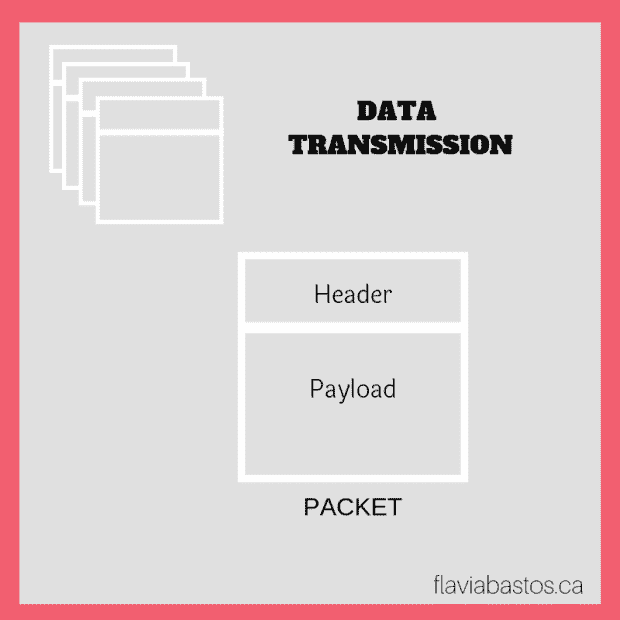
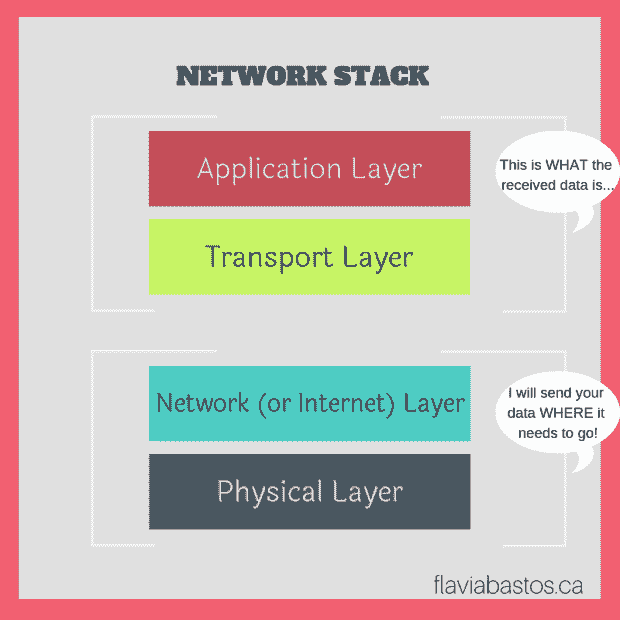

# 面向开发人员的网络——第 1 部分:概述

> 原文：<https://dev.to/flaviabastos/networking-for-developers--part-1-overview-187l>

出于某种原因，掌握计算机网络的概念对我来说一直很难。毫不奇怪，我发现我不是唯一的一个:许多软件开发人员并不真正理解计算机网络是如何工作的。我所知道的是，我通过互联网发送东西，我的东西会到达我想去的地方。但是这是怎么发生的呢？魔法？

很明显，没有！因此，我试图学习更多关于网络的知识，更重要的是，学习当事情不按预期进行时如何排除故障。我在这里的目标是分享一些我正在学习的东西。我希望它也能帮助其他人。

* * *

#### 基本概念

**联网**:连接计算机并在它们之间发送数据。

数据以称为**包**的小块在网络上传输，包有两部分:

1.  报头–所有标识信息，如起始主机、目的主机和基本协议。
2.  有效负载–实际数据，例如一些 HTML 或图像。

操作系统负责数据包和应用程序使用的数据之间的转换。

一个功能完整的网络包括一组网络层，这些网络层组合在一起称为**网络堆栈**。

> 注意:你可能听说过 OSI(开放系统互连)模型的七个网络层。OSI 模型更常用于网络教学和设计。对于互联网来说，下面的四层足以解释网络是如何工作的。

网络堆栈有四层，我会给你一个提示来记住这些层。这是小费…知道了吗？ATIP  从上到下:

*   **应用层**:用户与之交互的层(比如 web 浏览器)。它使用计算机应用程序和服务器用来通信的高级协议(HTTP、SSL、FTP 等)
*   **传输层**:数据传输，包括数据完整性检查、源端口和目的端口以及将数据分解成数据包的规范(以防应用层还没有这么做)。TCP 和 UPD 是最常见的传输层协议。
*   **互联网(或网络)层**:定义如何将数据包从源主机移动到目的主机。对于互联网，这是互联网协议(IP)
*   **物理层(或链路)**:定义如何通过物理介质发送原始数据，如以太网或调制解调器。

那里！ **ATIP** ！【T2

因此，从主机 A 到主机 B 的数据会经过所有这些层，就像这样:

堆栈中的下层(互联网/网络和物理)将帮助<u>发送计算机</u>知道**将数据发送到哪里**，上层(应用和传输)将帮助<u>目的计算机</u>计算出**它刚刚接收到的数据是什么**:

我将在以后的文章中分别介绍每一层。

> 帖子[面向开发者的网络——第一部分:概述](https://wp.me/pa0b0y-2s)最初发布于 [flaviabastos.ca](https://flaviabastos.ca)