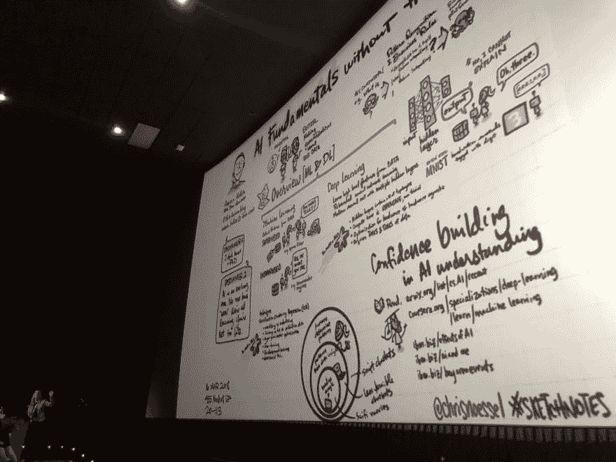
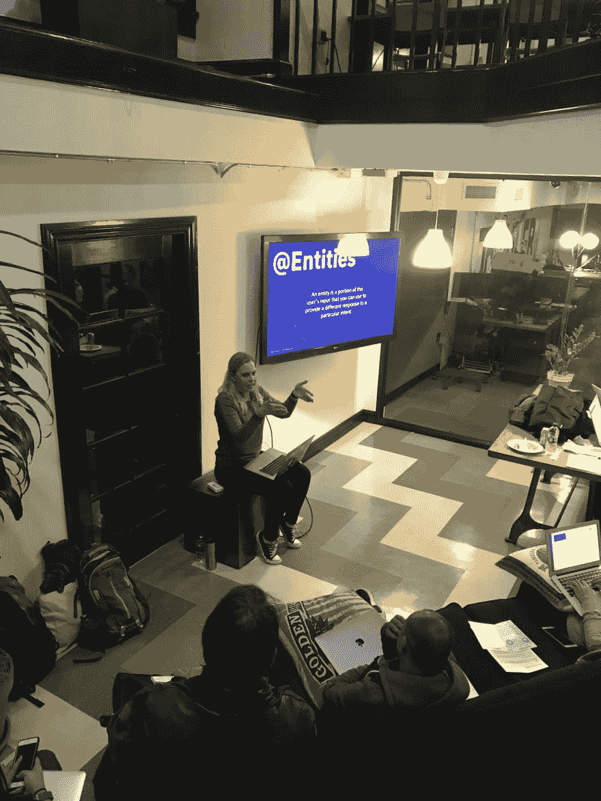
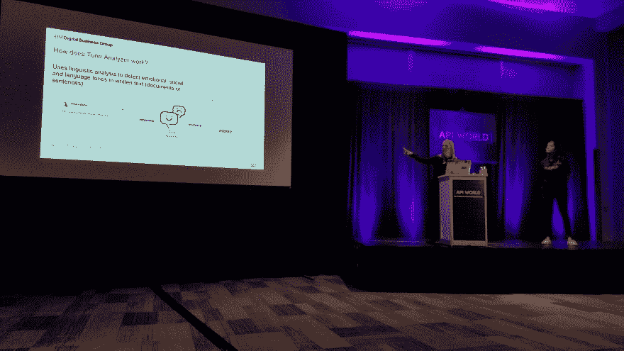

# 然而，阿马拉·格雷厄姆编码

> 原文：<https://dev.to/missamarakay/nevertheless-amara-graham-coded--5beb>

## 2019 年我继续码是因为...

我还有很多事要做！

但是真的，我希望成为像我一样成长的女孩和年轻女性的榜样，当这么多人不断告诉我那不是女孩应该喜欢的东西时，我对计算机感兴趣。作为一名开发者倡导者，我希望我可以“通过行动来展示”。

在我职业生涯的这个阶段，保持“技术性”也是非常重要的。虽然我知道我的最终使命和职业目标是经营/管理一个宣传团队，但我想确保我仍有时间进行编程。去年，我确保我展示的每个演讲、研讨会、教程和演示都是由你真实创作的，今年我打算继续这样做。维护旧的代码和创造新的东西可能是一个挑战，但是因为它，我是一个更好的倡导者。

这也意味着，如果你发现我的旧东西需要更新，考虑提交一份公关，帮助一位女士！

## 我应得的功劳...

掌控我的事业！几年前，我离开了一家企业 IT 组织，因为我想教更多的开发人员并与他们交谈。所以我做了，并且没有回头。开发人员宣传对我来说非常合适，我绝对是蒸蒸日上。

我不仅通过角色的转变掌控了自己的职业生涯，还找到了一个允许我推销新的有趣项目的组织。去年，我花了大量时间从事 AR/VR 和游戏开发工作，让这些领域的开发人员能够利用人工智能进行开发。今年我会继续这样做，采取更专注的方法。如果你有兴趣将人工智能引入你的游戏开发项目，让我们聊聊吧！

## 我希望看到我的技术社区...

继续就多样性和包容性进行令人不安的讨论，在此过程中创造更多的冠军和盟友。

我厌倦了成为全男性团队中唯一的女性。我厌倦了成为会议上唯一的女性发言人。我厌倦了整天坐在观众中间。而我不敢想象如果我是黑人，LGBTQ+，Latinx，或者其他被保护的群体，我会有多累！

别再说是管道问题了，做好自己的功课。接触当地团体、聚会、大学项目和其他组织。如果你要开一个会议或聚会，要考虑到像儿童看护、门票和旅行赞助这样的事情。无论是线上还是线下，只要有人聚集，就要制定并执行行为准则！联系特定的人，让他们知道你有一个公开的 CFP 或者工作机会，并且你认为他们的工作很棒。提高和放大看起来或听起来不像你的声音。值了。

我希望我们都能继续成长，为编码新手铺平前进的道路，无论老少！我们需要你，我们需要你，你值得留在这里。