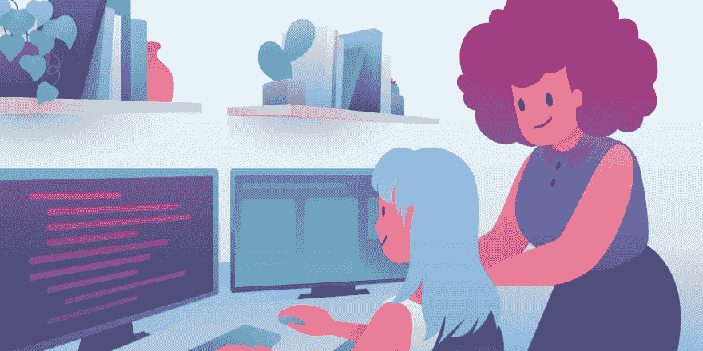

# 然而，劳伦编码

> 原文：<https://dev.to/thaelz/nevertheless-lauren-krantz-coded--28j4>

## 2009 年开始做代码，因为...

很有趣！我在大学时学过天体物理学，但我到处跑，学习机械工程、计算机科学和电子工程学科的课程，我知道我想做一份不用每天做同样事情的工作，并且可以在获得报酬的同时学习新东西！..最后，软件只是觉得很适合这一点；)

## 我应得的功劳...

我将注意力放在跨多种产品运行后端代码库上，专注于提高性能的设计模式和架构，并始终成为我的同事有问题时可以求助的人，因为我总是确保在工作时展现最好的自己，并在社区中易于接近。我认为成为一名伟大的工程师的一部分，是开放的交流和学习新的东西，谁知道呢？你可能会发现一个新的和新颖的方法来解决你从来没有想过的问题！我还认为耐心和对他人友好总是会产生更好的设计和开发发布周期。

## 我希望看到技术社区...

变得更容易接受不同的观点，这意味着包容每个种族、性取向和性别认同的少数群体！我认为，当我们与技术保持一定距离，并告诉其他人他们不符合工程师应该有的样子时，我们给自己造成了巨大的伤害，因为没有模型。只要有激情，你就会做得很好！勤奋努力，你会走得更远，让别人进来！所有技术领域的守门人都是最大的问题之一，当人们抱怨没有好的候选人时，我提醒他们，我们是如何排斥和疏远那些对工程、学习和解决难题充满热情的人，因为性骚扰、同性恋恐惧症和告诉每个人要适应一个盒子。