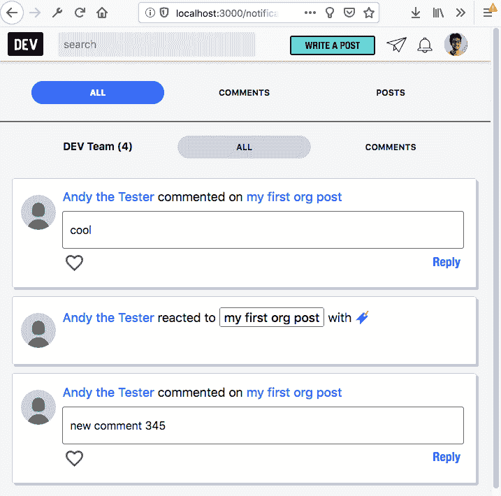
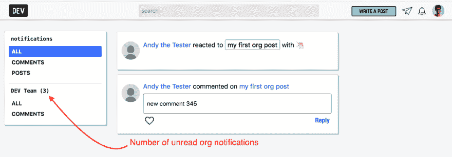

# 新功能:组织通知！

> 原文：<https://dev.to/devteam/new-feature-organization-notifications-4fp8>

组织现在可以接收通知了！

如果您是某个组织的成员，您将收到关于您组织帖子的任何新评论或反应以及您组织的任何新关注者的通知。您可以在您的[通知页面](https://dev.to/notifications)中找到它们。

基本细节和技术实现可以在拉取请求中找到:

# [ 组织通知 #1762](https://github.com/thepracticaldev/dev.to/pull/1762) 

 **[Zhao-Andy](https://github.com/Zhao-Andy)** posted on [<time datetime="2019-02-07T23:06:15Z">Feb 07, 2019</time>](https://github.com/thepracticaldev/dev.to/pull/1762)

## 这是什么类型的公关？(勾选所有适用选项)

*   [x]功能

## 描述

这为组织添加了通知！<g-emoji class="g-emoji" alias="tada" fallback-src="https://github.githubassets.cimg/icons/emoji/unicode/1f389.png">🎉</g-emoji>

实施细节:

*   任何组织的`member`成员都可以查看组织的通知。
*   任何查看组织通知的组织成员都会将其标记为`read`。
*   路线有:`/notifications/org/:org_id`和`/notifications/comments/:org_id`。这为属于多个组织的人保持了灵活性。
*   没有针对`posts`的过滤器，因为组织无法关注人员(因此无法接收新帖子的通知)。
*   组织可以在其组织帖子上接收新的评论和反应通知，以及新关注者的通知。
*   组织通知不计入钟形图标。
*   通知可以属于用户**或组织**。非此即彼，不可兼得。我可以添加一个数据库约束，但这需要一些定制的 SQL。不确定*是否完全*必要。

我忘记了一个功能——我写这篇文章的时候想起来了——组织可以向他们的追随者发送新帖子通知。如果我们需要，我可以把这个加进去。我认为这不会花太多时间在 T2。刚加了这个<g-emoji class="g-emoji" alias="+1" fallback-src="https://github.githubassets.cimg/icons/emoji/unicode/1f44d.png">👍</g-emoji>

## 相关车票&单据

解决#1222

## 手机&桌面截图/录音(如有 UI 改动)

### 移动查看

### 桌面视图

## 【可选】哪个 gif 最能描述这个 PR 或者给你的感觉？

[View on GitHub](https://github.com/thepracticaldev/dev.to/pull/1762)

编码快乐！