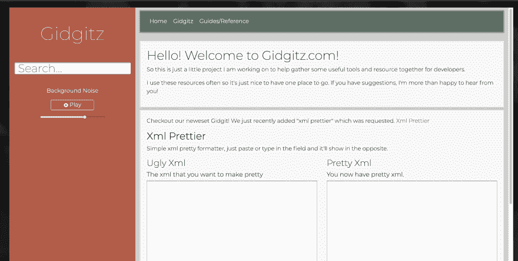
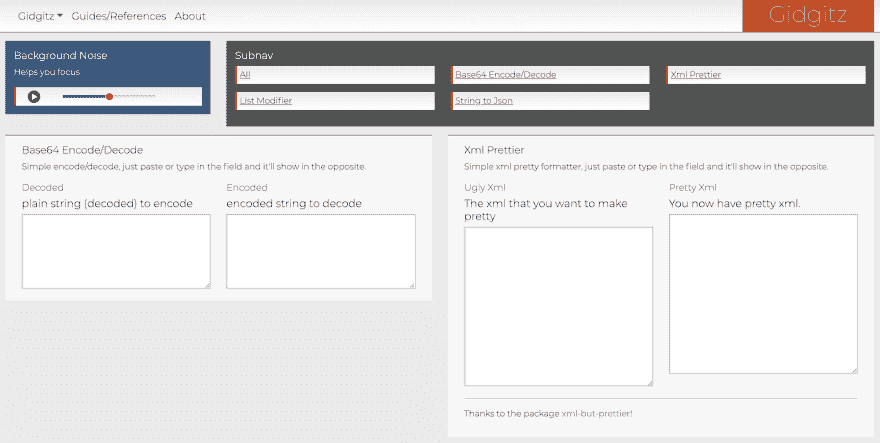

# 新布局需要反馈

> 原文：<https://dev.to/dechamp/new-layout-needs-feed-back-243f>

所以上周我发布了一个新的网站，https://gidgitz.com。因为我的一篇帖子，这里的流量有些大，耶！但我已经得到了一些反馈，所以我重新做了布局，我希望得到一些反馈。

我计划向它添加更多的工具，并且我想鼓励其他人也在它上面推广他们的工具。一种回报的方式。

请留下好的，坏的和丑陋的评论，都欢迎。我也真的很想得到一些可靠的反馈，如果这是有用的东西，或者如果有一种方法可以让它更有用。

这是我上周发布的第一个修订版。

这是新版本，也在这里直播>[https://gidgits.com](https://gidgitz.com)

以下是一些统计数据。

与 next.js/react/bootstrap 4 一起建造