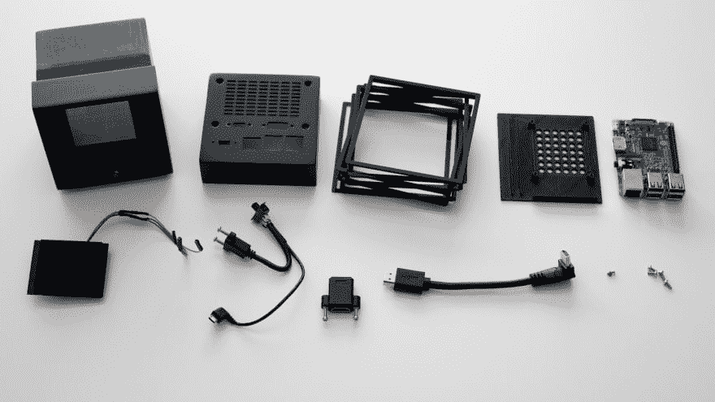
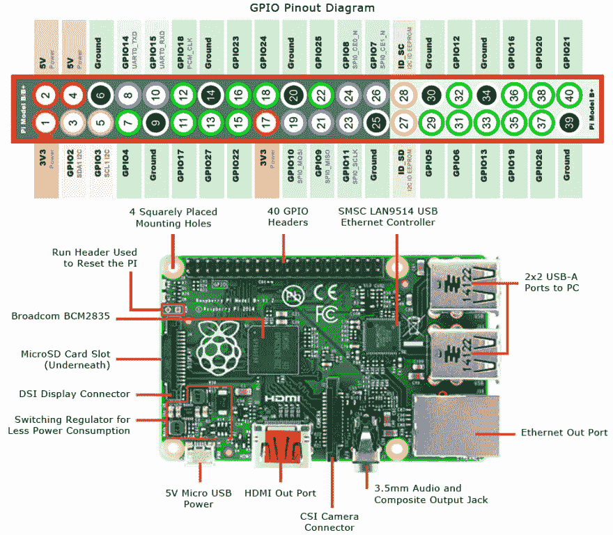
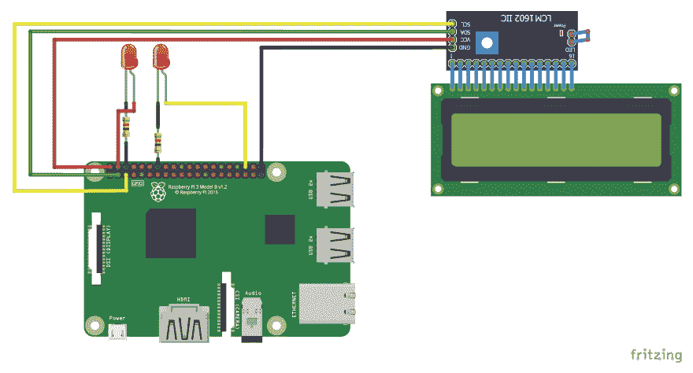
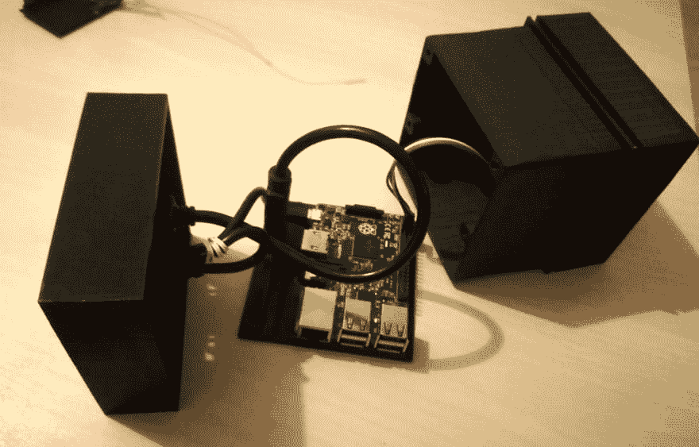
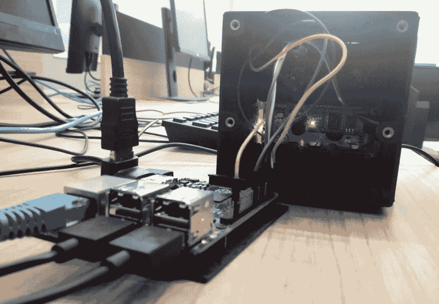
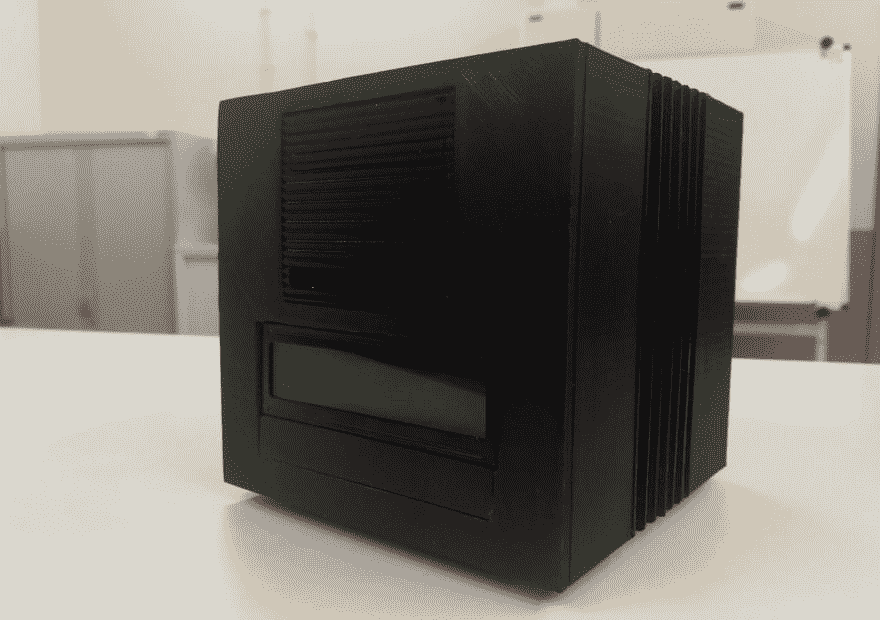
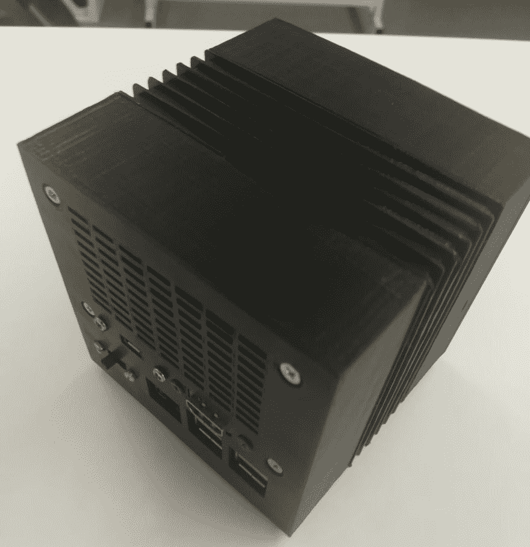
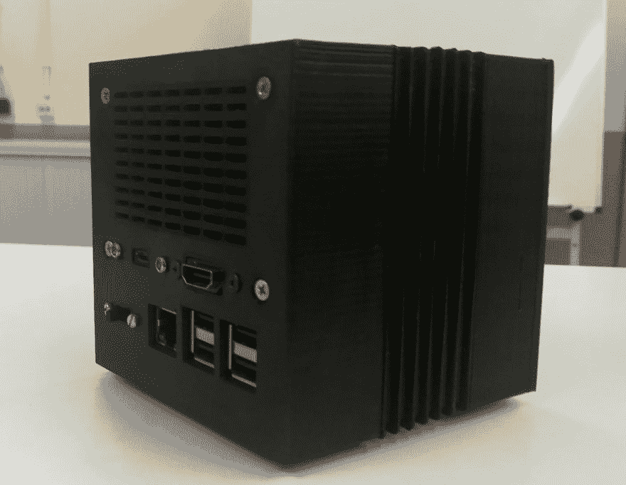
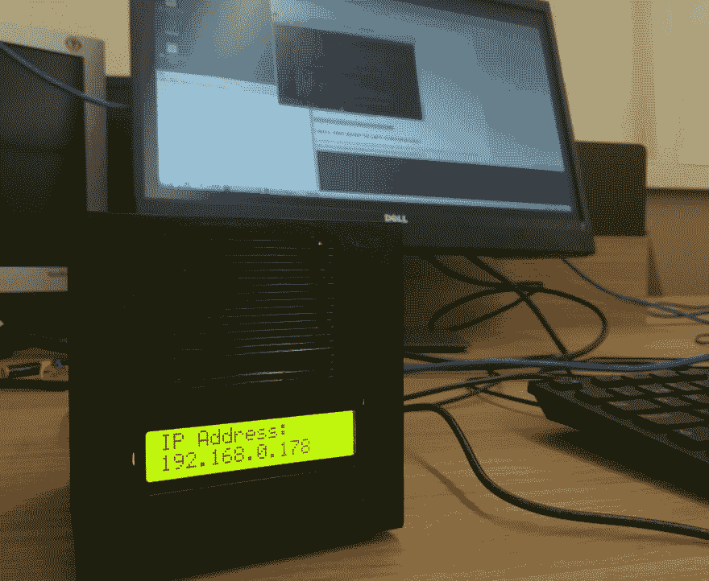

# 下一个 Pi

> 原文：<https://dev.to/jpdias/next-pi-1ocj>

NeXT Computer(也称为 NeXT Computer System)是一台由 NeXT Inc .开发并销售的工作站计算机。这是一个 maker 项目的书面报告，旨在用 Raspberry Pi 复制最初的 NeXT Computer(加上一些 *mods* )。

[](https://res.cloudinary.com/practicaldev/image/fetch/s--jg_AeXTa--/c_limit%2Cf_auto%2Cfl_progressive%2Cq_auto%2Cw_880/https://jpdias.img/nextpi/nextlogo.png)

> 欧洲粒子物理研究所的蒂姆·伯纳斯·李和罗伯特·卡里奥使用 NeXT 计算机及其面向对象的开发工具和库开发了**世界上第一个 web 服务器软件**，欧洲粒子物理研究所的 httpd，并用于编写第一个 web 浏览器 WorldWideWeb。–*来自* [维基百科](https://en.wikipedia.org/wiki/NeXT_Computer)

这个项目是基于 Nina Richards 之前的一个非常相似的项目。我不会把重点放在 3D 部分，因为它们在 Nina Richards 提到的博客文章中有很好的描述。

## 零件

[](https://res.cloudinary.com/practicaldev/image/fetch/s--4hQeSYuU--/c_limit%2Cf_auto%2Cfl_progressive%2Cq_auto%2Cw_880/https://jpdias.img/nextpi/parts.jpg) 图片来源于[妮娜·理查兹](http://www.ninamakes.co.uk/builds/next-computer-replica-raspberry-pi-case/)。

### 3D 零件

| 数数 | 部分 |
| --- | --- |
| one | 前部/车身 |
| one | 前面板(网格) |
| one | 托盘 |
| six | 带垫片的散热片 |
| one | 鳍状物 |
| one | 后部 |

所有的 3D 模型[STL 都可以在 Thingiverse](https://www.thingiverse.com/thing:2884543#files) 上获得。拥有 16x2 液晶显示器的模式需要在正面/主体部分钻一个孔，新的 STL 最终将被共享。

### 其他部分

| 数数 | 部分 |
| --- | --- |
| one | 树莓 Pi 2(与版本 3 兼容) |
| Two | 3 毫米发光二极管(或类似产品) |
| three | 母插头连接器 |
| Two | 82ω电阻 |
| one | 电源开关 |
| one | 面板安装微型 USB 插座 |
| one | 微型 USB 电缆 |
| one | 面板安装 HDMI 插座 |
| four | 带 M3 螺纹的 5 毫米热固黄铜螺纹插件 |
| four | M3 6mm 沉头螺钉 |
| four | 3 毫米 x 4 毫米自攻螺钉 |
| 4-8 | 热收缩管 |
| one | 带 I2C 的 16x2 液晶显示器 |

所有的零件都是在*速卖通*里带来的。你可以在*易贝*、*亚马逊*或任何其他硬件配件销售商上很容易找到类似的。

* * *

## 挂载指令

### 接线图

#### 树莓 Pi 2 原理图

[](https://res.cloudinary.com/practicaldev/image/fetch/s--ujUolOEg--/c_limit%2Cf_auto%2Cfl_progressive%2Cq_auto%2Cw_880/https://jpdias.img/nextpi/pi.jpg)

#### 熔结布线图

[](https://res.cloudinary.com/practicaldev/image/fetch/s--LXomD1CZ--/c_limit%2Cf_auto%2Cfl_progressive%2Cq_auto%2Cw_880/https://jpdias.img/nextpi/circuit.png)

[烧结原理图下载](img/nextpi/rpi.fzz)

### 改变活动 LED 默认 GPIO

要将状态 LED 从默认的板载 LED 更改为适合前面板的新 LED，我们需要更改默认的 GPIO 连接器。为此，只需编辑文件`/boot/config.txt`并将以下值设置为相应的新 GPIO(在上面的示意图中是 GPIO 16):

`dtparam=act_led_gpio=16`

### 配置 I2C LCD

**[1]配置 I2C 接口**

*   激活树莓 Pi 上的 I2C 通信。
    *   引导模式:
    *   `$ sudo raspi-config`
    *   5 个接口选项
    *   是启用 I2C
    *   是，自动加载内核模块
    *   完成并重启
    *   手动模式:
    *   编辑`/boot/config.txt`文件并设置`dtparam=i2c_arm=on`
    *   编辑`/etc/modules`文件并添加行`i2c-dev`
    *   重新启动

**【2】安装依赖关系**

```
$ sudo apt-get install i2c-tools 
$ sudo apt-get install python-smbus
$ sudo modprobe i2c-dev

$ i2cdetect -y 1 # get I2C address param 0 if rp1

$ wget https://raw.githubusercontent.com/emcniece/rpi-lcd/master/RPi_I2C_driver.py #change I2C address 
```

Enter fullscreen mode Exit fullscreen mode

**[3]样本脚本**

LCD 上的 hello World:

```
import I2C_LCD_driver
from time import *

mylcd = I2C_LCD_driver.lcd()

mylcd.lcd_display_string("Hello World!", 1) 
```

Enter fullscreen mode Exit fullscreen mode

显示本地 IP 地址:

```
import I2C_LCD_driver
import socket
import fcntl
import struct

mylcd = I2C_LCD_driver.lcd()

def get_ip_address(ifname):
    s = socket.socket(socket.AF_INET, socket.SOCK_DGRAM)
    return socket.inet_ntoa(fcntl.ioctl(
        s.fileno(),
        0x8915, 
        struct.pack('256s', ifname[:15])
    )[20:24])

mylcd.lcd_display_string("IP Address:", 1) 

mylcd.lcd_display_string(get_ip_address('eth0'), 2) 
```

Enter fullscreen mode Exit fullscreen mode

**【4】故障排除**

16x2 液晶屏可能会在对比度级别配置错误。要调整它，只需转动 I2C 转换器的电位计螺钉(两个方向)，直到获得正确的*对比度(位于 LCD 的背面)。*

## 装配&最终结果

[](https://res.cloudinary.com/practicaldev/image/fetch/s--exacmPav--/c_limit%2Cf_auto%2Cfl_progressive%2Cq_auto%2Cw_880/https://jpdias.img/nextpi/img_5.jpg)

[](https://res.cloudinary.com/practicaldev/image/fetch/s--pkSjn0nv--/c_limit%2Cf_auto%2Cfl_progressive%2Cq_auto%2Cw_880/https://jpdias.img/nextpi/img_3.jpg)

[](https://res.cloudinary.com/practicaldev/image/fetch/s--QMi8a2LW--/c_limit%2Cf_auto%2Cfl_progressive%2Cq_auto%2Cw_880/https://jpdias.img/nextpi/img_6.jpg)

[](https://res.cloudinary.com/practicaldev/image/fetch/s--rBpTU-jF--/c_limit%2Cf_auto%2Cfl_progressive%2Cq_auto%2Cw_880/https://jpdias.img/nextpi/img_2.jpg)

[](https://res.cloudinary.com/practicaldev/image/fetch/s--JgUyKLx6--/c_limit%2Cf_auto%2Cfl_progressive%2Cq_auto%2Cw_880/https://jpdias.img/nextpi/img_4.jpg)

[](https://res.cloudinary.com/practicaldev/image/fetch/s---L9g8RvC--/c_limit%2Cf_auto%2Cfl_progressive%2Cq_auto%2Cw_880/https://jpdias.img/nextpi/img_1.jpg)