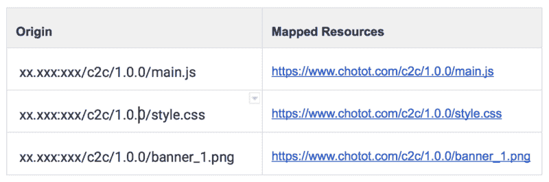
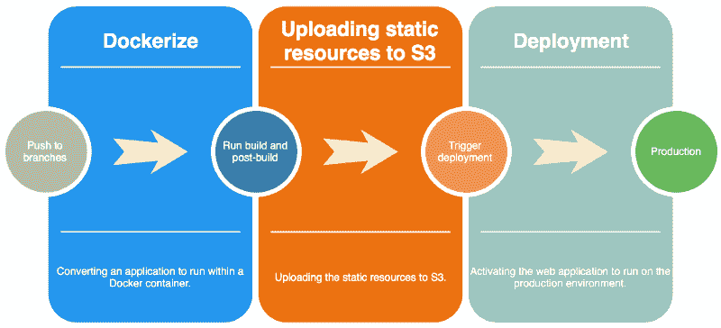
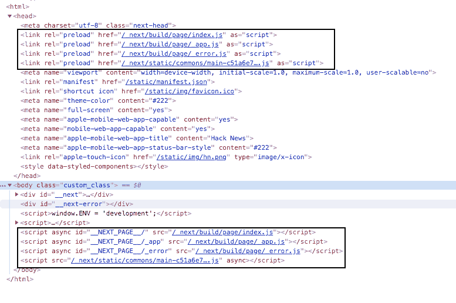
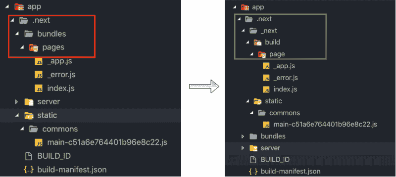
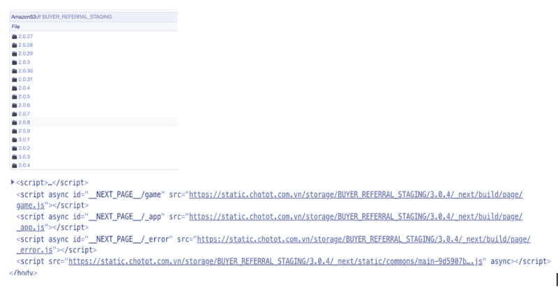
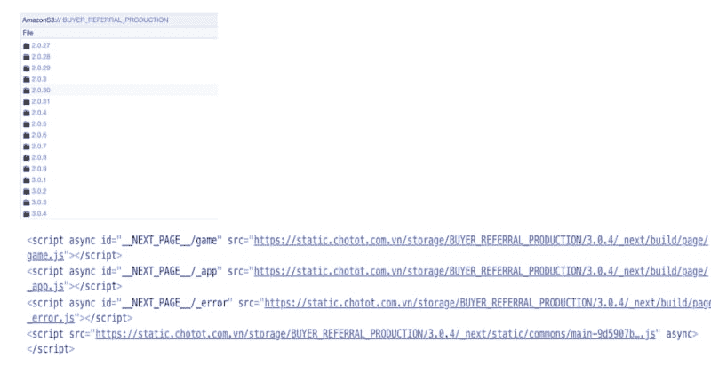

# 使用 Gitlab-CI 在 S3 部署 NextJS 管道

> 原文：<https://dev.to/dzungnguyen179/nextjs-deployment-pipeline-on-s3-with-gitlab-ci-59en>

# 概述

NextJS 于 2016 年发布。从那时起，它已经成为支持 ReactJS & NodeJS 服务器端呈现(SSR)的最大框架之一。作为越南首批应用 NextJS 开发产品的公司之一，我们遇到了有趣的挑战，并从开发到部署过程中学到了很多东西。在今天的主题中，我将分享我们如何处理帮助我们实现两大里程碑的部署步骤。

*   Web 团队和 SRE(站点可靠性工程)团队独立工作。
*   离生产只有一步之遥。

# 问题

## 映射 URL 到静态资源。

在建立了一个全新的项目之后，开发人员根据 SRE 规则来建立部署环境，以获得一个流畅的工作流。以下是我们通常需要的:

*   确定可用的 IP 和端口。
*   用可用的 IP 和端口注册服务。
*   请求将域映射到服务。

对于 web 应用程序，需要处理一些额外的项目。为了上线，你需要指定一些静态资源和资产，如 CSS 文件，JS 文件和图像…所以我们需要列出每个资源的具体网址，然后与 SRE 团队的 IP 和端口映射。

*例如:*
[](https://res.cloudinary.com/practicaldev/image/fetch/s--dcOoe3L1--/c_limit%2Cf_auto%2Cfl_progressive%2Cq_auto%2Cw_880/https://cdn-images-1.medium.com/max/800/1%2Aj65W5pyDxUCt8mE15c_OKA.png)

这种手动方法简单且易于设置。然而，会有以下挑战:

*   如果页面有很多资源。我们需要手动列出具有特定域的每个资源。这需要很多时间。
*   因为我们有很多服务和小型网络应用。因此，SRE 团队的映射配置文件变得很大。
*   有时映射配置文件在服务之间有冲突，例如，另一个团队注册了他们自己资源的 URL。

## 取决于 SRE 团队

Chợ Tốt 的很多服务都依赖于 SRE 团队。每当我们启动一个新的 web 应用程序时，我们需要来到 SRE 服务台，要求将 URL 映射到静态资源，当配置变得更加复杂时，例如这个 URL 被另一个 web 应用程序占用，我们做了一些“黑客”来使它工作。因此，它会导致其他 web 应用程序产生一些错误。然后我们回到原点，寻找另一个解决方案。

* * *

出于这些原因，网络团队和 SRE 团队提出了有助于整个系统自动化 CI/CD 管道的解决方案。

# 解

[](https://res.cloudinary.com/practicaldev/image/fetch/s--FGV0RHxs--/c_limit%2Cf_auto%2Cfl_progressive%2Cq_auto%2Cw_880/https://cdn-images-1.medium.com/max/800/1%2AIVEx3Puk0LspPygXW5d7lw.png)

当代码被合并到特定的分支时(主或者暂存或者发布)。CI/CD 流将被触发执行。CI/CD 有 3 个阶段。

将应用程序转换为在 Docker 容器中运行。

**上传静态资源到 S3**
将 web app dockering 后，我们做一些后期处理，然后开始上传整个构建目录到 S3。

这里的 S3 实际上是 Chợ Tốt 服务器，我们应用了 AWS S3 的接口。所以上传静态资源到 S3 意味着上传到我们自己的服务器。

**部署**
激活 web 应用在生产环境中运行。

# 动手

下面是项目的结构。你可以在[CNA](https://github.com/ChoTotOSS/cna)T2 找到它

```
my-app
├── deployment/
 └── post-build/
 └──── index.js
 └── s3/
 └──── index.js
├── app/
 └── …
 └── next.config.js
 └── …
├── package.json 
```

Enter fullscreen mode Exit fullscreen mode

在这一部分，我将讨论 4 点。

*   存储桶名称
*   凭据
*   配置
*   部署

## 桶名

我们要做的第一件事是为 S3 桶定义一个好的约定名称。为此，我们使用 AWS S3 SDK 的命令手动创建。桶名是服务名和环境的组合。

```
<SERVICE_NAME>_<ENVIRONMENT> 
```

Enter fullscreen mode Exit fullscreen mode

*例如 1:*
服务名称“chotot-vehicle”。这个桶的名字是

*   **分期:**分期 _ 车辆 _ 分期
*   **产量:**总产 _ 车辆 _ 产量

*例如 2:*
服务名“chotot-property”。这个桶的名字是

*   **分期:** CHOTOT_PROPERTY_STAGING
*   **生产:**巧克力 _ 属性 _ 生产

## 凭据

我们通过“秘密变量”特性使用 Gitlab，该特性提供了允许添加“凭证信息”作为环境变量的设置。(我相信其他 CI/CD 也有同样的特点，比如 [TravisCI](https://travis-ci.org/) ， [CircleCI](https://circleci.com/) ，…)。

通过这样做，我们遵循了[关注点分离(SoC)](https://en.wikipedia.org/wiki/Separation_of_concerns) 设计原则。开发人员不必关心部署或管理凭证。

## 构型

**。gitlab-ci.yml**

```
stages:
- dockerize
- s3
- deploy
dockerize:
  stage: dockerize
  script:
  - <DOCKERIZE_DO_SOMETHING>
s3:
  stage: s3
  script:
  - yarn install
  - yarn build
  - NODE_ENV=staging CDN_HOST_BUCKET=$CDN_HOST_BUCKET CDN_ACCESS_KEY_ID=$CDN_ACCESS_KEY_ID CDN_SECRET_ACCESS_KEY=$CDN_SECRET_ACCESS_KEY yarn s3:upload
  - NODE_ENV=production CDN_HOST_BUCKET=$CDN_HOST_BUCKET CDN_ACCESS_KEY_ID=$CDN_ACCESS_KEY_ID CDN_SECRET_ACCESS_KEY=$CDN_SECRET_ACCESS_KEY yarn s3:upload
deploy:
  stage: deploy
  script:
  - <DEPLOYMENT_SCRIPTS> 
```

Enter fullscreen mode Exit fullscreen mode

**next.config.js**

```
const version = require('package.json').version;

const config = {
  development: {
    assetPrefix: ''
  },
  staging: {
    assetPrefix: `https://static.com/CHOTOT_VEHICLE_STAGING/${version}`
  },
  production: {
    assetPrefix: `https://static.com/CHOTOT_VEHICLE_PRODUCTION/${version}`
  }
};

module.exports = {
  assetPrefix: config.assetPrefix,
  generateBuildId: async () => {
    return 'build';
  },
  webpack(config, options) {
    return config;
  }
}; 
```

Enter fullscreen mode Exit fullscreen mode

## 部署

**问题**

构建 NextJS web app 后，它有一个名为“的目录。下一个”和文件的结构不同于访问静态资源的 URL。

[](https://res.cloudinary.com/practicaldev/image/fetch/s--DeYyJUDl--/c_limit%2Cf_auto%2Cfl_progressive%2Cq_auto%2Cw_880/https://cdn-images-1.medium.com/max/800/1%2AGoLr0wSm6WtEhIi1GH4m9w.png)

[](https://res.cloudinary.com/practicaldev/image/fetch/s--FM9DUHpW--/c_limit%2Cf_auto%2Cfl_progressive%2Cq_auto%2Cw_880/https://cdn-images-1.medium.com/max/800/1%2AJiS5ArDw2pJeLefoQTurEw.png)

如您所见，有两条不同的路径。

```
.next/bundles/pages/index.js 
```

Enter fullscreen mode Exit fullscreen mode

对比

```
/_next/build/page/index.js 
```

Enter fullscreen mode Exit fullscreen mode

因此，如果我们将整个构建的目录上传到 S3 并运行我们的 web 应用程序。这绝对行不通。

**解决方案

因为部署与开发阶段是分开的。因此我们在将构建好的目录上传到 S3 之前增加了一个叫做“后期构建”的阶段。

“后构建”阶段负责重新安排文件的结构，以匹配指向文件的 URL 的结构。

*例如:*

[](https://res.cloudinary.com/practicaldev/image/fetch/s--Us8h7pqc--/c_limit%2Cf_auto%2Cfl_progressive%2Cq_auto%2Cw_880/https://cdn-images-1.medium.com/max/800/1%2AIPU8lvWh-i_-F9MnM0rGkQ.png)

**后期构建脚本**

为了创建后构建，我们创建了一个小脚本，它允许重新构建构建的目录。NextJS 的每个主要变化都创建了一个新的构建文件结构。因此，每个“后期构建”脚本都需要适应 NextJS 主要版本。

**post-build . js-nextjs 6**T2】

```
var fs = require('fs');
var mv = require('mv');
var dirs = ['app/.next/_next', 'app/.next/_next/build', 'app/.next/_next/build/page', 'app/.next/_next/static'];

const PAGE_PATH = {
  old: 'app/.next/bundles/pages',
  new: 'app/.next/_next/build/page'
};

const STATIC_PATH = {
  old: 'app/.next/static',
  new: 'app/.next/_next/static'
};

// create dir
dirs.forEach(item => {
  fs.mkdirSync(item);
});

// move files
mv(PAGE_PATH.old, PAGE_PATH.new, { mkdirp: true }, function(err) {
  if (err) console.log(err);
});

mv(STATIC_PATH.old, STATIC_PATH.new, { mkdirp: true }, function(err) {
  if (err) console.log(err);
}); 
```

Enter fullscreen mode Exit fullscreen mode

**post-build . js-next js 7**T2】

```
var fs = require('fs');
var mv = require('mv');
var dirs = [
  'app/.next/_next',
  'app/.next/_next/static',
];

const STATIC_PATH = {
  old: 'app/.next/static',
  new: 'app/.next/_next/static'
};

// create dir
dirs.forEach(item => {
  fs.mkdirSync(item);
});

mv(STATIC_PATH.old, STATIC_PATH.new, { mkdirp: true }, function(err) {
  if (err) console.log(err);
}); 
```

Enter fullscreen mode Exit fullscreen mode

```
var fs = require('fs');
var mv = require('mv');

var dirs = ['.next/_next', '.next/_next/static'];

const STATIC_PATH = {
  old: '.next/static',
  new: '.next/_next/static'
};

// create dir
dirs.forEach(item => {
  fs.mkdirSync(item);
});

mv(STATIC_PATH.old, STATIC_PATH.new, { mkdirp: true }, function(err) {
  if (err) console.log(err);
}); 
```

Enter fullscreen mode Exit fullscreen mode

**上传到 S3**

在重新构建构建的文件之后。现在我们只需要一些代码来上传整个构建目录到 S3。为此，我们创建了一个名为“ [s3-uploading](https://www.npmjs.com/package/s3-uploading) ”的小软件包来帮助我们实现它。

```
var path = require('path');
var version = require('./package.json').version;
var Uploader = require('s3-uploading').default;
var env = (process.env.NODE_ENV || 'staging').toUpperCase();

// CHOTOT_VEHICLE_PRODUCTION/1.0.1
var BUCKET_PATH = `<YOUR_BUCKET_NAME>_${env}/${version}`;

const options = {
  s3: {
    accessKeyId: process.env.CDN_ACCESS_KEY_ID,
    secretAccessKey: process.env.CDN_SECRET_ACCESS_KEY,
    endpoint: process.env.CDN_HOST_BUCKET,
    region: '',
    ACL: 'public-read',
    sslEnabled: false
  },
  upload: {
    directory: path.resolve(__dirname, '../../app/.next'), // path to built directory
    bucket: BUCKET_PATH
  }
};
const job = new Uploader(options);
job.upload(); 
```

Enter fullscreen mode Exit fullscreen mode

**注册脚本**

我们需要做的最后一件事是注册脚本来执行 package.json
的“上传静态资源到 s3”步骤

```
{  "scripts":  {  "s3:upload":  "node ./deployment/s3",  "start":  "node ./server",  "build":  "next build app",  "postbuild":  "node ./deployment/post-build"  },  } 
```

Enter fullscreen mode Exit fullscreen mode

# 结果

以下是试运行和生产环境的结果。

[](https://res.cloudinary.com/practicaldev/image/fetch/s--GS3o7MH0--/c_limit%2Cf_auto%2Cfl_progressive%2Cq_auto%2Cw_880/https://cdn-images-1.medium.com/max/800/1%2AEa4i-P1sDfJM_pD7zOi-Dg.png)

[](https://res.cloudinary.com/practicaldev/image/fetch/s--5EKlzgeI--/c_limit%2Cf_auto%2Cfl_progressive%2Cq_auto%2Cw_880/https://cdn-images-1.medium.com/max/800/1%2A6xn6kP_FFuS2vej2r4VrVA.png)

如您所见，我们基于“package.json”中的版本来管理静态资源。我们遵循语义版本化，更多细节[在这里](https://semver.org/)。在每个版本中，我们都会更新版本，然后上传到 S3。

# 结论

通过上述优化，我们将部署的 n (n > 1)个步骤缩减为 1 个步骤。它带来了一些好处。

*   加快开发时间。
*   更少依赖另一个团队。
*   静态资源版本化的缓存得到了很好的处理(因为我们基于版本存储所有静态资源)。
*   由网络团队完全控制。

如果你对此感兴趣，请务必查看我们的回复。

*   [https://github.com/ChoTotOSS/cna](https://github.com/ChoTotOSS/cna)
*   [https://github.com/davidnguyen179/s3-upload](https://github.com/ChoTotOSS/cna)