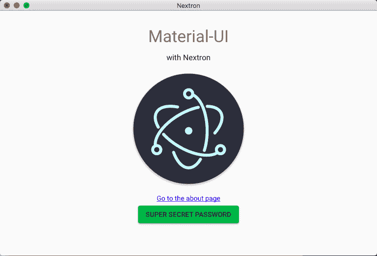

# Nextron v4:轻松电子+ Next.js

> 原文：<https://dev.to/saltyshiomix/nextron-v4--electron--nextjs-with-ease-29pl>

今天 zeit 发布了 [Next.js](https://github.com/zeit/next.js) v8，于是 [Nextron](https://github.com/saltyshiomix/nextron) 来到了 v4:)

[https://nextjs.org/blog/next-8](https://nextjs.org/blog/next-8)

## 什么是 Nextron？

Nextron 是一个电子应用程序生成器，它包括 Next.js，可以很容易地用 Next.js 处理电子渲染器进程。

```
# install nextron
$ npm install --global nextron@latest 
```

目前有 13 个示例模板:

```
# list all templates
$ nextron list

  Available examples:

    - custom-build-options
    - custom-server
    - custom-server-nodemon
    - custom-server-typescript
    - ipc-communication
    - parameterized-routing
    - store-data
    - with-javascript
    - with-javascript-ant-design
    - with-javascript-material-ui
    - with-typescript
    - with-typescript-less
    - with-typescript-material-ui

  USAGE

    $ nextron init my-app [--template example_folder_name]

  If you want to use "with-typescript-material-ui", just type the command below:

    $ nextron init my-app --template with-typescript-material-ui 
```

用法就是这么简单:

```
# generate an example
$ nextron init my-app --template with-typescript-material-ui

# install dependencies
$ cd my-app
$ yarn (or "npm install")

# development mode
$ yarn dev (or "npm run dev")

# production build
$ yarn build (or "npm run build") 
```

[](https://res.cloudinary.com/practicaldev/image/fetch/s--P4_ztPZE--/c_limit%2Cf_auto%2Cfl_progressive%2Cq_auto%2Cw_880/https://i.imgur.com/DNOsAH0.png)

## 我对 Nextron 的信念

1.  展示了一种开发桌面应用程序的方法
    *   始终维护👍
2.  使用方便
    *   运行一个命令
    *   构建它一个命令
3.  透明(对开放源码软件开发者开放)
    *   显示所有来源，如`webpack.config.js`、电子生产构建配置等

## Nextron 的状态

*   在过去的 9 个月里提交了 650 多次
*   200+版本(`npm publish`)
*   GitHub 上有 100 多个观星者
*   在 [awesome-nextjs](https://github.com/unicodeveloper/awesome-nextjs) 上市
*   欢迎公关！

## 对了...

我在东京(日本)工作，正在发展。NET 或使用人工智能(神经网络)翻译机的 JavaScript(类型脚本)应用程序。

我们的使命是帮助所有学习外语的人。

有人想加入我们吗？

感谢您阅读我的文章:)