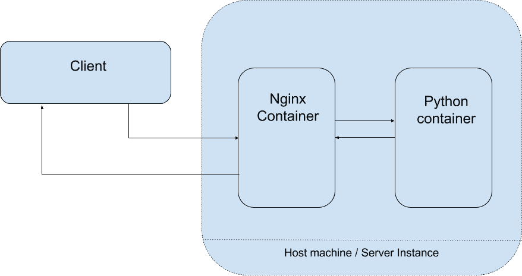
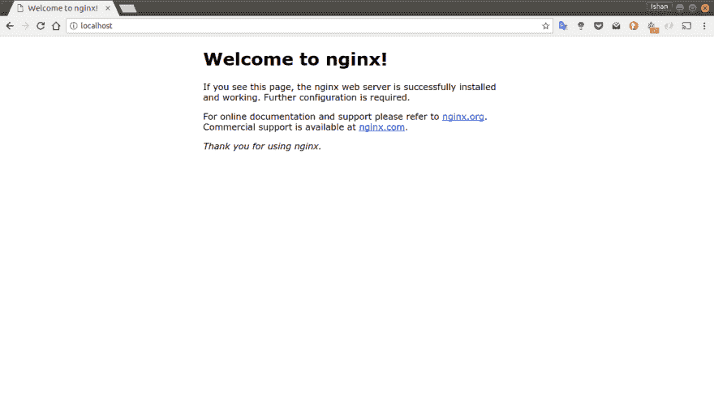

# Nginx 作为使用 Docker 的 flask 应用程序的反向代理

> 原文：<https://dev.to/ishankhare07/nginx-as-reverse-proxy-for-a-flask-app-using-docker-3ajg>

### 那么什么是反向代理呢？

反向代理是一种代理服务器，它代表客户端从一个或多个服务器检索资源。然后，这些资源被返回给客户端，就好像它们来自 Web 服务器本身一样。在此设置中，下图更好地描述了我们的架构:

[](https://res.cloudinary.com/practicaldev/image/fetch/s--dc_gXynR--/c_limit%2Cf_auto%2Cfl_progressive%2Cq_auto%2Cw_880/https://ishankhare.com/medimg/nginx-reverse-proxy.png)

### 用 docker 运行 Nginx

让我们首先运行一个简单的 nginx 容器，监听本地主机的默认端口(80)。我们需要安装 docker 才能工作，关于安装 docker 的说明请参考[这里的](https://docs.docker.com/engine/installation/)。

接下来，我们将使用以下命令从 [docker hub](https://hub.docker.com/_/nginx/) 中提取 nginx 容器映像:

```
docker pull nginx:1.13.7 
```

我们可以看到下载的图像

```
$ docker images
REPOSITORY                               TAG                 IMAGE ID            CREATED             SIZE
nginx                                    1.13.7              f895b3fb9e30        5 weeks ago         108MB 
```

一旦我们有了 nginx 映像，我们就用一个暴露的端口运行容器。

```
$ docker run --name nginx_test -d -p 80:80 nginx:1.13.7
66de8420687d0687f6c923269ccd1554c0d247f230dc3d064c10fcd8a099fb5d
$ docker ps
CONTAINER ID        IMAGE               COMMAND                  CREATED             STATUS              PORTS                NAMES
66de8420687d        nginx:1.13.7        "nginx -g 'daemon of…"   8 minutes ago       Up 8 minutes        0.0.0.0:80->80/tcp   nginx_test 
```

命令中的`-d`以`daemon`模式(在后台)运行我们的容器，而不会阻塞我们的 shell。

> 注意“PORTS”列显示的是`0.0.0.0:80->80/tcp`,这意味着我们已经将容器的端口 80 映射并暴露给了我们的主机。因此，我们现在应该能够在本地主机上访问 nginx。

我们可以在这里看到:

[](https://res.cloudinary.com/practicaldev/image/fetch/s--_Flxr1El--/c_limit%2Cf_auto%2Cfl_progressive%2Cq_auto%2Cw_880/https://ishankhare.com/medimg/Screenshot_from_2018-01-20_02-20-16.png)

停止运行的容器

```
$ docker stop nginx_test 
```

我们让 nginx 使用 docker 容器。这很简单，对吗？
[T3】](https://res.cloudinary.com/practicaldev/image/fetch/s--V28kjNUG--/c_limit%2Cf_auto%2Cfl_progressive%2Cq_auto%2Cw_880/https://i.imgur.com/2CjRYhW.png)

* * *

### 码头工-化合物

在我们的用例中，我们有不止一个容器:

1.  nginx
2.  大蟒

此外，我们希望能够以某种方式链接这些容器(很快会有更多)。实现这一目标的可行、简单且高效的方法是什么——输入`docker-compose`。官方 docker 文档将`docker-compose`描述为

> Compose 是一个定义和运行多容器 Docker 应用程序的工具。

首先，通过阅读这里的中的[说明来安装 docker compose](https://docs.docker.com/compose/install/)

接下来，我们将编写一个`docker-compose.yml`文件。首先让我们从复制我们到目前为止的工作开始，得到一个在本地主机上工作的 nginx 容器，但是这次使用 **`docker-compose`**

#### 码头工-化合物. yml

```
version: '3.1'
services:
    nginx:
        image: nginx:1.13.7
        ports:
            - 80:80 
```

来测试一下:`docker-compose up -d nginx`。现在，您可以在 localhost 上看到相同的 nginx 欢迎页面。
也是一个`docker ps`也会给你类似的输出。

```
$ docker ps
CONTAINER ID        IMAGE               COMMAND                  CREATED             STATUS              PORTS                NAMES
fc6308ec4ff6        nginx:1.13.7        "nginx -g 'daemon of…"   4 minutes ago       Up 3 seconds        0.0.0.0:80->80/tcp   code_nginx_1 
```

下一步是制作我们的 flask 容器，并用 docker-compose 运行它。

### python 容器

让我们来看看 python 容器:

```
$ docker pull python:3 
```

现在让我们写一个`Dockerfile`来安装我们对 python 的依赖。

**Dockerfile** :

```
FROM python:3
RUN pip install flask 
```

构建过程将安装`flask`本身的所有依赖项。现在我们可以用一个简单的`hello world`烧瓶程序连接`Dockerfile`，并确保一切正常。我们将把这个文件放在`code`目录中，这样我们就可以把它挂载到我们的容器中。

**code/main.py**

```
from flask import Flask
app = Flask(__name__)

@app.route('/')
def index():
    return 'Hello world!' 
```

现在让我们用`docker-compose`以及
**docker-compose.yml** 来设置它:

```
version: '3.1'
services:
    nginx:
        image: nginx:1.13.7
        container_name: nginx
        ports:
            - 80:80
    flask:
        build:
            context: ./
            dockerfile: Dockerfile
        image: flask:0.0.1
        container_name: flask
        volumes:
            - ./:/code/
        environment:
            - FLASK_APP=/code/main.py
        command: flask run --host=0.0.0.0
        ports:
            - 8080:5000 
```

我们来测试一下:
先停止 nginx 之前运行的容器

```
$ docker stop <your container name> 
```

现在，让我们从`docker-compose`开始集群

```
$ docker-compose up -d
Starting flask ...                                   
Starting nginx ... done
$ docker ps
CONTAINER ID        IMAGE               COMMAND                  CREATED              STATUS              PORTS                    NAMES                                                                              
f0f5bd9a2da1        nginx:1.13.7        "nginx -g 'daemon of…"   About a minute ago   Up 15 seconds       0.0.0.0:80->80/tcp       nginx                                                                              
9b065e02145b        flask:0.0.1         "flask run --host=0.…"   About a minute ago   Up 15 seconds       0.0.0.0:8080->5000/tcp   flask 
```

现在我们已经运行了`nginx`和`flask`容器，我们可以验证两个容器中的一切都工作正常。我们现在需要做的就是配置`nginx`到**反向代理**我们的`flask`容器

### 配置 nginx

我们希望基本上所有的 [`proxy_pass`](https://nginx.org/en/docs/http/ngx_http_proxy_module.html#proxy_pass) 流量在`/`到达我们的`flask`集装箱。

让我们从我们的`nginx.conf`文件开始

```
server {
    listen 80;
    server_name localhost;

    location / {
        proxy_pass http://flask-app:5000/;
        proxy_set_header Host "localhost";
    }
} 
```

我们所做的就是:

1.  声明了服务器层，它告诉监听端口 80。
2.  给定`server_name`，这在设置域名时特别有用，尽管在我们的例子中 localhost 已经足够好了。
3.  接下来我们来看 nginx 的`location directive`。在`location`之后，我们可以有一个`regex`模式来匹配。虽然在我们的例子中`/`已经足够好了。我们目前正在将**的全部**内容反向代理到 flask app。
4.  `proxy_pass`指令将我们代理的`url`作为参数。在我们的例子中，我们将把`docker network`中的烧瓶容器别名为`flask-app`。这使得我们的 flask 应用程序可以在`http://flask-app:5000/`从 nginx 容器内部访问。
5.  `proxy_set_header`将为 nginx 和 flask 之间的请求设置`__Host header__`，这有助于避免某些错误，特别是如果使用 Django 而不是 flask，`ALLOWED_HOSTS`设置将需要这个`Host`头。

我们用下面一行将这个文件装入我们的`nginx`容器中

```
nginx:
    volumes:
        - ./nginx.conf:/etc/nginx/conf.d/default.conf 
```

这将会覆盖容器中默认的 nginx 配置文件。

### 设置 docker 网络

在`docker-compose`文件的底部，添加这一行:

```
networks:
    my-network: 
```

在`flask`部分添加以下几行:

```
networks:
    my-network:
        aliases:
            - flask-app 
```

这将我们的两个容器都添加到了一个名为`my-network`的网络中，flask 容器在该网络中的别名为`flask-app`。我们现在所要做的就是将 flask 容器列为`nginx`容器的依赖项，这样它就会自动启动 flask 应用程序。

还要注意的是，现在我们已经完成了设置，我们不需要暴露 flask 容器的端口，所以我们可以从 flask 部分删除以下行

```
ports:
  - 8080:5000 
```

#### 这里总结一下文件的最终版本:

坞站-组合. yml

```
version: '3.1'
services:
    nginx:
        image: nginx:1.13.7
        container_name: nginx
        depends_on:
            - flask
        volumes:
            - ./nginx.conf:/etc/nginx/conf.d/default.conf
        networks:
            - my-network
        ports:
            - 80:80
    flask:
        build:
            context: ./
            dockerfile: Dockerfile
        image: flask:0.0.1
        container_name: flask
        volumes:
            - ./:/code/
        environment:
            - FLASK_APP=/code/main.py
        command: flask run --host=0.0.0.0
        networks:
            my-network:
                aliases:
                    - flask-app
        ports:
            - 8080:5000

networks:
    my-network: 
```

Dockerfile

```
FROM python:3
RUN pip install flask 
```

engine x . conf 文件

```
server {
    listen 80;
    server_name localhost;

    location / {
        proxy_pass http://flask-app:5000/;
        proxy_set_header Host "localhost";
    }
} 
```

### 让我们最后运行一下

```
$ docker-compose up -d nginx
Starting flask ... done Starting nginx ... done

$ docker ps
CONTAINER ID        IMAGE               COMMAND                  CREATED             STATUS              PORTS                    NAMES
874454f2ceb1        nginx:1.13.7        "nginx -g 'daemon of…"   13 minutes ago      Up 20 seconds       0.0.0.0:80->80/tcp       nginx
502fc6cc9603        flask:0.0.1         "flask run --host=0.…"   6 weeks ago         Up 23 seconds       0.0.0.0:8080->5000/tcp   flask 
```

> 注意，由于我们在 nginx 容器中将 flask 列为依赖项，`docker-compose`首先为我们启动 flask 容器，然后是 nginx。这适用于这种依赖链。

这篇文章最初发表在我的博客[ishankhare.com](ishankhare.com)上