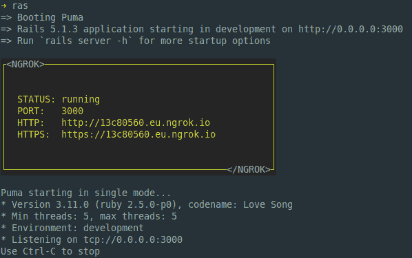
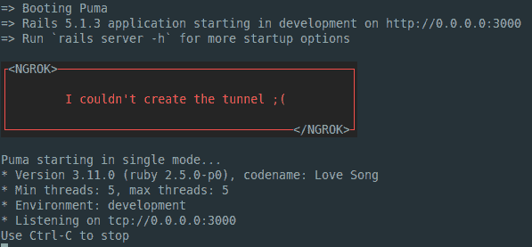

# Rails webhook 与 Ngrok 的集成开发

> 原文：<https://dev.to/sabatesduran/ngrok-for-rails-development-5f9k>

一切都是从我开始使用 [Mollie](https://www.mollie.com) 开始的，它是一个 PSP(支付服务提供商)，像 [Stripe](https://stripe.com) ，它有一个 ruby 包装器，但是如果你想在开发环境(localhost)中测试支付，你需要一个有效的 URL，这样他们就可以通过 webhook 联系到你(如果你想验证支付，webhook URL 参数是必需的)。

解决方案很简单，我只需创建一个 [ngrok](https://ngrok.com/) 隧道，然后根据我是在做只需要我的本地机器还是其他服务的事情，用一个环境变量来改变`default_url_options`。

为了用 mollie webhooks 运行我的应用程序，我需要这样做:

*   Start ngrok
*   为新的 ngrok `https` url 更改`ENV`变量
*   启动我的应用程序
*   启动 Sidekiq(用于后台作业)

在我看来，这并不太多，但在某些时候会变得很烦人，所以我决定让它对我来说更容易，现在我只有:

*   启动我的应用程序
*   启动 Sidekiq

下面是如何做到的:

*   在您的计算机中安装 ngrok v2+
*   将`ngrok-tunnel`添加到您的 gem 文件中

```
group :development do
  gem 'ngrok-tunnel'
  # Cool stuff for later but not really needed
  gem 'tty-box'
end 
```

*   在`puma.rb`中，我们在底部添加了这段代码

```
if ENV["IS_DEV_ENV"]
  begin
    options = {
      # App port
      addr: ENV.fetch("PORT") { 3000 },
      # ngrok system files
      config: File.join(ENV["HOME"], ".ngrok2", "ngrok.yml"),
    }

    # In case that you have a pay plan you can create
    # tunnels with custom subdomains
    options[:subdomain] = ENV["NGROK_SUBDOMAIN"] if ENV["NGROK_SUBDOMAIN"]

    # Region (since I only work in the EU is hardcoded)
    options[:region] = "eu"

    # Create tunnel
    Ngrok::Tunnel.start(options)

    # Create cool box
    box = TTY::Box.frame(width: 50, height: 10, padding: 2, title: {top_left: "<NGROK>", bottom_right: "</NGROK>"}, style: {fg: :green, bg: :black, border: {fg: :green, bg: :black}}) do
      "STATUS: #{Ngrok::Tunnel.status}\nPORT: #{Ngrok::Tunnel.port}\nHTTP: #{Ngrok::Tunnel.ngrok_url}\nHTTPS: #{Ngrok::Tunnel.ngrok_url_https}\n"
    end
  rescue => error
    box = TTY::Box.frame(width: 50, height: 5, align: :center, padding: 1, title: {top_left: "<NGROK>", bottom_right: "</NGROK>"}, style: {fg: :red, bg: :black, border: {fg: :red, bg: :black}}) do
      "I couldn't create the tunnel ;("
    end
  end
  puts "\n#{box}\n"
end 
```

让我们注释这段代码:

*   `ENV["IS_DEV_ENV"]`:由于`Rails.env.development?`在应用程序的这一点上没有被加载(至少在 Heroku 中),我们使用了一个环境变量，它只在你的`secrets.yml`或`application.yml`的`development`部分被设置，并且它需要被设置为真。

```
 development:
        IS_DEV_ENV: "true" 
```

*   在`options`散列中，我们有应用程序端口和 ngrok 文件所在的主目录。
*   如果你是 ngrok 的订阅者，你可以有一个自定义的子域，所以我把代码留在这里，以防有一天我成为订阅者。
*   `options[:region]`这不在 ENV 变量中，因为我们的总部在欧盟，我们不在欧盟之外工作，所以我只对欧盟进行了硬编码，但您可以选择:
    *   美国-美国(俄亥俄州)
    *   欧盟-欧洲(法兰克福)
    *   亚太地区(新加坡)
    *   澳大利亚联盟(悉尼)
*   `box`里有什么？？？？！！！为了让它更酷(至少对我来说)，它显示了一个包含 ngrok 信息的漂亮盒子。

[](https://res.cloudinary.com/practicaldev/image/fetch/s--Q6F5wpUH--/c_limit%2Cf_auto%2Cfl_progressive%2Cq_auto%2Cw_880/https://thepracticaldev.s3.amazonaws.com/i/c49od4z38jvwa59r30xh.png)

*   在 ngrok 无法连接的情况下，我们使用该框来表示我们无法连接

[](https://res.cloudinary.com/practicaldev/image/fetch/s--1F2kcF2l--/c_limit%2Cf_auto%2Cfl_progressive%2Cq_auto%2Cw_880/https://thepracticaldev.s3.amazonaws.com/i/0tt8x1gahc801h6zl1h9.png)

## 改变变量

你可能不需要这个，如果你只是想测试莫莉付款，但对我来说，很高兴有。

为了动态地改变配置，我选择了一种方式，我认为这种方式虽然不太好，但是很有效(是的，我知道它在每个请求上运行)。在`application_controller.rb`中我添加了这个方法:

```
before_action :set_ngrok_urls, if: "Rails.env.development?"

def set_ngrok_urls
    if Ngrok::Tunnel.running?
      # Getting current url
      url = Ngrok::Tunnel.ngrok_url_https

      # Variable hash
      default_url_options = {host: url}

      # Overwriting current variables
      Rails.application.config.action_controller.asset_host = url
      Rails.application.config.action_mailer.asset_host = url
      Rails.application.routes.default_url_options = default_url_options
      Rails.application.config.action_mailer.default_url_options = default_url_options
    end
  end 
```

因此，我在这里所做的是，在环境正在开发的情况下，我执行函数`set_ngrok_urls`并检查 ngrok 是否已连接。

然后，我获取当前的 ngrok https URL，并创建一个散列(路由和邮件程序默认 URL 需要这个散列),这两者首先只使用 URL。

就这些了，希望这对一些人有用，如果我做错了什么，请留下评论。

## 参考书目

*   auto start Ngrok With Rails:[https://stuff-things . net/2016/10/12/auto start-Ngrok-With-Rails/](https://stuff-things.net/2016/10/12/autostart-ngrok-with-rails/)