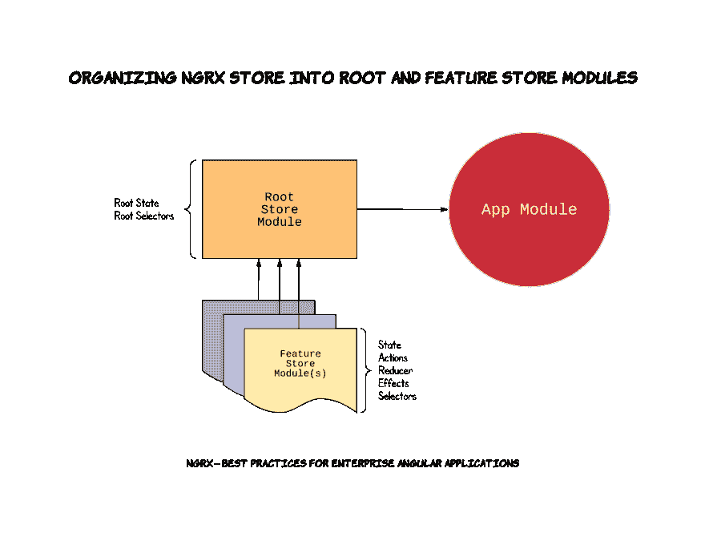

# NgRx —企业角度应用的最佳实践

> 原文：<https://dev.to/angular/ngrxbest-practices-for-enterprise-angular-applications-dbb>

### 开始之前

本文并不打算成为关于 **NgRx** 的教程。目前有几个很棒的资源，是由比我聪明得多的专家写的。我强烈建议你在尝试实现这些概念之前，花时间学习一下 **NgRx** 和 **redux** 模式。

*   [极限角度— NgRx 存储&效果](https://ultimatecourses.com/courses/angular/ref/wes.grimes/)
*   [多视角—逐角度播放 NgRx](https://www.pluralsight.com/courses/play-by-play-angular-ngrx)
*   [Medium.com 的 NgRx 博客](https://medium.com/ngrx)
*   [NgRx.io 文档](https://ngrx.io/docs)
*   [NgRx.io 资源](https://ngrx.io/resources)

### 背景

下面是我在日常工作中使用 **NgRx** 库构建了几个企业角度应用程序后开发的一个模式。我发现大多数在线教程在帮助您启动和运行您的商店方面做得很好，但通常无法说明在您的商店功能片段、根商店和用户界面之间清晰分离关注点的最佳实践。

使用下面的模式，您的根应用程序状态和该根应用程序状态的每个片段(属性)被分成一个 *RootStoreModule* 和每个特性 *MyFeatureStoreModule* 。

[](https://res.cloudinary.com/practicaldev/image/fetch/s--vDHdREtP--/c_limit%2Cf_auto%2Cfl_progressive%2Cq_auto%2Cw_880/https://cdn-images-1.medium.com/max/1600/1%2AheR7Q5p_9a-v4kD1WKg1XQ.png)

### 先决条件

本文假设您正在构建一个由 [Angular v6 CLI](https://cli.angular.io/) 生成的应用程序。

### 安装 NgRx 依赖项

在我们开始生成代码之前，让我们确保通过提示符安装必要的 **NgRx** 节点模块:

```
npm install @ngrx
/{store,store-devtools,entity,effects}
```

### 最佳实践#1 —根商店模块

创建一个根存储模块，作为一个合适的 Angular **NgModule 的**，将 NgRx 存储逻辑捆绑在一起。功能存储模块将被导入到根存储模块中，从而允许将单个根存储模块导入到应用程序的主应用程序模块中。

#### 建议实施

1.  使用**角度命令行界面**生成 *RootStoreModule*

```
ng g module root-store —-flat false —-module app.module.ts
```

2.使用 **Angular CLI:** 生成 *RootState* 接口来表示应用程序的整个状态

```
ng g interface root-store/root-state
```

这将创建一个名为`RootState`的接口，但是您需要在生成的`.ts`文件中将其重命名为`State`,因为我们希望稍后将它用作`RootStoreState.State`

请注意:您稍后将返回，并将每个特性模块作为属性添加到该接口中。

### 最佳实践# 2——创建功能存储模块

创建特征商店模块作为适当角度的 NgModule，将你的商店的特征切片捆绑在一起，包括*状态*、*动作*、*减速器*、*选择器*和*效果*。然后特性模块被导入到您的 *RootStoreModule* 中。这将使您的代码清晰地组织到每个特性库的子目录中。此外，如本文后面所述，公共*动作*、*选择器*和*状态*是名称空间的，并使用特性存储前缀导出。

#### 命名您的功能商店

在下面的示例实现中，我们将使用特征名 *MyFeature* ，然而，这对于您生成的每个特征来说是不同的，并且应该与*根状态*属性名非常接近。例如，如果您正在构建一个博客应用程序，一个特性名称可能是 *Post* 。

#### 实体特征模块还是标准特征模块？

根据您正在创建的特征类型，您可能会从实现 [NgRx 实体](https://medium.com/ngrx/introducing-ngrx-entity-598176456e15)中受益，也可能不会。如果你的商店特性片将处理类型的数组，那么我建议按照下面的*实体特性模块*实现。如果构建一个不包含类型的标准数组的商店特性片，那么我建议遵循下面的*标准特性模块*实现。

#### 建议实现—实体特征模块

1.  使用**角度 CLI:** 生成 *MyFeatureStoreModule* 特征模块

```
ng g module root-store/my-feature-store --flat false --module root-store/root-store.module.ts
```

2.Actions —在*app/root-store/my-feature-store*目录下创建一个 *actions.ts* 文件: