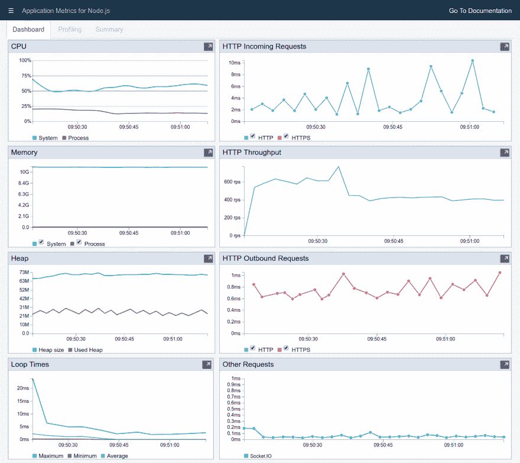
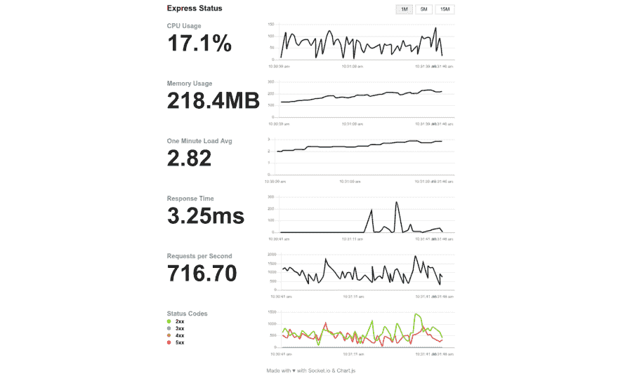
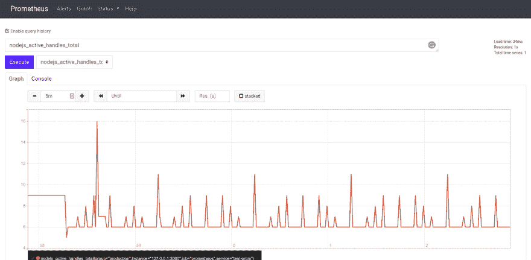
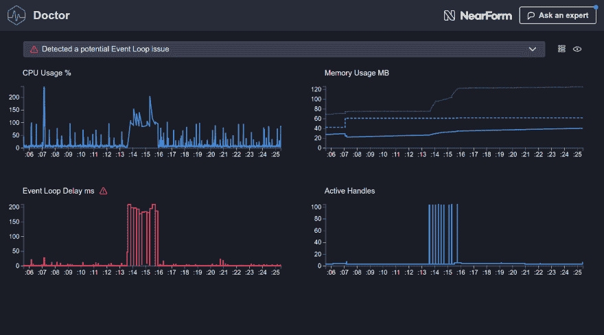
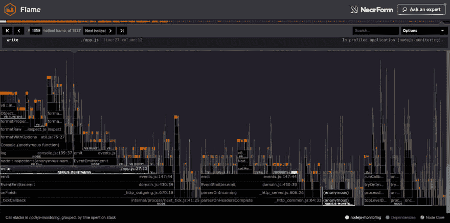
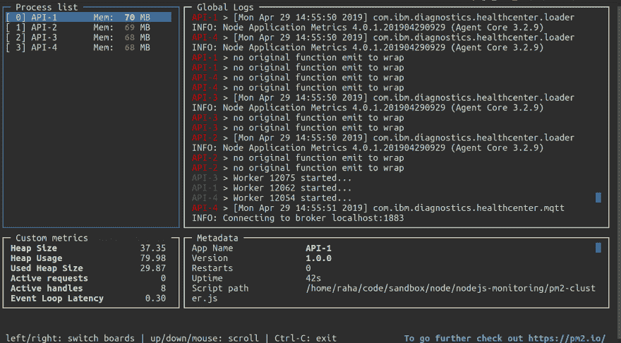

# Node.js 开源监控工具

> 原文：<https://dev.to/sematext/node-js-open-source-monitoring-tools-440a>

[https://api.parler.io/ss/player?url=https://www.parler.io/audio/7723913179/1eb8f9234e500cc772c089ba348248edf768458d.1d238b69-6730-40a0-8aa4-d9a932e47577.mp3](https://api.parler.io/ss/player?url=https://www.parler.io/audio/7723913179/1eb8f9234e500cc772c089ba348248edf768458d.1d238b69-6730-40a0-8aa4-d9a932e47577.mp3)

Node.js 应用程序最重要的特性是什么？你认为它是在为你的全文搜索提供花哨的模糊逻辑，还是在使用套接字进行实时聊天？你告诉我。你可以在 Node.js 应用程序中添加什么最有趣、最棒、最性感的特性？

想知道我的吗？**无停机时间的高性能**。高性能应用程序需要做好三件事。

1.  确保最短的停机时间
2.  具有可预测的资源使用
3.  基于负载有效扩展

在第 1 部分[要监控的 Node.js 关键指标](https://dev.to/sematext/top-node-js-metrics-to-monitor-3460-temp-slug-2084298)中，我们讨论了为了了解应用程序的健康状况应该监控的 Node.js 关键指标。我还解释了 Node.js 中应该避免的不良做法，比如阻塞线程和造成内存泄漏，以及一些可以用来提高应用程序性能的巧妙技巧，比如使用集群模块创建工作进程，以及将长时间运行的进程与主线程分开运行。

在本文中，我将解释如何使用 5 种不同的开源工具向 Node.js 应用程序添加监控。它们可能没有像 Sematext 或 Datadog 那样成熟的功能，但请记住它们是开源产品，可以很好地保持自己的功能。

[](https://res.cloudinary.com/practicaldev/image/fetch/s--9fpGoDrC--/c_limit%2Cf_auto%2Cfl_progressive%2Cq_auto%2Cw_880/https://sematext.com/wp-content/uploads/2019/05/monitoring-overview-1.png)

## Node.js 用 Appmetrics 监控

[Node Application Metrics Dashboard](https://developer.ibm.com/node/monitoring-post-mortem/application-metrics-node-js/)显示正在运行的 Node.js 应用程序的性能指标。这是一个简单的模块，需要安装在主 Node.js 源文件的顶部。您[通过在您的终端中运行以下命令从 npm](https://www.npmjs.com/package/appmetrics-dash) 安装模块。

```
$ npm install appmetrics-dash 
```

Enter fullscreen mode Exit fullscreen mode

Appmetrics 提供了一个非常易于使用的基于网络的仪表板。为了获得应用程序创建的所有 HTTP 服务器的仪表板，您需要做的一切就是将这个代码片段添加到 app.js 文件中，或者您称之为主源文件的任何文件中。

```
// Before all other 'require' statements
require('appmetrics-dash').attach() 
```

Enter fullscreen mode Exit fullscreen mode

现在您将有一个新的服务器路径`/appmetrics-dash`，在这里您可以看到大量有用的指标。

*   CPU 分析
*   HTTP 传入请求
*   HTTP 吞吐量
*   平均响应时间(前 5 名)
*   中央处理器
*   记忆
*   许多
*   事件循环次数
*   环境
*   其他请求
*   HTTP 出站请求

这个工具不仅仅显示指标。它允许您直接从仪表板生成节点报告和堆快照。除此之外，您还可以访问火焰图。对于一个开源工具来说非常酷。

[](https://res.cloudinary.com/practicaldev/image/fetch/s--YWgT6rUT--/c_limit%2Cf_auto%2Cfl_progressive%2Cq_auto%2Cw_880/https://sematext.com/wp-content/uploads/2019/05/screencapture-localhost-3000-appmetrics-dash-2019-04-29-09_51_12-1.png)

## 用快速状态监视器监视 Node.js

[Express.js](https://expressjs.com/) 是 Node.js 开发者选择的事实上的框架。[快速状态监视器](https://github.com/RafalWilinski/express-status-monitor)是一个非常简单的自托管模块，您可以添加到您的快速服务器中。它公开了一个在 [Socket.io](https://socket.io/) 和 [Chart.js](https://www.chartjs.org/) 的帮助下报告实时服务器指标的`/status` route。

从 [npm](https://www.npmjs.com/package/express-status-monitor) 安装工具就是这么简单。

```
$ npm install express-status-monitor 
```

Enter fullscreen mode Exit fullscreen mode

在您安装了模块之后，您需要在任何其他中间件或路由器之前添加它。

```
app.use(require('express-status-monitor')()) 
```

Enter fullscreen mode Exit fullscreen mode

一旦您运行了您的服务器，请转到`/status`路线并检查您的 Node.js 指标。

[](https://res.cloudinary.com/practicaldev/image/fetch/s--OSuPaT6t--/c_limit%2Cf_auto%2Cfl_progressive%2Cq_auto%2Cw_880/https://sematext.com/wp-content/uploads/2019/05/screencapture-localhost-3000-status-2019-04-14-10_31_47-1.png)

## 用普罗米修斯监控 Node.js

除非你生活在岩石下，否则你一定听说过普罗米修斯。这是你今天可以使用的最著名的开源监控工具。Prometheus 是 100%开源和社区驱动的。所有组件都可以在 [GitHub](https://github.com/prometheus) 的 [Apache 2 许可](http://www.apache.org/licenses/LICENSE-2.0)下获得。它也是[云原生计算基金会](https://cncf.io/)的[毕业成员项目](https://www.cncf.io/projects/)，与 [Kubernetes](https://kubernetes.io/) 和 [Fluentd](https://www.fluentd.org/) 等项目并列。

要使用 Prometheus 开始监控，您需要[下载最新版本](https://prometheus.io/download)并安装它。

```
$ tar xvfz prometheus-\*.tar.gz
$ cd prometheus-\* 
```

Enter fullscreen mode Exit fullscreen mode

然后通过运行可执行文件来启动它，但是在运行这个命令之前，您需要创建一个 prometheus.yml 文件。它是一个配置文件，用于通过收集这些目标上的度量 HTTP 端点来从被监视的目标收集度量。

```
# prometheus.yml
scrape_configs:
  - job_name: 'prometheus'
    scrape_interval: 1s
    static_configs:
      - targets: ['127.0.0.1:3000']
        labels:
          service: 'test-prom'
          group: 'production' 
```

Enter fullscreen mode Exit fullscreen mode

现在你可以运行普罗米修斯。

```
$ ./prometheus --config.file=prometheus.yml 
```

Enter fullscreen mode Exit fullscreen mode

不过我比较懒，很喜欢 [Docker](https://www.docker.com/) 。所以我的做法是运行[官方的普罗米修斯 Docker 镜像](https://hub.docker.com/r/prom/prometheus/)，避免下载它的所有麻烦。

## 用普罗米修斯和 Docker 监控 Node.js

首先，导航到 Node.js 应用程序的根目录。在这里，您将创建一个`prometheus-data`目录并将`prometheus.yml`文件放入其中。一旦完成了这些，就可以继续运行 Prometheus Docker 容器了。

您将获得正式的 Prometheus Docker 映像，并使用 docker run 命令运行一个容器。

```
$ docker run -d \
    --name prometheus \
    --network="host" \
    -v "$(pwd)/prometheus-data":/prometheus-data \
    prom/prometheus \
    -config.file=/prometheus-data/prometheus.yml 
```

Enter fullscreen mode Exit fullscreen mode

我选择用`–network="host"`运行容器，让 Prometheus 容器访问我的主机的本地主机，这样做的话，Node.js 应用程序的公开 HTTP 端点。否则，如果您在容器中同时运行 Prometheus 和 Node.js，您将在两者之间设置一个[网络](https://docs.docker.com/network/bridge/)，以便只在彼此之间可见。

`-v`标志将把来自主机的`prometheus-data`目录映射到容器内一个同名的目录。

随着 Prometheus 容器的运行，您可以继续在 Node.js 应用程序中添加所需的配置，以公开度量端点。您需要首先从 npm 安装 Node.js 的 [Prometheus 客户端。](https://www.npmjs.com/package/prom-client) 

```
$ npm install prom-client 
```

Enter fullscreen mode Exit fullscreen mode

然后，您将添加普罗米修斯的基本配置。

```
// after all 'require' statements
const client = require('prom-client')
const collectDefaultMetrics = client.collectDefaultMetrics
collectDefaultMetrics({ timeout: 1000 })
app.get('/metrics', (req, res) => {
  res.set('Content-Type', client.register.contentType)
  res.end(client.register.metrics())
}) 
```

Enter fullscreen mode Exit fullscreen mode

剩下的就是运行 Node.js 服务器并打开`http://localhost:9090/graph`来访问普罗米修斯图。

[](https://res.cloudinary.com/practicaldev/image/fetch/s--bFazMgcX--/c_limit%2Cf_auto%2Cfl_progressive%2Cq_auto%2Cw_880/https://sematext.com/wp-content/uploads/2019/05/Selection_436-1.png)

## 用 Clinic.js 监控 Node.js 性能

[Clinic.js](https://clinicjs.org/) 包括三个工具来帮助诊断和查明 Node.js 的性能问题。它非常容易使用。你需要做的就是从 npm 安装[模块并运行它。这将为您生成报告，使故障排除更加容易。](https://www.npmjs.com/package/clinic)

要安装 Clinic.js，请在您的终端中运行以下命令。

```
$ npm install clinic 
```

Enter fullscreen mode Exit fullscreen mode

一旦你安装了它，就可以选择生成什么样的报告了。你可以在三个之间挑选。

*   **医生**
    *   通过注入探针收集指标
    *   评估健康和启发
    *   创建建议
*   一种全新的、完全独特的分析 Node.js 代码的方法
    *   使用 async_hooks 收集指标
    *   跟踪操作之间的延迟
    *   创建气泡图
*   **Flame**–用 flamegraphs 揭示代码中的瓶颈和热点
    *   通过 CPU 采样收集指标
    *   跟踪栈顶频率
    *   创建火焰图

让我们从运行医生开始，并对 Node.js 应用程序进行负载测试。

```
$ clinic doctor -- node app.js 
```

Enter fullscreen mode Exit fullscreen mode

当它运行时，用您想要的工具运行一个负载测试。

```
$ loadtest -n 1000 -c 100 [http://localhost:3000/api](http://localhost:3000/api) 
```

Enter fullscreen mode Exit fullscreen mode

一旦运行完成，停止服务器，Clinic.js Doctor 将打开一个报告，您可以查看。

[](https://res.cloudinary.com/practicaldev/image/fetch/s--aI4Rsowu--/c_limit%2Cf_auto%2Cfl_progressive%2Cq_auto%2Cw_880/https://sematext.com/wp-content/uploads/2019/05/screencapture-file-home-raha-code-sandbox-node-nodejs-monitoring-clinic-2961-clinic-doctor-html-2019-04-29-13_59_42-1.png)

使用同样的方法，您可以运行 Bubbleprof 或 Flame，并获得相应工具的图形。

[](https://res.cloudinary.com/practicaldev/image/fetch/s--aI4Rsowu--/c_limit%2Cf_auto%2Cfl_progressive%2Cq_auto%2Cw_880/https://sematext.com/wp-content/uploads/2019/05/screencapture-file-home-raha-code-sandbox-node-nodejs-monitoring-clinic-2961-clinic-doctor-html-2019-04-29-13_59_42-1.png)

[](https://res.cloudinary.com/practicaldev/image/fetch/s--x670byZS--/c_limit%2Cf_auto%2Cfl_progressive%2Cq_auto%2Cw_880/https://sematext.com/wp-content/uploads/2019/05/Selection_456-1.png)

## 用 PM2 监控 Node.js

有了 PM2，在生产中运行 Node.js 应用程序变得容易多了。这是一个进程管理器，可以让你轻松地在集群模式下运行应用程序。或者，用英语来说，它将为您的主机拥有的每个 CPU 核心生成一个进程。

首先安装 [PM2](https://www.npmjs.com/package/pm2) 。

```
$ npm install pm2 -g 
```

Enter fullscreen mode Exit fullscreen mode

一旦安装完毕，如果你的主源文件是 app.js，你就可以通过在你的终端上运行这个命令来生成 PM2 守护进程

```
$ pm2 start app.js -i 0 
```

Enter fullscreen mode Exit fullscreen mode

`-i 0`标志代表实例。这将在集群模式下运行 Node.js 应用程序，其中 0 代表 CPU 核心数。您可以手动设置您想要的任何数字，但是让 PM2 计算核心数并产生那么多工作线程要容易得多。

[用 PM2](https://github.com/Unitech/pm2) 监控 Node.js 也一样简单。

```
$ pm2 monit 
```

Enter fullscreen mode Exit fullscreen mode

该命令将在终端中打开一个仪表板。在这里，您可以监视进程、日志、循环延迟、进程内存和 CPU。

[](https://res.cloudinary.com/practicaldev/image/fetch/s--GsnEGFEt--/c_limit%2Cf_auto%2Cfl_progressive%2Cq_auto%2Cw_880/https://sematext.com/wp-content/uploads/2019/05/Selection_458-1.png)

## 用开源工具包装监控节点. js

性能指标对于让用户满意至关重要。在本文中，我向您展示了如何使用 5 种不同的开源工具向 Node.js 应用程序添加监控。在了解了本系列第 1 部分中用于监控的 [Node.js 关键指标之后，添加工具来监控现实生活中的应用程序是自然的学习过程。本系列的最后一部分将介绍使用 Sematext](https://sematext.com/blog/top-nodejs-metrics-to-watch/) 的[生产就绪节点. js 监控。](https://sematext.com/blog/nodejs-monitoring-made-easy-with-sematext/)

如果你想查看样本代码，[这里有一个包含所有样本的 repo](https://github.com/adnanrahic/nodejs-monitoring-sematext/tree/develop) 。您还可以克隆 repo 并立即选择任何工具。

如果您需要软件栈的全栈可观察性，请查看 [Sematext](https://sematext.com/) 。我们正在推动[开源我们的产品](https://github.com/sematext)并产生影响。

希望你们喜欢读这篇文章，就像我喜欢写这篇文章一样。如果你喜欢，点击那个小小的分享按钮，那么更多的人会看到这个教程。下次见，保持好奇，玩得开心。