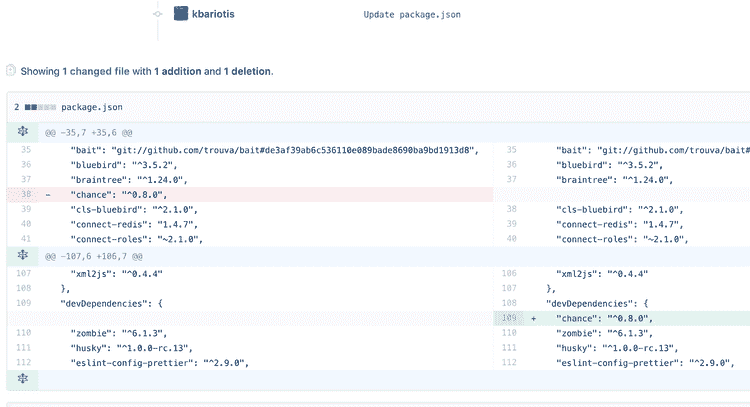

# NODE_ENV:很容易错过你的步骤

> 原文：<https://dev.to/kbariotis/nodeenv-so-easy-to-miss-your-step-okp>

我上周破坏了我们的主要 API。我合并了一个我已经工作了一段时间的公关。它得到了两位同事 green test suite 的两次批准，在本地和我们的试运行环境中运行得非常好，我们在将产品投入生产之前对其进行了测试。不知何故，Node.js 服务器无法在生产环境中启动，我们不得不回滚到上一次部署，导致了 2-3 分钟的停机时间。

从那次经历中我们可以学到很多东西，但我们在这篇文章中要关注的是，为什么 Node.js 服务器在本地和我们的预生产阶段环境中运行良好时却无法在生产阶段启动？继续读。

## 发生了什么？

想看看导致我们产量下降的公关吗？这是:

我将一个依赖项从`dependencies`部分移到了`devDependencies`。在本地重新安装我的依赖项，然后重新运行服务器，一切正常。然后，我部署到我们的舞台，再次，工作非常好。但是，无法在生产中启动。

具体来说，生产服务器无法引导，因为它无法找到`chance`模块。

是啊！真是晦涩难懂！没那么多。让我们从头开始。

Node.js 服务器主要运行在三种不同的环境中。它使用`NODE_ENV`来表示当前的环境。根据它运行的位置，它可以取三个不同的值，`development`表示它在本地运行，`staging`表示它在我们的暂存环境中运行，`production`表示它在我们的生产环境中运行。

这里有一个来自`npm` [docs](https://docs.npmjs.com/cli/install#description) 的有趣片段:

> 使用- production 标志(或者当 NODE_ENV 环境变量设置为 production 时)，npm 将不会安装 devDependencies 中列出的模块。

是啊！`NODE_ENV`实际上会影响您的生产环境，并扩大生产环境与其他环境之间的差距。让我们重温一下[十二因素应用](https://12factor.net/dev-prod-parity)中的一句名言:

> 让开发、试运行和生产尽可能相似。

不幸的是，通过将我们的`NODE_ENV`设置为基于它运行的当前环境的值，我们实际上使我们的环境奇偶校验更大。

事件发生后，我们立即采取的行动很简单。将我们的应用环境从`NODE_ENV`中分离出来。我们引入了`APP_ENV`变量，将所有的`NODE_ENV`事件重命名为该变量，然后将`NODE_ENV`移动到只有在本地运行或运行单元测试时才有值`development`，对于所有其他环境则有值`production`。

另一方面，其他一些库也可能在不知情的情况下使用这个变量。它不会寻找多个值，它只会寻找`production` vs 其他任何值。

那么`NODE_ENV`从何而来，为什么 npm 实际上使用它？Node.js 文档没有提到这种变量。嗯，`NODE_ENV`变量因 [Express.js](http://expressjs.com/) 框架而出名，在该框架中，变量被用来决定是否应该在产品上启用一些开发特性。在人们开始使用它之后，其他项目也开始采用它，我们达到了今天。

## 得出结论

就像我上面提到的，我们从那次事件中学到了不少东西，但是我们立即采取的行动是重新命名`NODE_ENV`,试图保持我们的在线环境尽可能的相似。🤓

你最近采取了什么行动或决定来解决这个问题吗？