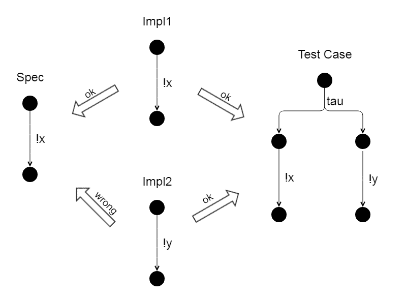

# 测试中的不确定性——如何做错

> 原文：<https://dev.to/frantzen/nondeterminism-in-testing-how-to-do-it-wrong-3ff9>

测试中最容易被误解的概念之一是**不确定性**。因此，让我们首先快速澄清一些概念。我们正在通过在一个**系统**上执行**测试用例**来测试它。测试用例来源于系统的某种**规范**或**模型**。测试用例向系统提供**输入**，并观察**输出**。根据输出，测试用例可以通过**或**失败**。失败意味着已经观察到了一个输出，这个输出不符合产生测试用例的规范。**

一个系统总是处于一个或多个状态。这种状态包括与系统的可观察行为相关的所有方面。例如，咖啡机可能已经打开，并且有足够的水和咖啡豆来供应咖啡。这是咖啡机的一种状态。如果我现在按下咖啡按钮，我希望得到一杯咖啡。相反，如果机器被关闭，或者没有水，我希望按下按钮时不会得到咖啡。这些是咖啡机的其他状态。

当一个系统总是恰好处于一种状态时，它被称为**确定性的**。当一个系统可以同时处于几个状态时，它被称为**非确定性**。这就是困惑的开始。

人们可能会说“每个系统根据定义都是确定性的”。从某种意义上来说，这是对的，但是在很多实际的测试情况下，这是非常错误的。例如，想象一下某个办公室里的商用咖啡机，你甚至不知道里面是否有足够的水和咖啡豆。所以即使机器处于一个特定的状态，你也不知道那个状态。但你仍然可以处理它:你按下按钮，当你没有咖啡时，你要求服务人员重新加水和咖啡豆(或者你只是踢踢机器，然后走开)。这样做就是所谓的**非确定性测试用例**。它是一个测试用例，可以处理系统的几种状态，这意味着根据测试用例观察到的内容(有咖啡或没有咖啡)，测试用例向一个方向或另一个方向前进。

我们来看一些比较常见的例子。例如，假设您正在测试一个在线商店。所以你查询一个产品。现在你可能会得到两个答案(即输出):该商品有货，或者卖完了。当它有货时，您继续测试订单流程。如果卖完了，你试试别的产品。同样在这里，系统处于一种状态，但是你不知道那种状态。为了能够处理这两种状态，你需要非确定性。

或者，假设您正在某个观察点测试一个系统，您不知道事件发生的确切顺序。这对于复杂系统来说是很常见的。但是你也可以简单地**不关心**一些事件发生的顺序。如果在启动操作系统时，您的 messenger 先启动，然后是日历应用程序，或者反过来，都没有关系。但两者都必须开始，这很重要。这里你也需要非确定性来处理它。

因此，非确定性是一种非常重要和有用的方法来指定和测试系统。不幸的是，许多工具不能处理不确定性。您只能在您的测试用例中指定一个允许的输出，所有其他的都被认为是错误的。这是这些工具的一个非常基本的限制。

但是，更糟糕的是，当工具允许不确定性时，人们倾向于错误地使用它。看一个我作为测试架构师工作的项目的例子:我们正在开发一个允许两种方式登录站点的网页，或者通过一些客户号或者通过电子邮件。您可以通过单击登录模块中的某个 GUI 元素在这两个选项之间切换。最初加载页面时，它总是在“通过客户编号登录”选项中。

当我在处理一个测试用例时，首先登录一个成员(通过客户号)，我检查了这个登录方法的测试代码，看到基本上是这样的:

```
function loginMemberWithCustomerNumber($member) 
{
  if (the login module expects an email)
  {
    click the GUI element to switch to login via customer number;
  }
  login the $member via its customer number;
} 
```

测试人员为什么要这么做？简单地说，这个函数是健壮的，因为它可以处理两种情况:

1.  登录模块需要一封电子邮件
2.  登录模块需要一个客户号

不过，花点时间想想为什么这可能是糟糕的测试代码！

首先，这段代码在测试中引入了不确定性。我们现在可以处理一个处于两种不同状态的系统。根据我们所处的状态，我们的行为会有所不同。但是我们也说过，这只有在我们不知道系统处于哪种状态时才有用！但是，对于我们的 web 页面示例，我们知道登录模块处于哪个状态，因为最初它总是处于“通过客户号登录”状态。这甚至是一个要求，因为大多数客户使用这个变体登录，所以它必须是默认的。因此，当我们加载页面时，登录模块不是处于“通过客户号登录”状态，而是处于“通过客户电子邮件登录”状态，这实际上是一个缺陷。现在的问题是，通过在测试代码中添加不确定性，我们失去了发现这个缺陷的能力。如果登录模块处于错误的状态，测试用例通过切换到正确的登录方法来纠正它。

让我用一点理论来结束这个例子。我们很幸运，手头有非常坚实的试验理论，可以为所有这些考虑提供一些基础。下一张图展示了上面的例子，参考了基于过渡系统的理论，比如最著名的 Jan Tretmans 的理论。

[](https://res.cloudinary.com/practicaldev/image/fetch/s---Zmy0md4--/c_limit%2Cf_auto%2Cfl_progressive%2Cq_auto%2Cw_880/https://thepracticaldev.s3.amazonaws.com/i/y2p49umxwnevxy2nspqf.png)

你看这里的说明书上写着！x 必须第一”(看到了！x，因为登录模块处于“通过客户号登录”状态)。旁边是两个实现。Impl1 做对了，Impl2 做错了，从“！y 必须第一”(看！y，因为登录模块处于“通过客户电子邮件登录”状态)。当然，在 ioco 这样的一致性关系中，Impl1 是正确的，Impl2 是错误的。但是现在看看不确定的测试用例。它做我们的函数所做的，它允许两种状态(“tau”表示不可观察的步骤)。但是有了这个测试案例，Impl2 现在也是正确的，我们失去了发现 Impl2 是错误的能力。

这可能看起来有点吹毛求疵，但是我总是发现这种错误的方法，我总是需要争论，因为测试人员认为她或他写了一个非常奇特的方法，可以处理系统的各种状态。而且这是真的！但是当我们并不真正需要它的时候，它对于测试来说很糟糕，因为它去除了缺陷检测能力。

另一个非常常见的例子是测试数据。当测试一个系统时，你应该尽一切努力来控制你的测试数据(比如系统中有哪些客户，客户做了哪些交易，向一个特定的客户显示了哪些优惠，等等。).只有当你真的无法控制这一点时，你才需要不确定性——然后它就非常非常有用了！但是，当您能够控制您的测试数据时，请忘记这里的不确定性！同样，测试人员倾向于编写非常奇特的方法，通过分析网页或数据库来发现可用的测试数据，例如试图找到一个特定的客户交易来继续测试，等等。然后你总是看到失望的面孔说:我们不需要那个！我们知道测试数据，我们甚至可以在我们的测试中硬编码它，**我们知道系统的状态**，我们不需要**学习**它！因为学习总是意味着允许不止一种状态。

不确定性总是增加测试代码的复杂性，你会得到所有这些条件，可能是异常处理和相当复杂的 SQL 语句，等等。因此，您肯定需要开始为您的测试编写测试，并且您会失去测试代码的稳定性和可读性。

总结如下:

*   让测试代码尽可能简单
*   尽你所能控制
*   尽可能避免不确定性
*   当你真正需要的时候，喜欢不确定性