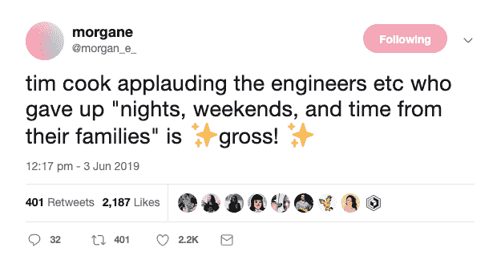

# WWDC2019:当然需要加班

> 原文：<https://dev.to/_adam_barker/notes-from-wwdc-should-we-put-overtime-to-bed-15e1>

蒂姆·库克在最近的 WWDC2019 活动上发表的评论引起了很大的反响。

他赞扬了那些放弃了“夜晚、周末和家庭时间”的工程师和其他员工。

这肯定是一个两极分化的评论。对于员工受到的待遇以及让他们感到有义务投入额外时间的方式，回应中充满了各种不同的意见。

在苹果公司的案例中，毫无疑问，有一大堆复杂的原因导致人们过度工作来准备这次活动。除了举办活动和邀请行业专业人士和媒体的后勤工作之外，作为一家受到这种审查的公司，还有巨大的压力(理解为*华尔街*)——这种压力会在越接近截止日期时成倍地感受到。

在其他行业，压力来自客户。在一些法律领域，就像在咨询游戏中，客户在很大程度上决定了时间框架，你最终会看到团队成员连续工作几天，没有休息，以满足最后期限。

常识告诉我们，客户应该明白，如果你的咨询团队夜以继日地工作，不睡觉，他们就不会为你做出最好的工作。然而，市场并不是根据常识运行的。客户也知道谈判的价格，如果团队没有足够的员工在不加班的情况下管理项目，那么就雇佣更多的员工。这是你的问题，不是我的。

实际上，我认为软件开发行业在管理这个问题上做得很好，因为我们喜欢各种各样的方法来帮助我们在任何给定的项目中跟踪和管理时间。

有了敏捷，我们可以将一个项目分解成冲刺，并相当准确地评估工作。敏捷不仅在让软件开发对更广泛的受众可见方面做了很多工作，而且还帮助我们避免了所谓的死亡行军:为了满足某个任意的截止日期而全天候工作，并在过程中打乱了我们的日常工作。

我认为将加班融入你们的文化从根本上来说是错误的。

我认为，有人选择额外投入一两个小时来确保第二天有一个坚实的开端，或者为未来的事件建立一些额外的保险是好的。作为一名开发人员，如果我在做某件事，时间在流逝，我会秘密地和自己协商，以达到某个点，因为明天从一个更干净的点开始，我会快乐得多。在某种程度上，额外的努力锁定了我以后的动力。

我也很喜欢加班能得到逐案奖励。相比之下，你可能会得到额外报酬，因为你知道你的咨询工作意味着你将一直受制于新的截止日期。你会一直加班。

我更喜欢*按需*模式——可能会有一个重要的演示，我们可能需要重整旗鼓，但在那个关键时期之后，团队需要感觉到努力在个人层面上是有价值的。他们应该立即得到休息时间(数倍于他们所承诺的额外工作时间)或额外报酬(数倍于他们的小时工资)。

加班是常事，也是不可避免的，但雇主和雇员之间的关系才是最重要的。任何雇主都不应该认为员工是理所当然的，认为加班是理所当然的。每个人在生活中有不同的优先考虑，当你期望得到额外的回报时，你需要付出额外的回报。

* * *

让我知道你的想法！我很想听听你的经历——你是否觉得自己被利用了，或者当关键时刻到来时，你是否觉得得到了适当的补偿。