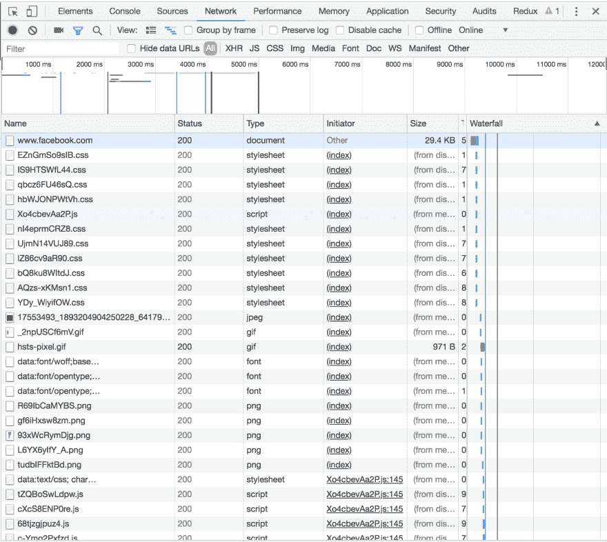
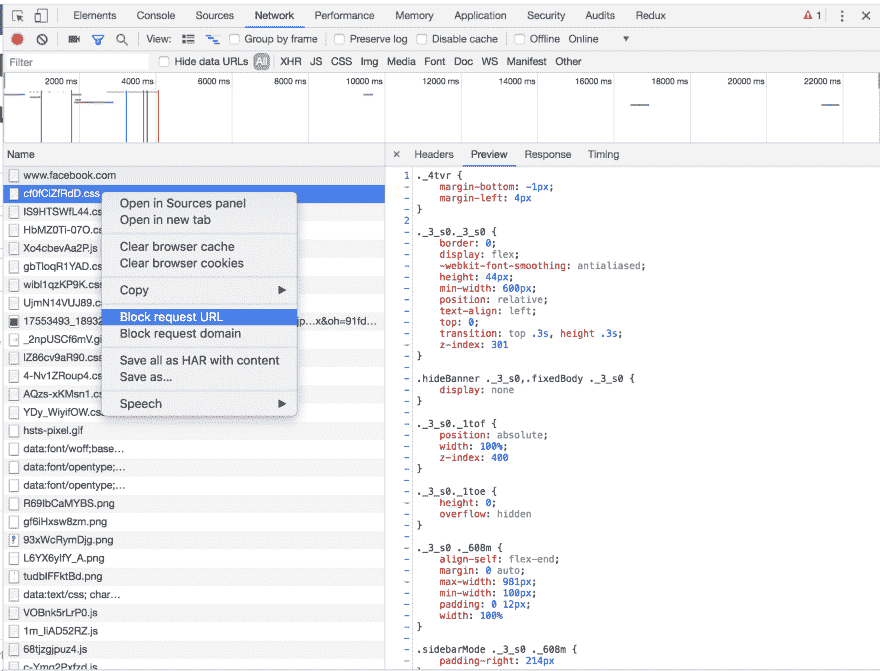
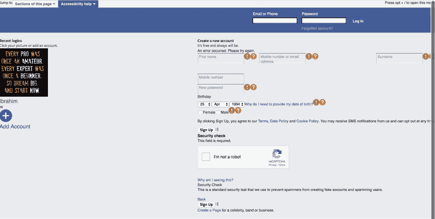

# 现在我知道为什么我可以从世界任何地方访问脸书了

> 原文：<https://dev.to/tosinibrahim96/now-i-now-know-why-i-can-access-facebook-from-anywhere-in-the-world-26jg>

所以，实际上我正在向 www.internetfundamentals.com 学习互联网的基础知识，第一课是关于客户端和服务器的。为了巩固我的理解，我试图用脸书作为一个案例来向自己解释。

如果马克·扎克伯格在他的电脑上设计了 facebook，那我怎么能从尼日利亚访问同样的应用程序呢？他是否在使用某种可以从世界任何地方访问的计算机？但是，等一下，他肯定不会使用他当时使用的同一台计算机系统，对吗？..呵...我明白了..他只是用闪存盘将文件转移到他的新系统，并在他的新系统上做了一些我不知道的配置，使脸书可供世界上任何人使用。

至少在我听说客户端和服务器这两个词之前，我以为马克·扎克伯格是这么做的。作为 web 开发人员，我们用就在我们面前(客户端)的计算机系统来构建我们的应用程序，但是我们如何让世界上任何地方的任何人都可以访问它们呢？事实证明，我们实际上需要将这些应用程序移动到一个地方，或者我应该说，另一个系统有能力确保来自完全不同大陆的人可以访问我们的应用程序(服务器)。

好吧，至少现在我知道马克·扎克伯格用一台客户端电脑建造了脸书，然后把它转移到一台服务器上，这样我就可以从尼日利亚访问它了。谢谢马克。

## 当我想查看 facebook 的主页时会发生什么

根据我目前的理解，这里有一个插图，描述了我的计算机系统(客户端)和马克·扎克伯格上传包含 facebook 代码的文件的计算机系统之间的交互。当我在地址栏输入[www.facebook.com](http://www.facebook.com)时，它会启动我的系统(客户端)和服务器之间的对话，大概是这样的。

我的电脑:嘿，服务器，我需要脸书的主页，你能帮我吗？

服务员:给你，伙计，这是主页。

这里先澄清一下，服务器实际上并不是像我们在图中看到的那样发送主页，它发送的是一堆被浏览器解读的文件，形成我们看到的主页。我们实际上可以查看服务器在我们发出请求后发送的所有文件..耶！！！

我实际上使用的是谷歌 chrome 浏览器，但我确信其他浏览器的命令可能类似。
按 Command+Option+C (Mac)或 Control+Shift+C (Windows、Linux)。
导航至网络选项卡并重新加载页面

现在，我们可以看到构成脸书主页的文件、图像和字体。

## 我们来玩一点这个。

右键单击第一个 CSS 文件，并选择 BLOCK REQUEST URL 以在页面重新加载时排除该文件。
[T3】](https://res.cloudinary.com/practicaldev/image/fetch/s--r_-hoYWT--/c_limit%2Cf_auto%2Cfl_progressive%2Cq_auto%2Cw_880/https://i.imgur.com/IMKcBrp.png)

现在重新加载页面，看看屏蔽 CSS 文件后我们的 facebook 主页是什么样子

呜...这是我的 facebook 主页在不加载 CSS 文件后的样子。

这是我对我们如何从世界任何地方访问网站的基本理解。如果有任何你认为我应该做的更正或任何补充，我会感谢你的反馈。谢了。