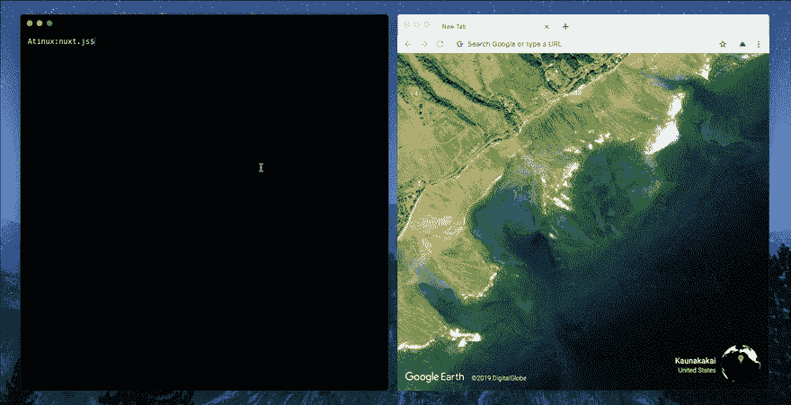

# NuxtJS:从终端到浏览器

> 原文：<https://dev.to/nuxt/nuxtjs-from-terminal-to-browser-35bc>

我们如何改变开发者的体验来停止在终端和浏览器之间切换。

> Nuxt.js 是一个 Vue.js 框架，用于创建不同种类的 web 应用程序，具有**相同的目录结构&约定**:通用、单页面、PWA 或静态生成。

*ℹ️这些特性在 [v2.8.0 版本](https://github.com/nuxt/nuxt.js/releases/tag/v2.8.0)中都有。*

## 问题

1.  使用 Webpack 或任何 bundler 开发 JavaScript 应用程序需要在浏览器和终端之间切换，以便进行调试。
2.  在 app 服务器渲染时使用`console.log`进行调试，需要记住刷新页面时会在终端上显示日志。

## 方案

1.  在浏览器中转发 Webpack 构建状态，并以一种奇特的方式显示它们。

1.  对于热模块替换也是如此(当项目变得更大并且需要更多时间来重新构建时，这非常有用)。

1.  在开发模式下将 SSR 日志转发到浏览器

## NuxtJS 视觉

这些更改的目的是将终端仅用于命令。

现在你可以专注于你的代码和它的视觉效果🙂

> 懒惰，聪明，无知。

链接:

*   文献:[https://nuxtjs.org](https://nuxtjs.org)
*   GitHub:[https://github.com/nuxt/nuxt.js](https://github.com/nuxt/nuxt.js)
*   加载屏幕源代码:[https://github.com/nuxt/loading-screen](https://github.com/nuxt/loading-screen)
*   推特:[https://twitter.com/nuxt_js](https://twitter.com/nuxt_js)