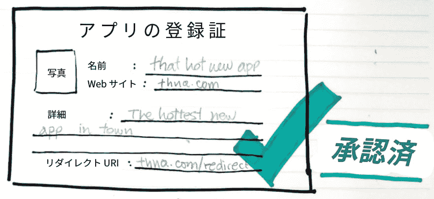
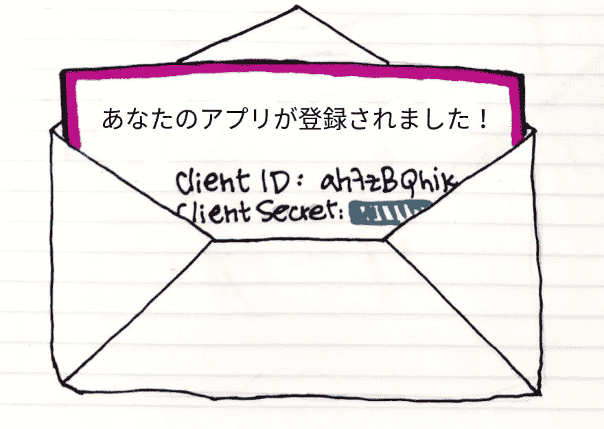
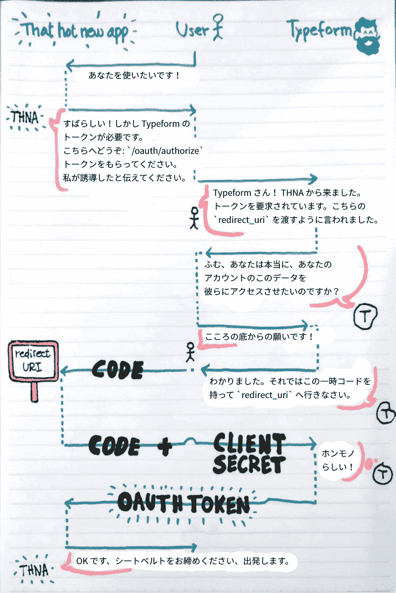
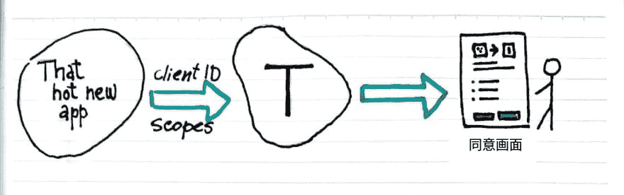

# OAuth 与舞蹈:分步式指南[翻译文章]

> 原文：<https://dev.to/nabbisen/oauth-----30ob>

本文为以下文章的翻译:
[dancing with oauth:a step by step guide](https://dev.to/anabella/dancing-with-oauth-emp)by [anabella](https://dev.to/anabella)
<small>*在得到笔者许可的基础上</small>

* * *

*本文原本是在[freeCodeCamp](https://medium.freecodecamp.org/how-to-dance-the-oauth-a-step-by-step-lesson-fd2364d89742) 上公开的*

开始学习新的东西并努力实践的时候，通常一决定就马上有一种无止境的舞蹈动作持续着的感觉。
于是，我吝啬地到处寻找正确的做法，但现实很残酷，我无法理解现在发生了什么，怎样才能摆脱那个房间没有墙壁的地方……

在什么齿轮开始顺利啮合之前，只能拼命地做。

也许，是我的学习过程有原因。
也许，指南和教程是以更熟练的人和有技术的人为对象的。
但是，我觉得，在关于对象主题的令人捧腹大笑的举句中，无论何时，为了理解关键的理念，甚至为了更容易地将其应用于项目，都可以有简单的指南。

因此，这次我决定不再光许愿，而是自己试试。
经营的是我所学的东西中最新的东西。

要说那是什么，那就是 OAuth 2.0。

## 欧文斯とは？

从最基本的开始吧:
OAuth 是指**开放授权( Open Authorization )**。
是指授权某个 APP 应用程序或网站访问其他网站提供的用户私人数据的过程。

此处提到的其他网站通常充当受信任身份信息的提供商(提供者)。
对于发送请求的 APP，提供一些关于你的基本信息。
这样可以让 APP 制作配置文件信息。
这样，你就不用填无聊的申请书了，也不用想出更多的新密码了

你已经使用了这个机制很多次，即使估算得少也是如此。
实际上只使用了点击“用 Facebook / Google / Github /...登录”的次数。
那个时候，下一步应该会显示同意画面吧。
在那里，对于你(例如) Facebook 的配置文件内的哪个信息，*that-hot-new-app.com* 进行读取(进而根据情况进行写入)
授权后，*that-hot-new-app.com* 信任 Facebook 提供的身份信息，根据接收到的数据，在自己的数据库中制作你的配置文件

*that-hot-new-app.com* 与 Facebook 的互动往往就此结束。
就是这个原因，即使你在 Facebook 上更改个人资料图像，互联网上的所有个人资料图像也不会改变。
APP 不会再次询问 Facebook 并请求更新后的数据。

### 音乐随着木琴的节奏开始 ......

建立这种机制还有其他目的。
其中之一是更有前景的东西:
将身份信息的提供者作为服务提供者使用。
(这是现在正在努力的主题。 )
如果可以实现的话，可以定期使用这个机制，向你的 APP 的用户提供扩展功能。

有一个很好的例子。
[Relive](https://www.relive.cc/) 这个服务。
通过连接多个体育追踪 APP，生成针对你跑步或乘坐交通工具的地球视图的视频。
Relive 在结束活动的时候，会询问是否生成视频。
选择 Yes 的话，会开始处理，在社交媒体上可以炫耀的时候……也就是可以分享的时候告诉你。

这里提到的两种使用方法实际上没有技术上的差异。
因此，关于使用社交媒体和 Google / Gmail 账户登录到哪里，可以说应该有所意识。

可能听起来像是可怕的事情吧。
但其实我并不害怕。
只是要记住以下事项。
您已经授权*that-hot-new-app.com* 访问某些关于您的信息，详细情况将显示在同意画面上。
将来再利用的情况下，也是基本的。
注意承认的权限，在感觉不可靠的时候随时可以将其无效化。

例如，假设您使用谷歌帐户访问*that-hot-new-app.com* 。
今后不想允许的情况下，只需前往[Google 的账户设定](https://myaccount.google.com/security#connectedapps)，禁用对象的访问即可。

所有主要身份信息的提供商都提供了执行此类操作的方法。

## 登台前整理一下仪容吧

在你进入*that-hot-new-app.com* 之前，甚至在点击“用喜欢的身份信息提供商登录”之前，有人——可能是开发者——

在这里注册*that-hot-new-app.com* 。
这样，在接下来的步骤中，提供商会掌握是谁请求了私人数据。

在这一步中，开发者应该设置有关 APP 应用程序的信息。
APP 或者网站的名字——更重要的东西——像重定向 URI 这样的信息。
提供商( Google 或 Facebook 等)使用该信息与请求的 APP 进行通信，向 APP 或网站传达用户认可的信息

[](https://res.cloudinary.com/practicaldev/image/fetch/s--CoEQgLYk--/c_limit%2Cf_auto%2Cfl_progressive%2Cq_auto%2Cw_880/https://thepracticaldev.s3.amazonaws.com/i/1gmgtwo7xwqt387whv0g.jpg)

注册 APP 后，提供商将向*that-hot-new-app.com* 发送`clientId`和`clientSecret`。
它们用于相互之间的通信。
作为与登录的 APP 相关的用户名和密码一样的东西发挥作用。

[](https://res.cloudinary.com/practicaldev/image/fetch/s--n3f_fi-x--/c_limit%2Cf_auto%2Cfl_progressive%2Cq_auto%2Cw_880/https://thepracticaldev.s3.amazonaws.com/i/nin1dkxoevtalv8r5h4h.jpg)

有非常重要的事情。
APP 应用的信息(重定向 URI、clientId，以及尤其是 clientSecret )必须保存在安全的地方。
如果有人获得对它们的访问，并基于它们，能够请求提供商代替你发送私人用户数据，从而导致数据被用于恶意用途！

我不希望那样，对吧？

### 把手绕到对方的腰或肩膀上吧

除了以上设置之外，开发人员还需要了解提供商发送的数据以及数据的划分方式。

这个“区分(段)”被称为*作用域*。
用于定义访问权限。
一般分为读/写类别。

因此，例如，假设*that-hot-new-app.com* 可以请求`profile:read`和`contacts:read`的作用域。
这意味着:
即*that-hot-new-app.com* ，只要是提供商分配给" profile "以及" contacts "的信息，则进行读取 不能更改。
而且，其他信息本身是无法访问的。 例如，投稿信息、对什么撒了稻的信息等。

那么，现在，我们来简单地捕捉一下事件吧。
准备好了吗？
*that-hot-new-app.com* 是网站。
[Typeform](http://typeform.com/) 与制作漂亮智能外形的服务集成。 这里也是我工作的公司
你现在一定想马上跳进最热门的东西里，到处看看吧。
那么按网站上的“用 Typeform 登录”，马上行动吧。
接下来会发生什么呢？

这是手工制作的有机、无胆固醇的图表。
用作表示整体情况的地图。
虽然看起来有点复杂，但不要担心。
接下来对各步骤进行说明。

[](https://res.cloudinary.com/practicaldev/image/fetch/s--gL8P-3PH--/c_limit%2Cf_auto%2Cfl_progressive%2Cq_auto%2Cw_880/https://thepracticaldev.s3.amazonaws.com/i/95kdhfyfkqb3qe3c8xbd.png)

## 认可:为了和 OAuth 开始跳舞，跳第一步吧

来吧，拿起那只手，按“用 Typeform 连接”吧。
看，*that-hot-new-app.com* (从这里开始记为 THNA。 我已经厌倦了写破折号分隔的词)，但我会将你转发到 Typeform 授权端点(/oauth/authorize )。
届时将提供这些东西:

*   clientid (请记住这是 thna 的用户名)
*   希望的范围(或访问权限)
*   重定向 URI (重新通知) (因为已经预先配置，所以这是 Typeform 已经知道的内容。 但是从慎重担保安全性的角度再次通知。 ）

转发吗的 url 是这样的吧:

```
https://api.typeform.com/oauth/authorize?client_id=yourClientId&scope=accounts:read+forms:read+results:read 
```

Enter fullscreen mode Exit fullscreen mode

Typeform 使用这些信息生成同意画面。
你可以在那里评论 THNA 想要给予可以看到和处理什么样的东西的认可。

[](https://res.cloudinary.com/practicaldev/image/fetch/s--A0SfuC0g--/c_limit%2Cf_auto%2Cfl_progressive%2Cq_auto%2Cw_880/https://thepracticaldev.s3.amazonaws.com/i/un6ct6ia5pvxtf4ioxep.jpeg)

**完全阅读要同意的内容后**按下“允许”和幸福的心情，Typeform 就会将你转发到重定向 URI。
届时，会传递临时代码。
就是这个样子:

```
https://that-hot-new-app.com/auth/redirect?code=xxxXXXxxxXXXxxx 
```

Enter fullscreen mode Exit fullscreen mode

## 令牌:下一步让 OAuth 和探戈(即 tangOAuth )跳舞吧

看着至今为止的整体来来去去，会不会有和谁一起在探戈里跳来跳去的感觉呢？

与 OAuth 跳舞的下一步是 THNA 接收刚才的代码，并将其转换为 OAuth 的令牌。

正如您刚才看到的那样，在这个舞台上，THAN 获取了表示所有请求内容的临时代码。
把这个作为加密发信内容的方法来处理吧。

> “嗨，你还记得我吗？ 我是 THNA。 我从这边的用户那里听说可以看到你的表格和主题。 如果准备好了的话，请从这里的重定向 URI 发送用于那个的令牌。 ”

为了报答你走了所有的步骤，并且没有踩过任何人的脚尖，THNA 将会获得耀眼的 OAuth 令牌
用它来奖励用户(也就是你！ )而是可以与 Typeform 进行交互，在需要它的地方请求授权数据。

## 靠在一起( stay )，摇晃身体( sway )吧

从现在开始，对于 THNA 代表您发送到 Typeform 的所有请求，必须使用访问令牌授予授权标头。
在此基础上，Typeform (或其他某种提供商)可以识别以下内容:

*   是谁在请求数据(这次是 THNA )
*   是关于谁的数据(是你啊！ ）
*   此外，索赔人是否确实获得了对该数据的访问的合法授权(仅限于您同意的内容)

## 舞池准备好了

来吧，你知道了关于 OAuth 和舞蹈技术的所有步骤和旋转。
所以，你可以创造自己的编舞，也就是说可以进一步发展吧。
然后可以让网络成为更棒的地方吧。

* *手绘插图的同时，敬具*

* * *

*如果你想寻求更深入、更实地体验 OAuth 2.0 的方法，我强烈推荐 Net Ninja 的 PassportJS 教程。 (以 nodejs APP 为题材)涵盖了了解如何构建 OAuth 2.0 所需的所有基础。 而且理论和实践的平衡非常好。 对我来说，这是在理解这里记载的所有事情的过程中的转折点。*

[https://www.youtube.com/embed/sakQbeRjgwg](https://www.youtube.com/embed/sakQbeRjgwg)

* * *

谢谢您的阅读。

本記事は、以下の記事の翻訳です:

致安娜贝拉:非常感谢你允许我翻译你的文章。