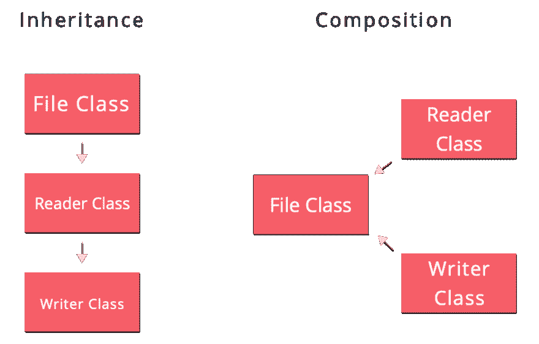

# 面向对象编程

> 原文：<https://dev.to/blackcat_dev/object-oriented-programming--1oie>

*最初发表于[sasablagojevic.com](https://sasablagojevic.com/object-oriented-programming)T3】*

这篇文章的目的是以一种更容易理解的格式为新开发人员分解 OOP 的主要概念，我希望他们在阅读之后能对面向对象的范例有更好的理解。

* * *

我们都知道大多数新手开发人员更喜欢弄脏自己的手而不是去阅读，所以我会尽量减少废话。当我还是编程新手时，当我第一次钻研 OOP 世界时，学习什么是*类*和什么是*对象*是比较容易的部分。将它们应用于我试图解决的现实世界问题是棘手的部分。

*   我如何构建我的代码？
*   我的*课*应该关注什么？
*   我应该把这个*类*拆分成更多吗？
*   我的*类*的公共 API 应该是什么样子的？
*   方法应该如何与*类*的名字一起命名？
*   这个方法应该是静态的吗？

这些都是我问自己的问题。

由于我是自学成才的开发人员，缺乏一些理论知识，所以我决定多读一些关于 OOP 和设计模式的知识。以前我一直凭直觉做事，这让我感觉很好。我走在正确的轨道上，我在职业生涯中取得了进步，没有人抱怨我的代码，相反，但有时你需要更深入地理解，事情如何“在引擎盖下工作”，以将你的知识和职业生涯带到下一步。

这篇文章的目的是为新开发人员分解 OOP 的主要概念，我希望他们在阅读之后对面向对象的范例有更好的理解。它的目的是作为一个小抄，他们可以回来重温他们的知识，不仅是他们，包括我自己；)

## 条条大路通罗马

为了更好地理解 OOP 以及人们试图用它来解决什么问题，我们将简要回顾一些不同的和最常见的编程范例。虽然大多数现代语言在其生命周期中的某个时刻都有多范式方法，但它们可能没有。这是一个迭代的过程，从汇编程序到 PHP 有很长的路要走。

### 编程范例

*   **祈使句**
    *   程序的
    *   ...
*   **结构化**
    *   面向对象
    *   ...
*   **声明式**
    *   功能的
    *   ...

在**命令式编程**中，我们给计算机下达指令做什么以及按照什么顺序去做。每次我们告诉计算机通过存储在变量中来记忆一些东西，我们都在使用*语句*来改变程序的全局状态。你已经可以看到在有很多开发人员的大型程序中这是如何变得混乱的，因为他们都在直接改变全局状态，产生错误和覆盖数据的几率很高。

**过程化编程**，虽然经常被用作命令式编程的同义词，但实际上是命令式范式的扩展。在过程化编程中，我们将上述指令分成过程，也称为[子程序](https://en.wikipedia.org/wiki/Subroutine "Subroutines")或函数。过程只是一组指令，一个模块单元，我们可以通过调用它在程序中重用它，而不必重新编写具体的步骤。但是在这一点上，你已经知道了这一点；)过程化编程给我们带来了[块](https://en.wikipedia.org/wiki/Block_(programming) "Blocks")和[作用域](https://en.wikipedia.org/wiki/Scope_(computer_science) "Scope")的概念，这给了我们一种新的状态类型*局部*。本地状态意味着只在特定过程的上下文中有效。

正如我们所看到的，过程化编程的重点是将计算机指令分解成变量和子程序/函数，而在面向对象编程中则是将其分解成 T2 对象 T3。

对象通过方法(类/对象函数)暴露它们的行为，并以[成员/属性](http://php.net/manual/en/language.oop5.properties.php "Properties")的形式拥有自己的内部状态。方法和属性对于外界来说可能是可访问的，也可能是不可访问的，这取决于它们的[可见性](http://php.net/manual/en/language.oop5.visibility.php "Attribute and Method visibility")。

所以你看，*过程化的*和*面向对象的*范例都试图解决相同的问题:改变全局状态和将复杂的任务分解成更小的模块单元(子程序/函数对对象)，用他们各自的方式。

面向对象编程的核心就是发送消息和响应消息。

> 在过程式编程中，一个过程被表达在一个地方，其中一系列指令按顺序编码。而在面向对象中，过程被表示为对象间的一系列消息。(David Chelimsky 在《应用于方法的单一责任》中)

在我看来，这最好用 [*告诉不要问*](https://martinfowler.com/bliki/TellDontAsk.html "Tell Don't Ask") 的原则来描述。

> 不要询问你做工作所需的信息；要求有信息的对象为你工作。(艾伦·霍卢布-霍卢布谈模式)

让我们用通俗的语言对此进行一点扩展。与我们将数据从一个函数传递到另一个函数、操纵它并返回它的过程和函数范例相反，在 OOP 中，我们希望封装该数据的对象(在其内部状态中包含该数据)为我们进行操纵。我们通过向它发送一条*消息来实现这一点。*在接收到我们的消息后，对象将基于其内部知识和方法确定它将给我们什么样的*响应*。

更简单地说，*消息*是我们的方法调用，*响应*是这些方法返回的数据。请记住，方法可以是空的，这意味着它们不返回任何数据，它们只是改变对象的内部状态，但您可以了解它的要点。

所以实际上，它看起来会像这样。*免责声明*这是一个高度简化的示例，仅用于说明目的。

```
function mark_as_read(array $email) 
{
    $email['is_read'] = 1;
    return $email;
}

$email = [
    "from" => "Marry Doe",
    "to" => "John Doe",
    "subject" => "Dear John",
    "body" => "I\'m leaving you"
];

mark_as_read($email);

// vs.

class Email {

    protected $from;

    protected $to;

    protected $subject;

    protected $body;

    protected $isRead;

    public function __constructor(string $from, string $to, string $subject, string $body)
    {
        $this->from = $from;
        $this->to = $to;
        $this->subject = $subject;
        $this->body = $body;
    }

    public function markAsRead(): Email
    {
        $this->isRead = 1;
        return $this;
    }

    public function isRead(): bool
    {
       return $this->isRead === 1;
    }
}

$email = new Email("Marry Doe", "John Doe", "Dear, John", "I'm leaving you.");

$email->markAsRead(); 
```

OOP 的创始人之一 Allan Kay 有一个很好的比喻，他说*对象*就像我们身体中的细胞，是组成我们人类的小型独立单元。

好吧，仅仅因为我们现在知道如何在一个类中填充函数和数据并不意味着我们知道 OOP，让我们现在把所有东西都做成一个类是一个常见的新手陷阱。还有几件事我们需要牢记在心！:D，但是在进一步讨论之前，让我们简单回顾一下最后两个范例。

与命令式范式相反，**声明式**范式告诉计算机我们想要什么，而不是如何得到它的步骤。声明式编程语言的一个完美例子是 **SQL** 。

**Functional paradigm** 是 declarative paradigm 的一个子集，它使用声明/表达式，不像命令式家族中的语句，但像它的对应物一样，它也试图解决操纵全局状态的问题。在函数式编程中，程序被认为是纯函数的集合。 [纯函数](https://en.wikipedia.org/wiki/Pure_function "Pure functions") 是接受输入并总是返回新值的函数。它们从来没有副作用，它们从来不会改变状态，并且在给定相同输入的情况下，它们总是被期望给出相同的结果。所以在函数范式中，状态是不可变的。

[@AnjanaVakil](https://twitter.com/AnjanaVakil "Programming Across Paradigms") 在她在 WebcampZG 2017 的[编程跨范式主题演讲中说得更明白，我推荐你观看。](https://2017.webcampzg.org/talks/programming-across-paradigms/ "WCZG 2017 - Programming Across Paradigms")

## 面向对象的基本原则

### **单一责任**

一个类应该只关心和处理我们试图解决的复杂问题的一个方面。这并不意味着一个类应该只有一个责任，这不是一个函数，它可以有多个，但它们都需要成为**一个**更广泛任务的一部分。当我们说*单一责任*时，我们是从我们的业务/领域逻辑的上下文来谈论的。例如，让我们看看 PHP 的内置 *SplFileObject* ，该类负责:

*   阅读文件，
*   写入文件时，
*   检查文件是否存在，
*   检查给定的路径是否是文件或目录等。

但是所有这些动作都在一个更广泛的任务的保护伞下，*与文件*交互。

### **抽象**

在这种情况下，抽象是接口和抽象类的总称。在 PHP 中，这是两个主要的抽象机制。

**[界面](http://php.net/manual/en/language.oop5.interfaces.php "PHP - Interfaces") 是行为契约**。我们使用它们来定义类的公共 API，并确保当消息被发送到实现该接口的类实例(对象)时，该对象将总是根据定义做出响应，否则程序将失败。换句话说，接口定义了一个类需要实现的方法，这样我们的程序才能正常工作，否则就会崩溃。

*   接口不能被实例化
*   接口只能有方法签名
*   接口上不能声明属性(尽管 PHP 允许它们有常量)
*   接口只能有公共方法

**[抽象类](http://php.net/manual/en/language.oop5.abstract.php "PHP - Abstract Classes") 也是行为契约，但不止于此**。不同于*接口*，*抽象类*也可以，像任何其他*类一样，*具有在其上定义的具体方法和成员/属性(状态)。

*   抽象类不能被实例化
*   抽象类必须至少有一个抽象方法
*   抽象类可以有具体的方法
*   抽象类可以有成员/属性(特性)
*   抽象类可以有所有的可见性级别(公共、受保护和私有)

> 编程到接口，而不是实现。

这是什么意思？简单地说，这意味着:[类型提示](http://php.net/manual/en/language.oop5.typehinting.php "Type Hint")你的变量/属性为*抽象* *(接口/抽象类)*非具体*类。*

通过对接口编程，您可以将代码的设计从实现中分离出来。这使您能够在需要时更容易地替换代码片段。是的，你的代码的可维护性直线上升。这也将使您的代码更具可测试性，因为您将能够通过实现接口并用“测试”行为替换“生产”行为来模拟系统的某些部分。

*抽象*将我们的注意力从方法的底层实现转移到它们的签名上，因为在某种意义上它们与我们无关，只要*抽象*方法签名和它们的定义(参数和返回值)得到尊重，一切都会正常工作。这允许我们有一个更加健壮和灵活的代码库。让我们看看下面的例子。

**很好的例子** -因为我们编程的是一个接口而不是一个实现，改变存储方法只是改变我们通过*应用的*构造函数提供的类，我们只是改变了一行代码。

```
// Storable Interface
interface Storable {
    public function store(array $data): bool;
}

// Database Storage
class Mysql implements Storable {

    protected $conn;

    public function __construct(PDO $conn)
    {
        $this->conn = $conn;
    }

    protected function insert(string $table, array $data): bool
    {
         $columns = implode(',', array_keys($data));

         $placeholders = "?".str_repeat(",?", count($columns) - 1);

         $values = array_values($data);

         $sql = "INSERT INTO $table($columns) VALUES($placeholders)";

         $stmt = $this->pdo->prepare($sql);

         return $stmt->execute($values);
    }

    public function store(array $data): bool
    {
        return $this->insert('emails', $data);
    }

}

// File Storage
class File implements Storable {

    protected function write(string $file, array $data): bool
    {
        $file = new \SplFileObject($file.'.txt', 'a+');

        if (!file_exists($file.'.txt')) {

            $columns = implode(', ', array_keys($data)); 

            $file->fwrite($values, strlen($values));  

        } else {

            $file = new \SplFileObject($file, 'a+');
        }

        $values = implode(', ', array_values($data)); 

        return (bool) $file->fwrite($values, strlen($values));
    }

    public function store(array $data): bool
    {
        return $this->write('emails', $data);
    }
}

// Client
class App {

    public function __construct(Storable $storable)
    {
         $data = [
             'from' => 'foo@mail.com',
             'to' => 'bar@mail.com',
             'subject' => 'Hello',
             'body' => 'World'
         ];
         $storable->store($data);
    }
}

// Databse App
$dbApp = new App(new Mysql(new Pdo(...$config)));

// File Storage App
$fileApp = new App(new File()); 
```

**糟糕的例子** -假设我们想要改变这个例子中的存储方法，现在这将会比上一个例子花费更多的精力。

```
// Database Storage
class Mysql implements Storable {

    protected $conn;

    public function __construct(PDO $conn)
    {
        $this->conn = $conn;
    }

    public function insert(string $table, array $data): bool
    {
         $columns = implode(',', array_keys($data));

         $placeholders = "?".str_repeat(",?", count($columns) - 1);

         $values = array_values($data);

         $sql = "INSERT INTO $table($columns) VALUES($placeholders)";

         $stmt = $this->pdo->prepare($sql);

         return $stmt->execute($values);
    }
}

// File Storage
class File implements Storable {

    public function write(string $file, array $data): bool
    {
        $file = new \SplFileObject($file.'.txt', 'a+');

        if (!file_exists($file.'.txt')) {

            $columns = implode(', ', array_keys($data)); 

            $file->fwrite($values, strlen($values));  

        } else {

            $file = new \SplFileObject($file, 'a+');
        }

        $values = implode(', ', array_values($data)); 

        return (bool) $file->fwrite($values, strlen($values));
    }
}

// Client
class App {

    public function __construct(Mysql $mysql)
    {
         $data = [
             'from' => 'foo@mail.com',
             'to' => 'bar@mail.com',
             'subject' => 'Hello',
             'body' => 'World'
         ];
         $mysql->insert('emails', $data);
    }
} 
```

当然，这两个都是微不足道的例子，但是想象一下，如果这些类有更多的方法在代码中被调用，这可能会让你非常头疼。

### **封装**

封装和*告诉不问原则*齐头并进。正如我们已经说过的，对象应该操纵它们自己的状态。应该避免让其他对象直接改变我们对象的状态。再说一次:

> 不要询问你做工作所需的信息；要求有信息的对象为你工作。(艾伦·霍卢布-霍卢布谈模式)

通过保留封装，我们正在编写更少易出错和更易调试的代码，因为我们是显式的，我们只在向对象发送消息时改变对象的状态。

我们还使用封装来隐藏我们的*抽象*及其实现的复杂性和错综复杂性，这样我们只让“简单的东西”对外界可用，所有那些血淋淋的细节都被隐藏了。

*可见性/访问器是我们确保对象保持封装的方式。和许多其他语言一样，PHP 有三个层次的可见性:*

 **   **public** -方法和属性可以从外部访问。当谈到*公共方法*时，它们构成了我们类的公共 API，这些是我们希望其他开发者和/或对象与之交互的方法。
*   **受保护的** -方法和属性只能从类和它的*子*(扩展它的其他类)中访问
*   私有的方法和属性只能从定义它们的类中访问

*getter/setter*也称为*访问器*和*赋值器*让我们能够保持对象的封装，同时能够访问和改变它们的状态，只是我们不是直接访问它，而是通过 getter/setter 方法。

```
// Without getters/setters
class Article {
   public $slug = 'foo';
}

$article = new Article();

// Imagine we wanted to check for equality
// but forgot to add the second '='.
// See, a simple typo could introduce a bug.
if ($article->slug = 'bar') {
    // Do something awesome here
}

// With getters/setters
class Article {
   proteceted $slug = 'foo';

   public function getSlug(): string 
   {
      return $this->slug;
   }

   public function setSlug(string $slug)
   {
      $this->slug = $slug;
   }
}

$article = new Article();

if ($article->getSlug() == 'bar') {
    // Do something awesome here
} 
```

### **继承**

[继承](http://php.net/manual/en/language.oop5.inheritance.php "Inheritance")是不言自明的，一个对象将继承所有*超*(父)类的方法和属性，除非方法的可见性是*私有的*，我们通过扩展一个类来实现这一点。你可能遇到过短语*“偏爱合成胜过继承”*或者有些人更进一步说[继承是邪恶的](https://codeburst.io/inheritance-is-evil-stop-using-it-6c4f1caf5117 "Inheritance is evil")。依我拙见传承不坏，坏的传承是尽管。现在我们如何区分好的和坏的遗传呢？

> 好的继承是“是一个(特例)”。关键字 extends 还支持“分类”,对象比类做得更好，还支持“代码重用”,组合更适合它！
> 
> — Pim Elshoff (@Pelshoff) [November 26, 2018](https://twitter.com/Pelshoff/status/1066973076037005312?ref_src=twsrc%5Etfw)

正如@Pelshof 在他的推文中完美地说的那样，你应该把继承看作*的一个特例。我们应该把一个子类看作是的一个特例，它的*超类*，它拥有其父类的所有行为，甚至更多。好的继承是浅层次的，如果你真的没有必要，你不应该深入到一个层次以上，你应该从*抽象*类继承，除非在那些扩展一个具体类有意义的情况下，例如，一个框架的具体 BaseController，你想从框架中抽象出一点或添加一些公共行为。*

 *当你扩展类的时候，你应该始终记住*单一责任原则*，如果你因为扩展*作文的时间而打破了它，把它作为一个试金石。*

**组合** 用最简单的话来说就是将一个复杂的任务分解成多个可重用的类，而不是深度继承多个层次。组合与继承在某种意义上类似于*水平*与*垂直*缩放。使用组合，你是在水平方向上分解任务，而使用继承，你是在垂直方向上分解任务。

[](https://res.cloudinary.com/practicaldev/image/fetch/s--AziatOhB--/c_limit%2Cf_auto%2Cfl_progressive%2Cq_auto%2Cw_880/https://sasablagojevic.com/img/content/132/inheritance_composition.png)

这个图使它更清楚，在左边我们有一个*父*文件类和它的*子*和*孙*读者和作者类。所以我们垂直地分解了我们的示例*文件交互*任务。

在右边，我们有 File 类及其依赖项*，两个独立的可重用类 Writer 和 Reader，我们将通过其构造函数将它们注入 File 类。在这种情况下，我们横向扩展了 File 类的职责。

### **多态性**

用简单的英语来说，多态性意味着实现相同接口的**对象可以做不同的事情**“在引擎盖下”，只要它们遵守接口的定义，因此 [*多态*](http://lmgtfy.com/?q=polymorph "What does polymorph mean?") 部分。

当我们谈论*抽象原则*时，我们已经涉及到这一点，方法实现的复杂性和错综复杂隐藏在*接口*之下——我们的一个“单一”入口和出口点。我们可以用无限多种方式实现一个方法，只要我们接受定义数量的参数并返回预期的结果，我们就万事俱备了。

如果你跳回到*抽象*部分的*好例子*，你会清楚地看到这也是多态性在起作用。我们有一个*可存储的* *接口*和两个实现它并做两件不同事情的类。 *Mysql* 存储到数据库，*文件*写入 CSV 文件。

## 罗马

我主要是从 PHP 开发人员的角度来说的，但是所有这些概念都可以应用于任何支持面向对象范例的编程语言。为了证明我的观点，让我们比较一下如何在 PHP 和 Swift 中应用**抽象**原则。

在 PHP 中我们有*接口*，在 Swift 中我们有*协议*，它们是同一个东西，只是不同的关键字，这里没有问题，但是当涉及到抽象类时，Swift 不支持它们。

尽管 Swift 没有抽象类的概念，但它们有一个不同的语言结构，允许我们有相同的行为，即*协议扩展。*

协议扩展允许我们扩展协议，并向其添加额外的方法和/或属性，因此我们可以通过以下方式实现与抽象类相同的行为:

```
protocol Animal() {
    func sound();
}

extension Animal {
   func numberOfLegs() -> Int {
       return 4;
   }
}

class Cat: Animal {
   func sound() {
       print("woof");
   }
}

class Dog: Animal {
   func sound() {
       print("woof");
   }
}

let dog = Dog();

dog.sound(); // woof

dog.numberOfLegs(); // 4 
```

看，这些概念是“无语言的”；)

我们都应该努力坚持这些原则，但是作为一名开发人员，这 2.5 年多的专业工作经验告诉我，我们永远不应该过于教条，每个规则都有例外。

* * *

* *[**依赖**](https://askubuntu.com/questions/361741/what-are-dependencies "What are dependencies?") 是一个广义的软件工程术语，用来指一个软件依赖于另一个软件。耦合(计算机编程)在软件工程中，耦合或依赖是指每个程序模块对其他模块的依赖程度。程序 X 使用库 y***