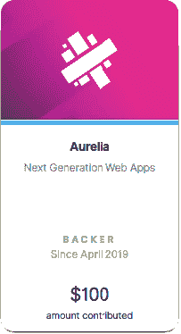

# 官方支持 Aurelia 前端框架

> 原文：<https://dev.to/dolittle/officially-backing-aurelia-front-end-framework-2bjo>

### 正式支持 Aurelia 前端 JavaScript 框架

在 Dolittle 讨论了我们关于前端 JavaScript 框架的策略后，我们决定通过[成为开源前端框架](https://opencollective.com/dolittle?referral=39202) [Aurelia](https://aurelia.io) 的支持者来使我们选择的框架正式化！

 

<figcaption>打开集体靠山徽章来自[杜立德的官方靠山页面](https://opencollective.com/dolittle?referral=39202)</figcaption>

### 为什么要捐赠开源？

在杜立德，我们相信在开放中开发我们的平台，其中一部分依赖于其他开源项目的工作。我们试图找到对开源做出贡献的方法，成为官方支持者是我们对 Aurelia 的强烈感受。

### 为什么是奥雷利亚？

我们已经使用 Aurelia 作为构建我们产品的前端 JavaScript 库，以及我们开源扩展的默认框架有一段时间了。

它不是最热门的框架，也不是 GitHub 上最受欢迎的框架。它是一个非常符合我们构建典型业务线应用程序的开发原则的框架。

它基于开放 Web 标准、开源、受 MVVM 启发、约定优于配置、完全可扩展和关注点分离、[等等。](https://aurelia.io/docs/overview/what-is-aurelia#what-is-aurelia)

它还获得了一个忠诚而活跃的核心团队的动力，他们正在为 vNext 的发布而努力。

### 总之

我们要感谢 Aurelia 团队和开源贡献者的无数小时的工作，并希望我们的贡献能帮助他们实现他们的目标。因为他们的工作帮助我们达到我们的目标。

> 罗布·艾森伯格@艾森伯格效应非常感谢[@杜立德](https://twitter.com/Dolittle)对[@奥雷利亚效应](https://twitter.com/AureliaEffect)[opencollective.com/aurelia](https://t.co/sSy4hc276h)🎉😊2019 年 4 月 16 日下午 13:57217

我们也想借此机会让人们关注这个伟大的框架及其[有益的社区](https://discourse.aurelia.io)。如果你还没有这样做，一定要去看看奥雷利亚。

***关于其他框架的说明……***

我们想说清楚的是，我们支持 Aurelia 并不意味着你不能在 Dolittle 上使用其他前端框架。我们很高兴地说，您可以自由选择您喜欢的前端框架。我们计划在未来增加更多的官方支持。

*拍手👏或者跟着多看 Aurelia 的文章，还有开源应用平台和公司，* [*【杜立德】*](http://dolittle.com) *。*

*最初发布于[杜立德博客](https://medium.com/dolittle/officially-backing-aurelia-front-end-framework-ad6e21827774)T3。*

* * *