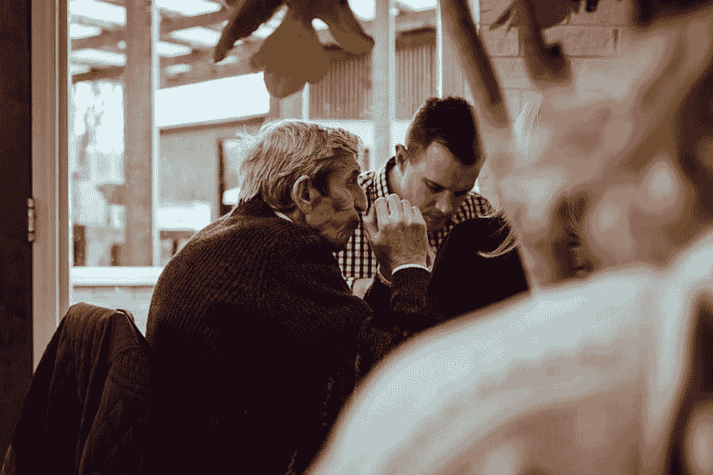

# ...论成为终身学习者

> 原文：<https://dev.to/chingu/on-being-a-lifelong-learner-5792>

# ……论做一个终身学习者

## 与年轻时的自己对话

最近完成了一个为期九个月的学习目标，我一直在思考成为“终身学习者”意味着什么，为什么它很重要，以及遵循这条道路会有什么好处和坏处。对我来说幸运的是，最近一次去瑞士梅林的旅行让我和年轻时的自己讨论了这个问题，并为我们俩提供了一个独特的机会来扩展我们对这个话题的看法。

 
照片由[哈尔盖特伍德](https://unsplash.com/photos/OgvqXGL7XO4?utm_source=unsplash&utm_medium=referral&utm_content=creditCopyText)上[Unsplash](https://unsplash.com/search/photos/cern?utm_source=unsplash&utm_medium=referral&utm_content=creditCopyText)T9】

在 Meyrin 和 Vernier 之间的一次徒步旅行中，当臭氧的气味变得突出时，我正在欣赏乡村，我的视线模糊了，我变得迷失方向，感觉脱离了现实。突然，所有的东西都变得清晰起来，一道紫色的光似乎同时从任何地方和任何地方发出。

我的第一个想法是，王子来自伟大的来世，或者也许我有一个酸的闪回。然而，当我的视线重新聚焦时，在 63 岁的我面前是我 21 岁时的二重身。几个尴尬的时刻过后，我们都适应了新的现实，奇怪的是，我们开始讨论生活、宇宙和终身学习。

 
图片由 [Cathal Mac an Bheatha](https://unsplash.com/photos/MxOc_5_CsaY?utm_source=unsplash&utm_medium=referral&utm_content=creditCopyText) 上 [Unsplash](https://unsplash.com/search/photos/old-man?utm_source=unsplash&utm_medium=referral&utm_content=creditCopyText)

**21 岁的我……**“老兄，你的头发怎么了？”

**63 岁的我……**“遗传，年龄，年轻时不戴帽。只要你戴上帽子，你就能解决这个问题。”

**21 岁的我……**“不可能！那会弄乱我的头发，我必须看起来最好。再过几个月我就要完成本科学位了，我期待着走出学校，找到一份真正的工作！”

63 岁的我… “你可能正在完成你的学位，但你不会停止学习。至少你不应该停止学习！”

**21 岁的我……**“说真的，我受够了学校。我已经学会了我需要知道的东西，我已经出色地完成了学业。我现在知道的和我的一些教授一样多。”

**63 岁的我……**“你懂个屁。你可能和你的一些教授知道的一样多，但是总有更好、更聪明、知道更多的人。你应该寻找顾问和导师，即使只是非正式的，他们会挑战你，让你拓展自己的视野和知识。”

“我属于一个名为 Chingu.io 的组织，它就是做这个的。即使在你的时间范围内不存在这种情况，你也应该考虑加入当地的用户组。”

“这一点相信我。你不想成为房间里最聪明的人，因为那样你就没有太多的机会成长。与愿意教学、挑战和激励的人在一起是无价的。”

21 岁的我… “但是如果我找到一份好工作，我就可以过一辈子了。如果你能在像 IBM 这样的公司取得成功，就没有必要再学习更多了。他们会提供我需要的在职培训。大型机在这里停留的人！此外，我是一名汇编程序员，这是众所周知的尖端技术中的佼佼者。”

63 岁的我… “你没学过经济学或心理学吧？”

21 岁的我… “没有。CS 和数学给我。”

**63 岁的我……**”可见一斑。公司在他们已经在做的事情上有既得利益，除非有一些经济或社会压力影响他们的收入。这意味着，在没有外部压力的情况下，公司总是倾向于改善他们已经做的事情，而不是在他们的舒适区之外进行创新。除了最进步的雇主，你将从他们那里学到的是他们需要你知道的对现有技术进行纳米级改进的东西。当外部力量开始将他们推出舒适区时，往往为时已晚——他们要么继续把头埋在沙子里，希望“旧时代”会回来，要么他们已经耗尽了资本和收入，以至于没有资源进行创新。”

**21 岁的我……**“说真的？？？IBM、惠普和其他公司一直存在。”

63 岁的我… “我的建议是卖掉你的 IBM 股票。”

“不管是正式的还是非正式的，继续学习还有另一个原因。你可能不想在整个职业生涯中都呆在同一个雇主那里。就像公司对他们的产品沾沾自喜一样，人类也会沾沾自喜，对自己在生活中的地位过于满足。以提高你已经知道的东西为目标继续学习，获取新的知识和技能，这不仅让你作为一名员工更有价值，也让你在就业市场上更有价值，更重要的是，这让你扩大了视野。”

**21 岁的我……**“拓展我的视野？？?"

**63 岁的我……**“是的。在你选择的专业或学科领域之外拓展自己的学习范围有两个好处。”

“首先，用同一学科中其他领域的知识来补充您对某一主题的深入了解，可以产生关于如何对现有流程进行重大改进的宝贵见解。例如，了解应收账款应用程序中所需的基本流程将让您发现应用高级搜索算法比简单的账户线性搜索能显著提高性能的地方。”

“第二个好处来自于走出你的学科(在我们这里是计算机科学)去学习另一门学科的基础知识。”

21 岁的我… “那有什么用？我想写操作系统，那么像会计这样的东西会有什么帮助呢？我的一些最好的朋友是会计，但会计很无聊。”

**63 岁的我……**“真庆幸我不再是你了！这就是它如何帮助低能儿的。假设你有一个新的操作系统功能的想法。你会如何向你的老板提出这个建议，”

**21 岁的我…** “嗯，我们一起去吃午饭，我会描述我的想法，它有多棒，创建它有多有趣，以及它将如何帮助用户。”

**63 岁的我……**“遗憾的是，‘整洁’和‘有趣’并不是商业中的决策因素。它如何帮助用户是一个因素，但对决策者来说真正关键的是它会带来什么收入，开发它需要多少成本，以及它是否能提高公司在市场中的地位。了解会计的基本知识将让你用你的领导习惯的术语来定义这些，并让你建立一个更有可能被接受的商业案例。”

“趁我们在这的时候想想这个。心理学和社会学。”

**21 岁的我……**“女朋友是学心理学的，我不搞她
也不搞它。”

**63 岁的我……**“别担心。那在另一个
半年内不成问题，不过我跑题了。”

“对心理学和社会学都有基本的了解，会帮助你更好地了解你的用户和影响他们的力量。这将有助于你识别真实的和可感知的“需求”，这些需求可以吸引用户使用你的产品，并帮助你留住他们。

“记住，你不一定要喜欢一个主题，才能看到它的好处并使用它。”

21 岁的我… “但是保住工作和学习将会很难。我想玩得开心。”

**63 岁的我……**“学习很有趣，诀窍是让它成为你日常生活的一部分，这样它就不会比你生活的其他方面消耗过多的时间。当然，除非你希望如此。这可以简单到每周花几个小时阅读，然后创建项目将你所学付诸实践。记住学习是学习+实践的结合。”

21 岁的我… “你说的有点道理。但是即使我们的行业在改变，也不会改变太多。鉴于此，这是不是有点白费力气？”

63 岁的我… “如果那是真的就好了。这是给你的练习。写下 1900 年以来最重要的事件、发现和事件，然后按日期绘制成聚类图。然后看你对变化率的看法。”

“事实是，由于技术和社会因素的结合，每十年变化都在加速。你可以拥抱变化，随波逐流，也可以任其摆布。接受改变的一个方法是建立在你所知道的基础上，并努力获得新的知识。换句话说，成为一个终身学习者。”

**21 岁的我……**“激进。我有更多的工作要做。”

**63 岁的我……**“它永远不会停止桑尼。快去！”

在这一点上，我们注意到臭氧的味道已经回来了，伴随着模糊的视觉和迷失方向的感觉。随着一道紫光的闪现，我的感官恢复了，我发现我自己在我当前的现实中。

我年轻时的自己不见了，大概回到了他的时间框架，没有受到伤害，因为我还在这里。

我只能猜测，这一事件是欧洲粒子物理研究所一些涉及 LHC 粒子和超光速粒子的奇怪实验的结果。这很奇怪，因为欧洲粒子物理研究所致力于通过增加我们的集体学习来扩展我们对塑造我们宇宙的基本物理力的知识。

我吗？当我回家后，我会拿着我的 iPad 坐在我的前廊上，了解最新的 TC39 提案，完成我正在学习的 GraphQL 课程，并对邻居的孩子大喊大叫，让他们离开我的草坪。

不断学习，勇往直前！

 
照片由[este 扬森斯](https://unsplash.com/photos/RARH8b7N-fw?utm_source=unsplash&utm_medium=referral&utm_content=creditCopyText)上 [Unsplash](https://unsplash.com/search/photos/fail-forward?utm_source=unsplash&utm_medium=referral&utm_content=creditCopyText)