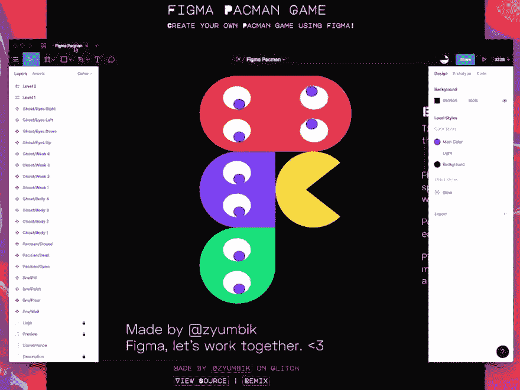

# 关于格林奇

> 原文：<https://dev.to/glitch/on-glitch-this-week-ef2>

本周 Glitch 是一个常规系列，在这个系列中，我们总结了一些了不起的创作者在 Glitch 上完成的令人惊叹的项目。以下是本周吸引我们眼球的几个项目。

## [打造自己的吃豆人游戏](https://glitch.com/~figma-pacman)

顾名思义[格莱布·萨比尔兹亚诺夫](https://glitch.com/@zyumbik)的 [figma-pacman](https://glitch.com/~figma-pacman) 是一款你可以在 figma 定制的吃豆人游戏。有了 Figma 文件的副本，你就可以自定义游戏的关卡设计，然后上传到 app 上玩。格莱布创造了一个[粉色心形吃豆人关卡](https://twitter.com/zyumbik/status/1129361314504216576)和另一个[形状的 Figma 标志](https://twitter.com/zyumbik/status/1129564817738620929)，而阿里萨拉赫则制作了一个[推特 Vs 社交媒体版](https://twitter.com/alollou/status/1130491266192617472)。你会创造什么水平？

> <video loop="" controls=""><source src="https://video.twimg.com/ext_tw_video/1129025183027744770/pu/vid/960x720/uRhuF_iiC8tK-RVG.mp4?tag=9" type="video/mp4"></video>Gleb Sabirzyanov[@ zyumbik](https://dev.to/zyumbik)fig ma Pacman 游戏！💜自定义 [@figmadesign](https://twitter.com/figmadesign) 文件，只需五分钟就可以玩你的 Figman 游戏:
> 
> ✨设计你自己的关卡。🕹
> ✨打造自己的角色。🐄✨创造令人费解的迷宫并挑战他人！✨把你的朋友加入游戏！👫
> 
> →[fig ma-pacman . glitch . me](https://t.co/Ni2obX6q3Y)🍪2019 年 5 月 16 日下午 14:301140

[https://glitch.com/embed/#!/embed/figma-pacman?previewSize=100&path=index.html](https://glitch.com/embed/#!/embed/figma-pacman?previewSize=100&path=index.html)

## [让推特更易访问](https://glitch.com/~tweet-a11y-stats)

[Cole Gleason](https://glitch.com/@colegleason) 是一名博士生，正在研究针对视觉障碍人士的无障碍技术。他创建了“[tweet-a11y-stats](https://glitch.com/~tweet-a11y-stats)”——一个告诉 Twitter 用户他们有多少照片可供盲人用户访问的工具。目前，Twitter 上只有约 0.1%的照片推文有图像描述，但图像描述对于视力障碍者访问 Twitter 上的视觉内容至关重要，因为这些描述会被屏幕阅读器或盲文显示软件读取。科尔的应用程序提供了一个有用的提醒，让你养成或保持习惯，确保所有人在 Twitter 上分享内容时都可以访问内容。

[https://glitch.com/embed/#!/embed/tweet-a11y-stats?previewSize=100&path=index.html](https://glitch.com/embed/#!/embed/tweet-a11y-stats?previewSize=100&path=index.html)

## [本地存储入门](https://glitch.com/~hello-local-storage)

计算机科学教师凯利·鲁希德(Kelly Lougheed)创建了“[你好——本地存储](https://glitch.com/~hello-local-storage)”，这样她的学生就可以开始使用本地存储在浏览器中存储信息。你也可以通过重新混合应用程序并检查[评论的源代码](https://glitch.com/edit/#!/hello-local-storage?path=script.js:1:0)来看看它是如何工作的。

## [凯莉·鲁伊](/kellylougheed1)

[JavaScript/Python developer](/kellylougheed1)

[凯利·卢吉](https://github.com/kellylougheed)

[https://glitch.com/embed/#!/embed/hello-local-storage?previewSize=100&path=index.html](https://glitch.com/embed/#!/embed/hello-local-storage?previewSize=100&path=index.html)

本周综合报道中的其他应用包括《权力的游戏》的共鸣板、闪亮的实时网络聊天和名为 colors 的 CSS 3D 可视化。[看看他们](https://glitch.com/@glitch/glitch-this-week-may-22-2019)！