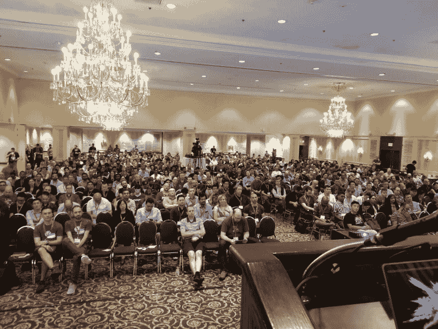

# 论专门会议的起源

> 原文：<https://dev.to/wiredferret/on-the-origin-of-the-speciated-conference-ema>

我参加了很多会议！这是我工作中令人敬畏和惊奇的一部分。我对他们讲话，但我也参加他们。我坐在前排，实时发微博。我参加会谈。我参加非会议会议。我在排队的时候，在午餐的时候，在会后的聚会上与人交谈。我分发贴纸，向小贩问好。会议是我的专长。当我不做技术工作时，我是科幻会议主持人的支持团队。

鉴于此，我很惊讶我还没有看到技术会议的分类，这将有助于你了解你将要参加的会议的类型。据我所知，大约 10 年前，会议类型有了很大的发展。

最初，我们有技术会议。人们付了很多钱，他们坐在大会议室里(据说超过 100 人)，他们听取行业专家的意见。一些/许多行业专家也是进行推介的供应商。

然后，十年前，许多人认为这种方法不能满足他们的需求，他们想要更多的互动，更多的同伴接触，更多的联系。我们以一些新的会议形式结束:

*   语言会议的地区差异。不再只是 PyCon，而是 PyConAU 和 EU，JSConf 和 Ruby 也是如此。把人们带到离他们近的地方更便宜，会议更小，会议发言人和专家的几率更高。
*   有注册上限的单轨会议。写文档，首席开发人员，还有(我认为)Monitorama 都用这种方法。每个人都参加同样的演讲，但是注册人数限制意味着仍然可以识别演讲者并与之交谈。一个运行良好的单轨制会议允许在两次会谈之间有很多时间，这样人们可以交流和交谈。
*   DevOpsDays。国防部的形式是灵活的，但倾向于单一轨道上午，非会议下午。他们还非常努力地工作，以适应允许人们自己参加的预算，低廉的注册费和遍布各地的位置。
*   没有绒毛，只是东西。我在第一个无赞助的会议上发言。没有供应商，演讲者的重复率很高，有很多曲目，所以你很有可能会在一个小团体中。
*   一丘之貉。这不是任何一个会议组织系统所独有的，而是对类似问题感兴趣的人找到彼此并进行协作学习的一种方式。这些大多发生在非编程时间。

所有这些会议风格都更重视合作学习，而不是独裁教学。如果你是一个来自更专制背景的演讲者，我不得不想象这种变化会有点令人震惊。我知道当面对一大群我看不见的观众时，我会感觉很奇怪。我不希望你认为哪种方式更好，这取决于你需要什么。如果 AWS reinvention 没有价值，5 万人不会去那里。“重塑”有小型的、未录制的会议，也有大规模的主题演讲。

多伦多

那么谁是举办会议的利益相关者呢？

*   出席者
*   赞助商
*   扬声器
*   组织者

当你最大化一个群体的幸福或效用时，其他群体的效用下降，或者可能下降。有一些重叠。与会者希望内容能够回答他们的问题。演讲者希望提供新的内容，并推广他们的个人品牌。组织者希望选择带来良好价值且可靠的演讲者。赞助商希望他们的发言人被选中，因为谈论产品可以推动销售。总的来说，与会者不想听推销演讲。你看到问题了！

作为一个演讲者，我更喜欢单轨会议。这样，我就不会错过别人的演讲了！这些演讲通常都是精心策划的，因为一整天的会议可能只有 7 位演讲者，所以被选中是一件非常荣幸的事情。作为一名与会者，我喜欢大小合适的会议，这样每个发言人最终能和大约 50 个人交谈。它足够小，让我感到很投入，也足够大，让演讲者感觉不到他们必须停下来回答问题。作为赞助商，我希望有多个大空间的轨道，人们必须走过我的摊位才能获得咖啡因。作为组织者，嗯，我还在努力。

我之所以想到这个，是因为 LaunchDarkly 正在召集我们今年(2019 年)的第一次会议，本着 Gremlin 的[混沌会议](https://www.gremlin.com/blog/chaos-conference-2018-a-day-of-chaos-engineering-resilient-systems-and-antifragility/)和 Honeycomb 的 [o11ycon](https://www.honeycomb.io/blog/o11ycon-a-conference-for-the-observability-community/) 的精神。我们想给人们什么，我们认为我们会有多少人，以及我们如何使这种体验有用？

本着在生产中进行测试的精神，我们将尝试多种方式的结合——主题演讲将是单声道的，因此每个人都有共同的话题可谈，然后我们将在下午分成其他配置。

我们正在寻找希望在 4 月 9 日的 Trajectory 上加入我们的人，他们将讨论特性标记、基于主干的开发、devops 工具、生产中的测试、蓝绿部署，以及加速您的开发和交付的其他方式……安全。

[https://www.papercall.io/trajectory](https://www.papercall.io/trajectory)

如果你需要推销方面的帮助，或者想探讨一个想法，请告诉我。我会在 7 号回来工作，并准备好和你一起考虑这件事！(是的，我们稍后会发布更大的公告！)