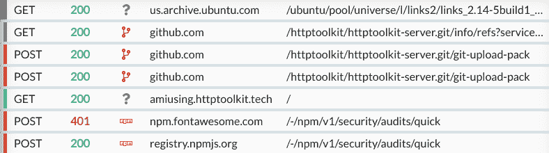
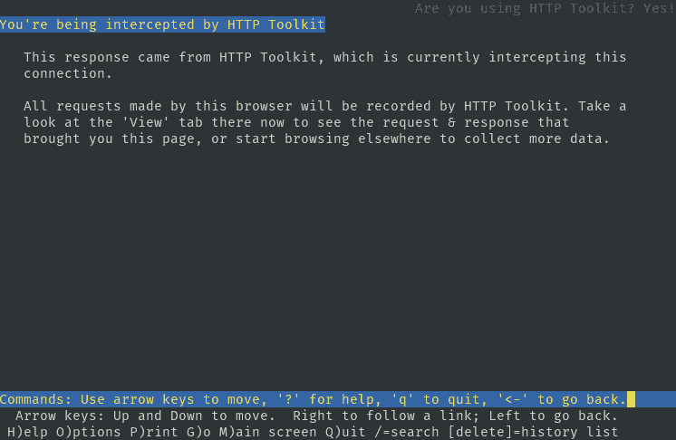
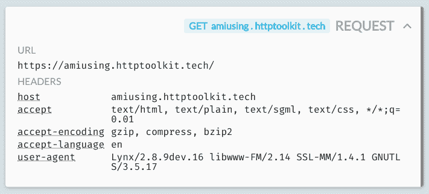

# 任何 CLI 工具的一键式 HTTP 调试

> 原文：<https://dev.to/pimterry/one-click-http-debugging-for-any-cli-tool-1ih6>

*调试由 git、npm、apt-get 或其他任何东西发送的所有 HTTP(S)*

命令行功能强大，但是很难理解，也很难调试。有没有运行一个命令，看到它失败，出现一个神秘的错误，却不知道为什么？

更好的工具可以帮助你理解到底发生了什么。它们可以让您看到正在运行的命令的内部，了解它是如何通信的，看到它正在处理什么数据，并深入调试它。

令人兴奋的是，我刚刚发布了一键式终端拦截功能，使用 HTTP 和 HTTPS 的 HTTP Toolkit 实现了这一功能，向您显示您的 CLI 发送的所有内容，并帮助您了解到底发生了什么。

HTTP Toolkit 是免费的&开源的，所以如果你想亲自尝试一下，现在就去[下载](https://dev.to/view)然后开始吧。

## 我怎么试？

*   安装 HTTP 工具包(如果您还没有安装的话)。
*   在截取页面上，单击“终端”按钮。
*   在打开的终端中，发出一些 HTTP 请求(尝试`curl example.com`、`sudo apt-get update`、`git clone https://...`或任何东西！)
*   打开 HTTP Toolkit 中的视图页面，查看发送的每个请求的全部细节。

## 这个能做什么？

### 调试失败的应用

让我们假设你正在使用一个 CLI 工具，它讨厌你。不管出于什么原因，它拒绝做你要求的完全合理的事情。它以某种神秘的错误退出，或者只是无声无息地失败，而您就被困住了。也许你只是下载了它，或者它是你的代码，你只是忘记了它是如何工作的(我们都经历过)。

在内部，这个脚本可能正在与某处的 HTTP 服务进行对话，并且稍后会失败。不幸的是，您不知道它在请求什么，它得到什么响应，或者为什么结果不起作用。大多数应用程序都不是为调试而设计的，而且非常不透明。

如果你能拦截来自应用程序的所有 HTTP，那么你就能看到发送的所有内容，发现错误，并直接修复根本原因。你的脚本向 github 请求一个文件，然后试图使用它时崩溃了吗？当您看到 github 返回意外的 HTML 而不是下载时，因为 github 再次关闭*，问题变得稍微清楚了一些。*

 *### 现场令人毛骨悚然的 app 追踪&监控

未来是一个黑暗的地方。您认为您的 CLI 工具可能会将您的私人数据发送回分析和跟踪服务？如果您可以看到它发送的所有 HTTP，您就可以确切地看到正在报告的内容并确定无疑。

实时编辑也即将推出，因此您也可以在运行中阻止/编辑这些请求。

### 了解你的工具是如何工作的

想知道 Git 实际上是如何工作的吗？没问题——打开一个被拦截的终端，通过 HTTPS 克隆一个回购协议，并立即通读它发送和接收的每一个请求以实现这一点。

Apt-get [不使用 HTTPS](https://whydoesaptnotusehttps.com) ，而是通过 HTTP 分发包，但是带有您可以在本地验证的签名。这意味着你的客户提出的每个请求都是公开可读的。打开一个截获的终端，运行一个快速的`sudo apt-get update`，看看它到底与世界共享了什么。

想看看你的`npm install`有多少请求吗？...你明白了。

## 这是怎么回事？

自动终端拦截的工作原理是在您的机器上启动一个新的终端窗口，并确保它在启动时设置了各种环境变量。这并没有严格执行 HTTP 拦截，但是您在 CLI 上使用的几乎每种语言& HTTP 库都会观察到这些变量，这足以确保 90%的工具开箱即用。

这些变量需要做两件事:通过代理发送所有 HTTP(S)流量，然后确保所有 HTTPS 客户端信任 HTTP Toolkit 使用的拦截证书颁发机构(CA)。实现这一目标的变量包括:

*   `HTTP_PROXY`(和`http_proxy` ) -代理用于 HTTP 流量的完整 URL(例如`http://localhost:8000`)

*   `HTTPS_PROXY`(和`https_proxy` ) -代理用于 HTTPS 流量的完整 URL(例如`http://localhost:8000`)

*   `SSL_CERT_FILE` -包含 OpenSSL 应该信任的证书颁发机构(CA)证书的文件路径

*   `NODE_EXTRA_CA_CERTS`-node . js(7 . 3 . 0+)应该信任的额外 CA 证书的路径

*   `REQUESTS_CA_BUNDLE`-Python 的[请求](http://docs.python-requests.org/en/master/)模块应该信任的 CA 证书的路径

*   `PERL_LWP_SSL_CA_FILE`-Perl 的 [LWP](https://metacpan.org/pod/LWP) 模块应该信任的 CA 证书的路径

*   `GIT_SSL_CAINFO`-Git 应该信任的 CA 证书的路径

开箱即用，跨 Windows、Linux 和 Mac，它立即拦截:

*   Curl、Wget 和 Lynx 等经典 HTTP 客户端。
*   基于 HTTP(S)构建的更强大的工具，包括 Git、Apt-Get 和 [HTTPie](https://httpie.org/) 。
*   几乎所有的 Ruby、Perl、Go、Bash 或 Python 脚本。
*   所有正确观察`HTTP_PROXY`的 Node.js 工具(与大多数工具不同， [Node.js 不会自动这么做](https://github.com/nodejs/node/issues/15620))。不过，这确实包括 npm，以及使用 Axios (0.14+)或 Request (2.38+)等库或使用[全局隧道](https://github.com/np-maintain/global-tunnel)发出的任何请求。
*   可能更多。非常欢迎问题/其他工作客户的报告！

我怀疑会有额外的情况，可以用更多的环境变量来捕获。如果你有，我很乐意收到你的来信。要么[提交一些反馈](https://github.com/httptoolkit/feedback/issues/new)，要么直接在拦截器上开一个 PR。

 

如果这看起来很有趣，现在就去[下载 HTTP Toolkit】并亲自尝试一下。](https://dev.to/view)

有反馈？评论如下，在 Github 上归档[，或者在 Twitter](https://github.com/httptoolkit/feedback/issues/new) 上联系[。](https://twitter.com/httptoolkit)

*最初发布于[https://httptoolkit . tech/blog/announcing-terminal-interception/](https://httptoolkit.tech/blog/announcing-terminal-interception/)**