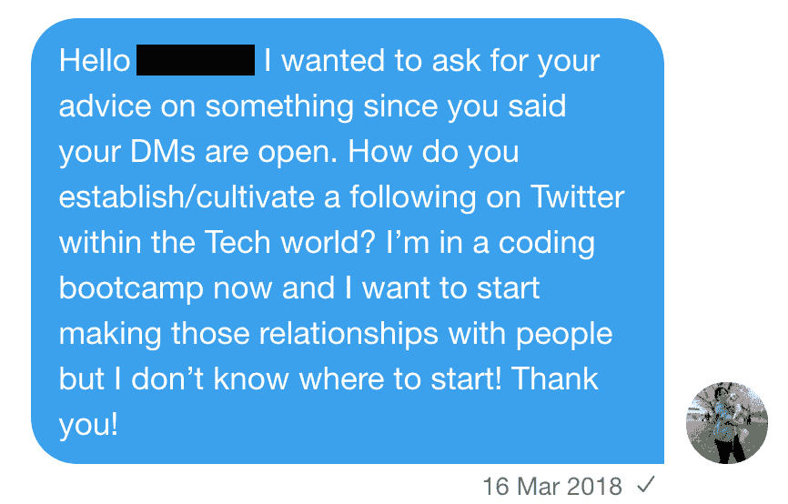

# 一个女人不那么容易(但并非不可能)的科技之旅

> 原文：<https://dev.to/katiefujihara/one-woman-s-not-so-easy-but-not-impossible-journey-to-tech-4kjg>

如果你发现自己在这篇博客上，欢迎！我会假设你在这里是因为你正经历求职倦怠期，你正试图寻找如何获得第一份技术工作的建议。我将讲述我为获得第一份技术工作所采取的不同步骤，以及这是一个多么艰难的旅程。

只是一个免责声明:这篇博客文章不是放之四海而皆准的。每个人在科技领域的第一个角色的旅程都大不相同，我在这里不是要教你“正确”的方法。

## 我是谁？

 
我是凯蒂，在意识到我在大学里所学的东西(以及我后来走的路)会导致非常不满足的生活后，我最近转向了科技行业。我出生在洛杉矶，但大部分时间都住在夏威夷的檀香山。我也曾在日本、旧金山生活过，目前我住在波特兰。

### 目录:

#### [它是如何开始的](#how-it-started)

*   [起源故事](#the-origin-story)
*   [训练营后勤](#bootcamp-logistics)

#### [在求职中使用 Twitter](#twitter)

*   [关注谁并寻找社区](#be-on-twitter)
*   [分享你的旅程](#journey)
*   [寻找工作机会](#opportunities)

#### [拓展你的线下社区](#expanding)

*   [当地社区活动](#community)
*   [会议](#conferences)
*   [线上朋友变成线下朋友](#friends)

#### [我吸取的教训](#lessons)

*   [找到你的焦点](#focus)
*   [贡献开源](#open-source)
*   [从事副业](#side-project)
*   [回馈](#help)

#### [外卖](#takeaway)

# 怎么开始的

### 起源故事

2016 年，我认为夏威夷的有限行业不适合我，所以我心血来潮搬到了旧金山，因为一个亲戚向我介绍了为一家初创公司而不是大公司工作的想法(我目前正在这样做)。在一家电子商务初创公司做客户支持时，我和三名软件工程师中的两名成了朋友。我们经常一起去喝咖啡，在喝咖啡的时候，他们总是鼓励我学习如何编程。根据我们的交流，他们告诉我，作为一名工程师，我会在解决问题方面表现出色。我对他们不断的推荐不屑一顾，说了“我不擅长数学”和“我不够聪明”之类的话。但这是它最终实现的时刻。他们告诉我:

> 学习如何编程比学习数学算法更类似于学习第二语言。

啊哈！我已经学会了第二种语言，并且非常喜欢它。既然他们把它框成这样，我决定试一试，并在 2017 年 6 月购买了我的第一个 Udemy 课程(这是柯尔特·斯蒂尔的热门课程)。有趣的是，我不知道 Udemy 是什么，但我的一个朋友碰巧在 Udemy 工作，是一名文案，她告诉了我他们提供的所有课程，这是我最初开始学习的原因。

### 训练营后勤

完成课程后，我意识到我已经爱上了 web 开发。我非常喜欢它，所以我决定把它作为我的职业。我知道我想参加训练营，因为我喜欢结构化学习，但有几个问题:

1.  我没有钱支付训练营的费用
2.  我当时住在旧金山，无法抽出时间进行全日制学习

这是我决定搬到俄勒冈州波特兰市的时候。我在俄勒冈大学上学一年，已经知道我喜欢俄勒冈州。我也知道波特兰有一个小的技术领域正在成长，所以我决定尝试一下。2017 年秋天，我搬到了波特兰，并通过俄勒冈州找到了这个名为 [TechRise](http://www.techrisepdx.org/) 的项目，这是一个针对 18-29 岁之间的人的项目，旨在帮助他们在技术方面起步。在被这个项目录取后，我知道我想申请他们的奖学金来帮助支付训练营的费用，在你参加这个项目的时候，他们还会给你提供一张月票。我提交了冗长的奖学金申请，得到了惊人的消息。**我收到了全额的 7500 美元来支付我的训练营费用。**

我选择的训练营从 2018 年 1 月开始，到 2018 年 5 月结束。该课程主要关注 HTML/CSS/Javascript、Ruby、Angular 2 和 Rails。总的来说，我的经历不错，但是训练营的经历各不相同。甚至我的同龄人也不喜欢这种体验。我参加的训练营主要关注结对编程。

训练营结束后，我在波特兰一家相对较大的公司实习了 3 个月，做营销自动化，这是我将过去的兴趣(营销)和现在的兴趣(编码)结合起来的尝试。
[返回目录](#tableofcontents)

# 在求职中使用 Twitter

### 关注谁，寻找社区

2018 年 2 月，在一位朋友告诉我这是科技行业人士聚会的平台(当然是虚拟的)后，我加入了 Twitter。我以前从未使用过 Twitter，非常害怕。我回想起我的市场学教授在大学时说过的话:

> 使用 Twitter 的人有两种:一种是创造人们想看的内容的人，另一种是只消费内容的人。

这让我吓坏了。我是这个行业的新手，我不认为我有什么可以说的，人们会关心，但我不想只是潜伏...我想参与社区活动。一个月来，我很少使用 Twitter，因为我不知道该做什么。然后，有人打开了他们的 DMs 的一个 AMA(问我任何事情)相关的技术。我的朋友催促我给他发信息，所以我发了。

> “在科技界，你如何在 Twitter 上建立/培养粉丝？我现在在一个编码训练营，我想开始和人们建立关系，但是我不知道从哪里开始！谢谢大家！”

他给了我宝贵的建议。他告诉我要在社区中找到志同道合的人，并关注他们的推文。他还告诉我通过截图和 gif 分享我所学到的东西。

我把他的建议记在心里，并立即跟踪我参与的当地社区组织的情况。例如，女性编码:波特兰和波特兰女性技术。我做了一点调查，了解了这些组织的成员，并跟踪了他们。然后，我会留意他们会与之互动的人，并跟踪这些人。现在我有了我正在关注的人，我实际上有了我的时间线上的东西可以互动。我开始在线程中回复，并会大量转发。慢慢地，我开始在 Twitter 上找到波特兰技术社区。

### 分享你的旅程

一旦我结束实习(大约在 2018 年 8 月)，我知道我想开始更有策略地使用 Twitter，以便它可以帮助找工作。我注意到，为了在求职中广泛撒网，我需要创造更多的价值，因为事实是，如果人们知道你和你的故事，你的求职推文更有可能获得更多的关注。这是我开始参与#100DaysOfCode，开始分享自己每天的进步的时候。因为实习不是很有技术含量，很多东西我都忘了怎么做，感觉好像要从头再学。我贴了很多截图和 gif。

我也开始在推特上发布更多关于我一直在做什么，我在求职中的挫折，倦怠，以及其他早期职业开发人员可能涉及的事情。我甚至在当地的一次集会上发表了关于如何应对失败的演讲。

作为一名早期职业开发人员，如果你担心在 Twitter 上扩大你的社区，我强烈建议你尝试公开你的成功和失败。失败是一个很难谈论的话题，但最终，每个人都会涉及到它。

### 寻找工作机会

如果你愿意把自己放在那里，在推特上说你正在寻找机会是非常有用的。过了一段时间，我不再冷冰冰地申请职位，我只使用 Twitter 上的信息作为找工作的途径。虽然我不是专家，但我有一些制作求职推特的注意事项。

**做**

*   简单介绍一下你自己
*   具体说明你对什么感兴趣，比如导师
*   指定你想工作的地方(即使是偏远的或者“可以搬迁的”)
*   指定您熟悉的技术
*   确保你有一个作品集或网站，让人们看到你觉得舒服

**不要**

*   不要过于具体地说明你想从一份工作中得到什么(如果你处于职业生涯的早期)，人们可能会看到这一点，并认为你不会对他们的机会感兴趣
*   避免那些可能让人们对你的经历打折扣的话。例如，我选择使用“早期职业发展者”、“职业改变者”等术语。而不是像“年轻人”这样的词

*旁注:我讨厌“初级”*
这个词通常用来描述没有什么专业经验的开发人员，但我觉得这个词特别有损尊严。这是一个有内涵的词，虽然它在这个行业中被普遍使用，但我觉得在英语中它有一个内涵。对我来说，感觉几乎是*少年*。作为一个正在寻找我在技术领域的第一个角色的人(这非常困难)，我不想让自己与任何可能给人一个在见到我之前下意识地贬低我的经历的理由的词语联系在一起。
[返回目录](#tableofcontents)

# 拓展你的线下社区

### 当地社区事件

与我当地的技术社区接触是认识更多业内人士的另一个好方法。当我还在代码学校的时候，我甚至开始了我自己的聚会！我并不是说，你必须开办自己的聚会才能引起别人的注意(不过，这在求职中是一笔巨大的财富，因为这表明我关心当地的科技社区)。坚持参加活动是在社区中结识更多朋友的好方法。虽然有很多不同类型的聚会，但我建议一开始先去参加一些不同的聚会，然后再回来，只参加你最喜欢的聚会。我这么说的原因是，就我个人而言，当我一个月参加一百万次会议时，我会感到筋疲力尽。我根据聚会的内容和参加的人进行挑选，减轻了自己的压力。

除了聚会，我建议参加研讨会和黑客马拉松。我在训练营开始两个月后参加了一次黑客马拉松(不知道还有谁参加)，这是一次很棒的经历。汉伯拉格:我们队最终获得了第一名！这是与不同水平的开发人员一起工作的好方法。如果你认为自己不够好，或者你会拖累你的团队，那就别想了。有很多方法可以在不贡献代码的情况下为黑客马拉松团队做出贡献。例如，我团队中的工程师想要使用 React，这是我以前从未使用过的，所以我没有让每个人停下来或者让他们用一个周末的时间教我 React，而是决定致力于演示的演示，以将我们与其他团队区分开来。这包括制作一个静态网站来展示我们的项目，而不是使用幻灯片，并制作一个宣传视频，就好像我们的产品要上市一样。不要低估你的其他技能。人们是多面的，认为你能为黑客马拉松团队做的唯一贡献就是代码是有局限性的。

研讨会是另一个很好的方式，不仅可以提高你的技能，还可以结识新朋友。我已经参加了一些研讨会，我通常带走的最好的东西是结交新朋友。如果你没钱参加研讨会，通常会有奖学金的选择，或者你可以直接联系组织者询问。

### 会议

在我进入技术社区的一年半时间里，我参加了三次会议:

*   写、说、编码(国内)
*   ACT-W 波特兰(当地)
*   js 英雄(国际)

因为我是一个超级外向的人，我喜欢参加会议。这并不适合所有人。我喜欢与线下的人互动，不仅在当地社区，而且在国内和国际上与人接触。如果会议让你害怕，试着和朋友一起去参加一个小规模的会议。此外，**始终**确保会议有一个行为准则。这非常重要，因为你知道会议优先考虑与会者的包容性和安全性。如果你没钱参加会议，留意“学生”票、奖学金，甚至是早到的票。网站上什么都没看到？你可以随时联系组织者询问。

如果你准备好了，试着在会议或聚会上发言！你不必成为一个经验丰富的开发人员来谈论你正在做的很酷的事情或者你学到的东西。你也可以做一个关于你和你的旅程的演讲，这减轻了 100%技术准确性的压力。

### 线上的朋友变成线下的朋友

我会认真做的一件事是找到那些在技术职业生涯中走得更远的人，他们似乎致力于在技术职业生涯的早期培养人，无论是明确表示他们的 DMs 是开放的，还是他们创造了教育内容。我会和他们交流，并且很乐意问问题。我开始在网下和这些人见面，这是巩固网上友谊的好方法。我通过推特交了这么多一辈子的朋友。如果你打算和你只在网上认识的人见面，只要确保你做出明智和安全的决定。
[返回目录](#tableofcontents)

# 我吸取的教训

### 找到你的焦点

我花了将近一年时间找工作的一个原因是我因为冒名顶替综合症而注意力不集中。我知道我想成为一名工程师，因为这些是我喜欢解决的问题，但我觉得我的编码能力不足以通过面试。这导致我在不同的道路上跳跃。我在申请和面试产品设计师、技术客户经理、产品负责人等职位。我基本上是在想，我会把我的编码能力作为我申请的角色的额外奖励。我做了这个没有重点的求职游戏，直到 2019 年 2 月左右。就在那时，我意识到我真正感兴趣的是 UX 工程。我能够通过学习不同的课程和教程，认识到我喜欢和不喜欢的编码元素，我擅长和不擅长的东西，来学习这一点。我毫不怀疑，找到自己喜欢的东西，并在求职初期加倍努力掌握这些技能，会让我省去几个月可怕的求职痛苦。

### 兼职

*免责声明:如果你在找工作的时候平衡已经很忙的时间表，这可能会很困难*

这似乎是很多人推荐做的事情，但老实说可能会被击中或错过。这是在没有被雇佣的情况下证明你技能的好方法。对我来说，当我从事我的副业项目时，与其说是为了证明我的技术能力，不如说是为了我想培养的其他技能。例如，当我开始我的副业项目时，我想成为一名产品负责人/经理。我想展示的技能是:

*   管理团队
*   与分布式团队合作
*   研究
*   数据分析

我组建了一个团队来解决所有这些问题，这个团队由一名产品设计师(檀香山)、一名前端工程师(芝加哥)和一名后端工程师(波特兰)组成。在开始应用程序之前，我对我想要构建的产品类型、当前的市场环境和竞争对手进行了研究。当我有了自己想做的事情的想法后，我在 30 分钟的时间里采访了大约 6 个人。在那之后，我转录了我们的对话，在电子表格中加入了值得注意的引用，并根据出现的常用术语对单元格进行了颜色编码。我重新定位，然后在这个项目上和我的团队一起工作了大约 4 个月。

### 促成开源

*免责声明:如果你在找工作的时候平衡已经很忙的时间表，这可能会很困难*

如果你从未在协作环境中工作过(这种环境涉及到大量的合并、提取、代码审查等等)。)为开源做贡献是获得这种体验的好方法。寻找有“好的第一期”标签的初学者友好的项目将是一个好的开始。修复文档可能是最容易解决的问题。在某些情况下，如果你在打开一个 PR 时遇到困难，项目的维护者会开放结对编程或者帮助你通过他们的松弛通道。这不仅能让你体验 git，还能拓展你的人脉(注意到这篇文章中的一个趋势了吗？)，这也向潜在雇主展示了你乐于回馈社会。当你感到舒适的时候，解决你想学的特定问题，而不一定是你已经是专家的问题。这给了你在低压环境中提升技能的机会。还记得我建议你应该找到你的焦点吗？开源是一个尝试不同类型的东西来看看你喜欢做什么的好方法！

### 送还

如果你已经注意到这篇文章中的一个趋势，那就是如果不是我的社区支持我，我会在一个完全不同的地方。这就是为什么当你有能力的时候给予回报是非常重要的。我们在一个高度协作的行业中工作。如果有人帮助你，当你有能力的时候，试着向前支付。这并不意味着你必须成为导师，创造内容，或者捐一堆钱。你可以用很多方式回报社区，甚至分享你的旅程来帮助他人也是回报！
[返回目录](#tableofcontents)

# 外卖

如果你要从这篇文章中得到什么，那就是:

1.  每次旅行都是不同的，所以要有所保留
2.  社区就是一切，他们会在好的时候和你一起庆祝，在困难的时候支持你
3.  除了练习白板练习和学习算法之外，做一些事情也是非常重要的(事实上，我从来没有研究过白板问题或常用算法)

最终，

> # Try your best and don't let failure (or fear of failure) stop you from reaching your goal. You can do it!