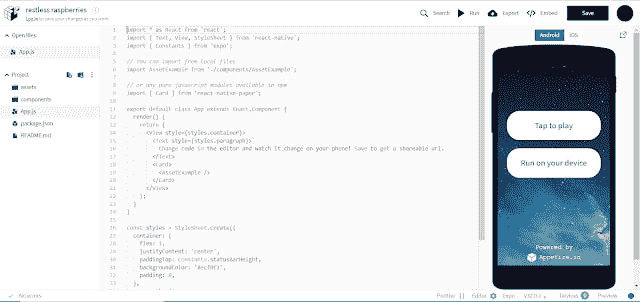

# 在线 Android 模拟器

> 原文：<https://dev.to/skptricks/online-android-emulator-k55>

帖子链接:[在线安卓模拟器](https://www.skptricks.com/2019/03/online-android-emulator.html)

这篇文章解释了如何使用在线 android 模拟器进行 react 本地应用程序开发。我们将使用零食博览会网站作为在线应用程序开发编辑器，您也可以在在线模拟器中看到实时结果。让我们按照以下步骤在在线 android 模拟器中运行 react 本机代码。

第一步:首先访问小吃博览会网站网址[https://snack.expo.io/](https://snack.expo.io/)

第二步:之后，你会在屏幕上看到下面的结果。

[在线仿真器演示](https://www.skptricks.com/2019/03/online-android-emulator.html)