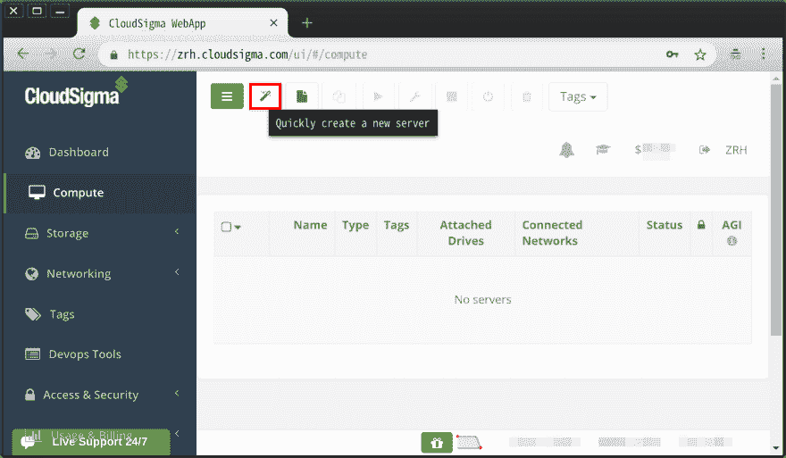
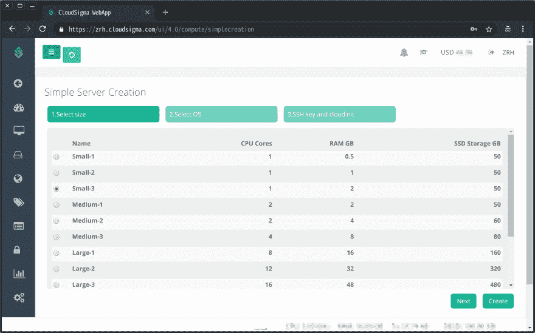
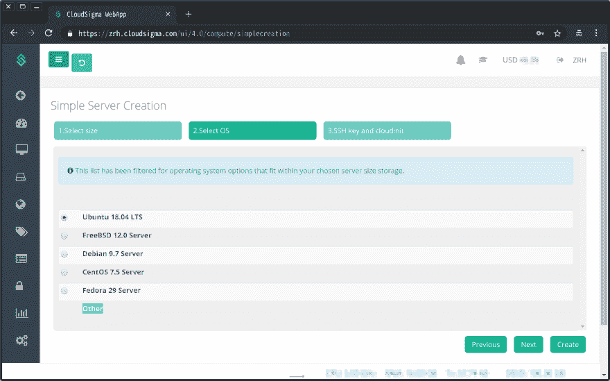
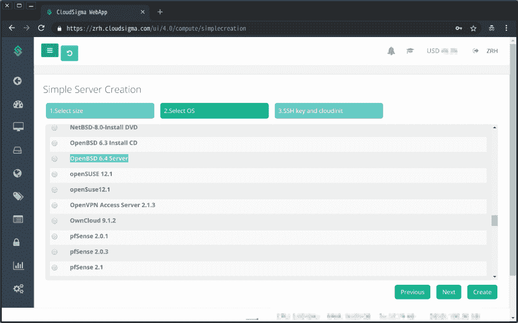
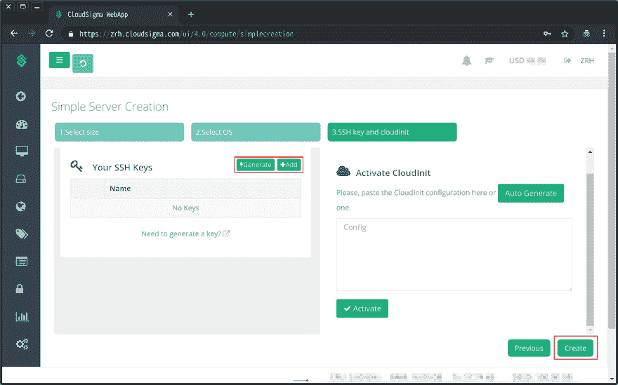
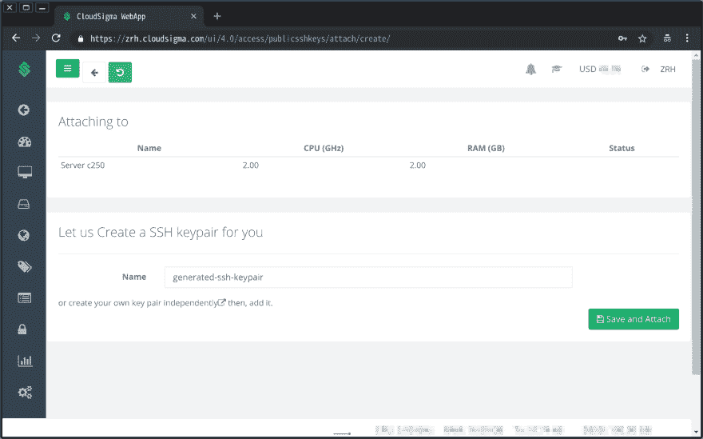
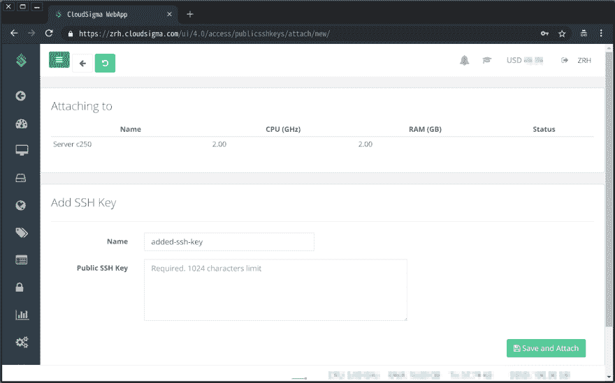
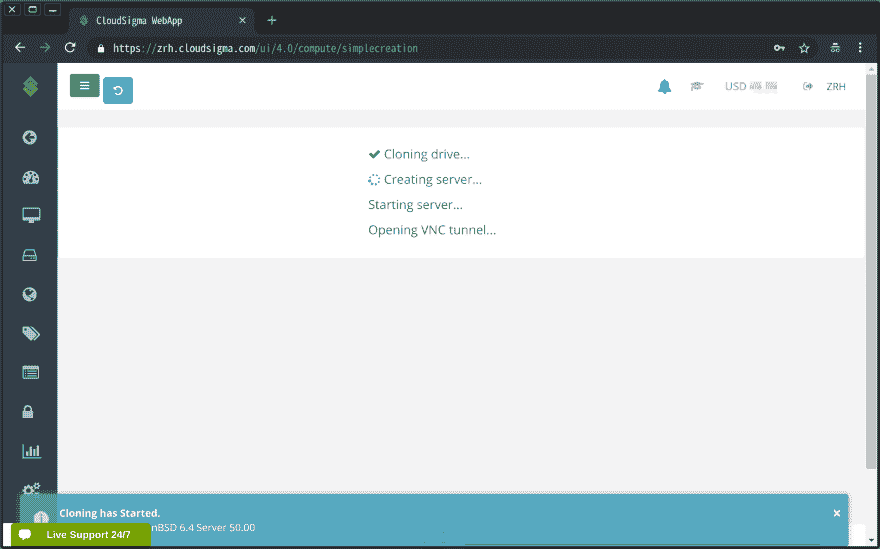
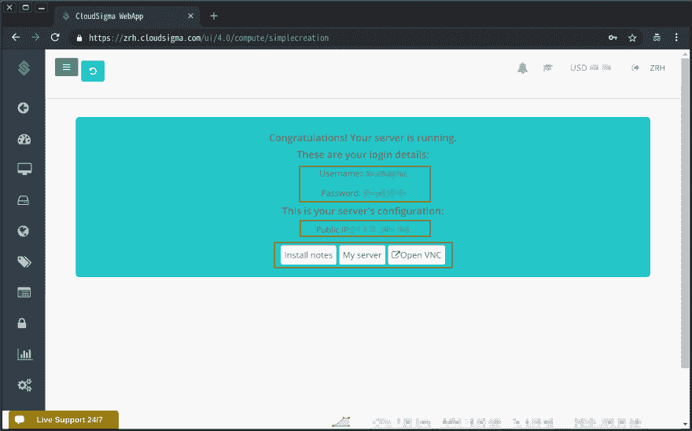
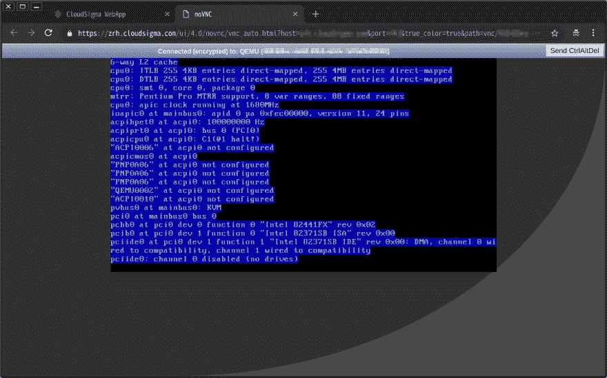

# CloudSigma 上的 OpenBSD 使用向导菜单轻松安装

> 原文：<https://dev.to/nabbisen/openbsd-on-cloudsigma---wizards-easy-installation-4k91>

为了在 [CloudSigma](https://www.cloudsigma.com/) 中构建服务器，我认为使用“计算机”页面中的“向导”菜单是一种简单易行的方法。
这篇文章将展示如何用菜单创建 [OpenBSD](https://www.openbsd.org/) 服务器。
基本上，向导会询问服务器应该如何。

<center>✿ ✿ ✿</center>

### #1。起始页和输入按钮

打开“计算机”页面，点击“向导”按钮。

[](https://res.cloudinary.com/practicaldev/image/fetch/s--MzUPoeIC--/c_limit%2Cf_auto%2Cfl_progressive%2Cq_auto%2Cw_880/https://thepracticaldev.s3.amazonaws.com/i/15ozc0c4orue5ty5ta6i.png)

### #2。步伐

#### 第 1/3 步:选择机器计划

[](https://res.cloudinary.com/practicaldev/image/fetch/s--CiP-hbSt--/c_limit%2Cf_auto%2Cfl_progressive%2Cq_auto%2Cw_880/https://thepracticaldev.s3.amazonaws.com/i/7r890n6du5erq50n8774.png)

#### 第 2/3 步:选择操作系统

默认情况下，OpenBSD 选项是隐藏的:

[](https://res.cloudinary.com/practicaldev/image/fetch/s--0t7_VYd---/c_limit%2Cf_auto%2Cfl_progressive%2Cq_auto%2Cw_880/https://thepracticaldev.s3.amazonaws.com/i/ourokontjokwed3vdh3z.png)

单击“其他”,将显示所有可用的服务器:

[](https://res.cloudinary.com/practicaldev/image/fetch/s--7sITFnYY--/c_limit%2Cf_auto%2Cfl_progressive%2Cq_auto%2Cw_880/https://thepracticaldev.s3.amazonaws.com/i/fr0s0ewo0avbne5k8nwx.png)

[OpenBSD 6.4](https://www.openbsd.org/64.html) ，最新版本，现已上市！
谢天谢地，从去年 11 月开始升级了:)

#### 第 3/3 步:配置访问控制和 CloudInit

如果需要，您可以添加 SSH 密钥。
( [CloudInit](https://cloudinit.readthedocs.io/en/latest/) 根据需要也有。)

[](https://res.cloudinary.com/practicaldev/image/fetch/s--AAoRQAPy--/c_limit%2Cf_auto%2Cfl_progressive%2Cq_auto%2Cw_880/https://thepracticaldev.s3.amazonaws.com/i/vmsadbea7stfgx5ni67b.png)

有两种方法可以添加 SSH 密钥。此外，密钥可以在安装后添加。

##### 情况 1:生成密钥

可以使用 CloudSigma 支持的服务功能。

[](https://res.cloudinary.com/practicaldev/image/fetch/s--EyIj0Oxl--/c_limit%2Cf_auto%2Cfl_progressive%2Cq_auto%2Cw_880/https://thepracticaldev.s3.amazonaws.com/i/svtdny03445ts316l86f.png)

##### 情况二:使用现有密钥

如果你有一些由`ssh-keygen`命令或其他东西生成的键，你可以使用它们。

[](https://res.cloudinary.com/practicaldev/image/fetch/s--WPj1Wub6--/c_limit%2Cf_auto%2Cfl_progressive%2Cq_auto%2Cw_880/https://thepracticaldev.s3.amazonaws.com/i/7pt4ymd0o5ph9eiiik66.png)

### #3。创作过程

当点击“创建”按钮时，创建过程开始。

[](https://res.cloudinary.com/practicaldev/image/fetch/s---_RqvRjc--/c_limit%2Cf_auto%2Cfl_progressive%2Cq_auto%2Cw_880/https://thepracticaldev.s3.amazonaws.com/i/s8aa43iry5r5r8g2niee.png)

### #4。完成

稍等片刻，您将看到如下结果:

[](https://res.cloudinary.com/practicaldev/image/fetch/s--Fx44mZeD--/c_limit%2Cf_auto%2Cfl_progressive%2Cq_auto%2Cw_880/https://thepracticaldev.s3.amazonaws.com/i/tq3gjwbl63eua3fe9q0x.png)

请注意，显示了用户和密码。

#### 安装说明

是这样的:

[](https://res.cloudinary.com/practicaldev/image/fetch/s--dhk3LmW6--/c_limit%2Cf_auto%2Cfl_progressive%2Cq_auto%2Cw_880/https://thepracticaldev.s3.amazonaws.com/i/apfzl9eu6dr195qktpir.png)

### #5。开始管理

好了，服务器准备好了。让我们连接到主机。

#### 连接

##### 案例一:VPC

在完成页面(或“计算机”详细信息页面)中单击“打开 VPC”。

[](https://res.cloudinary.com/practicaldev/image/fetch/s--cFCzTUj2--/c_limit%2Cf_auto%2Cfl_progressive%2Cq_auto%2Cw_880/https://thepracticaldev.s3.amazonaws.com/i/zp2bem3g9v9powzi519s.png)

##### 案例二:宋承宪

您也可以通过 SSH 连接主机:

```
$  ssh %host% -l %username% 
```

Enter fullscreen mode Exit fullscreen mode

在我的例子中，%username%是`cloudsigma`。

您将收到欢迎消息，并被要求输入密码:

```
 Welcome to CloudSigma!

        Root account login is restricted, please use default credentials which
        can be found in the Install notes. Install notes can be viewed in the
        Webapp, choose Storage -> Drives, click on the OS image and then
        Install Notes. Under "Initial Credentials" you will find the username
        and the password. For root privileges use "sudo" command.
        For example:

        sudo su - Change to root user until the session is closed

        When SSH key is used for authentication, local login (VNC) is disabled.
        If you want to use local login, log in through SSH and type:

        sudo passwd cloudsigma

        You can read this message again by typing:
        cat /home/cloudsigma/welcome

cloudsigma@%host%'s password: 
```

Enter fullscreen mode Exit fullscreen mode

当输入密码时，你会得到 OpenBSD 的问候:

```
OpenBSD 6.4 (GENERIC.MP) #999: %datetime%

Welcome to OpenBSD: The proactively secure Unix-like operating system.

Please use the sendbug(1) utility to report bugs in the system.
Before reporting a bug, please try to reproduce it with the latest
version of the code.  With bug reports, please try to ensure that
enough information to reproduce the problem is enclosed, and if a
known fix for it exists, include that as well. 
```

Enter fullscreen mode Exit fullscreen mode

然后你会被要求第一次更改密码:

```
You must change your password!
Changing password for cloudsigma.
Old password:
New password:
Retype new password:
Connection to %host% closed. 
```

Enter fullscreen mode Exit fullscreen mode

<center>✿ ✿ ✿</center>

快乐计算:)