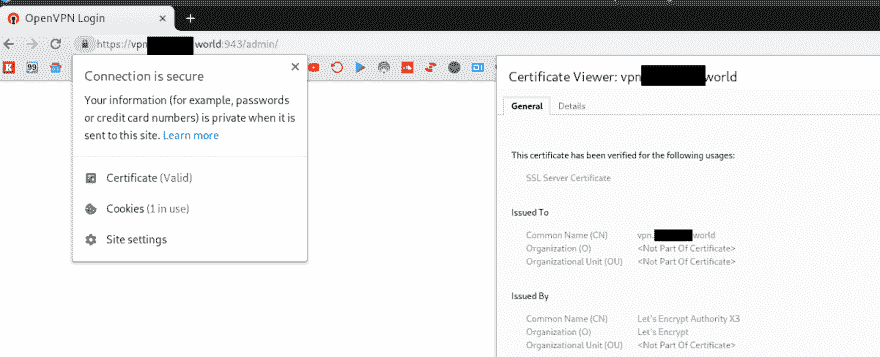
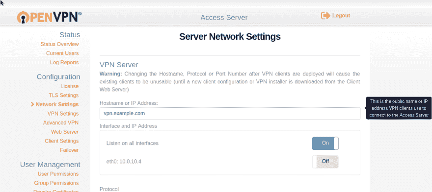

# OpenVPN: SSL 和主机名配置

> 原文：<https://dev.to/setevoy/openvpn-ssl-and-hostname-configuration-2nb9>

[](https://res.cloudinary.com/practicaldev/image/fetch/s--wzHUWC0j--/c_limit%2Cf_auto%2Cfl_progressive%2Cq_auto%2Cw_880/https://rtfm.co.ua/wp-content/uploads/2014/07/openvpn-logo-1.png) 我们已经在生产中运行了我们的 OpenVPN，所以再发几篇关于其配置的最后步骤的帖子。

目前——需要配置 SSL 以避免客户端浏览器中的警告。

OpenVPN 作为 SSL 设置的文档—[此处> > >](https://openvpn.net/vpn-server-resources/managing-settings-for-the-web-services-from-the-command-line/#Installing_a_signed_SSL_certificate) 。

### 让我们加密

安装让我们加密客户端:

```
root@openvpnas2:~# git clone https://github.com/letsencrypt/letsencrypt /opt/letsencrypt 
```

在您的 AWS 安全组中打开端口 80——它与 OpenVPN 一样安全，因为客户端在 443 上监听，管理页面访问在 943 上监听。

获取新证书:

```
root@openvpnas2:~# /opt/letsencrypt/letsencrypt-auto certonly -d vpn.example.com
...
1: Spin up a temporary webserver (standalone)
...
IMPORTANT NOTES:
- Congratulations! Your certificate and chain have been saved at:
/etc/letsencrypt/live/vpn.example.com/fullchain.pem
Your key file has been saved at:
/etc/letsencrypt/live/vpn.example.com/privkey.pem 
```

### SSL 在 OpenVPN 中作为

您可以使用 *Web 服务器配置*中的管理用户界面或使用 CLI 更改证书。

第一次运行时，OpenVPN AS 生成存储在`/usr/local/openvpn_as/etc/web-ssl/`目录中的自签名证书:

```
root@openvpnas2:~# ls -l /usr/local/openvpn_as/etc/web-ssl/
total 16
-rw-r--r-- 1 root root 1111 Feb 21 14:50 ca.crt
-rw------- 1 root root 1708 Feb 21 14:50 ca.key
-rw-r--r-- 1 root root 1082 Feb 21 14:50 server.crt
-rw------- 1 root root 1704 Feb 21 14:50 server.key 
```

它们是一种故障转移证书，以防其他证书被破坏。

要配置 SSL，我们需要三个文件，在使用“让我们加密”的情况下，我们将使用下面的文件来创建它们:

*   `*.crt`–是我们的`fullchain.pem`文件
*   `*.key`–`privkey.pem`文件
*   `*.bundle`–将从`fullchain.pem`和`privkey.pem`中创建

选中让我们加密现有文件:

```
root@openvpnas2:/etc/letsencrypt/live/vpn.example.com# ls -l
total 4
lrwxrwxrwx 1 root root  42 Feb 22 10:56 cert.pem -\> ../../archive/vpn.example.com/cert1.pem
lrwxrwxrwx 1 root root  43 Feb 22 10:56 chain.pem -\> ../../archive/vpn.example.com/chain1.pem
lrwxrwxrwx 1 root root  47 Feb 22 10:56 fullchain.pem -\> ../../archive/vpn.example.com/fullchain1.pem
lrwxrwxrwx 1 root root  45 Feb 22 10:56 privkey.pem -\> ../../archive/vpn.example.com/privkey1.pem 
```

将私钥安装到 OpenVPN 服务器:

```
root@openvpnas2:/etc/letsencrypt/live/vpn.example.com# /usr/local/openvpn_as/scripts/sacli --key "cs.priv_key" --value_file "privkey.pem" ConfigPut
[True, {}] 
```

安装其公共证书:

```
root@openvpnas2:/etc/letsencrypt/live/vpn.example.com# /usr/local/openvpn_as/scripts/sacli --key "cs.cert" --value_file "fullchain.pem" ConfigPut
[True, {}] 
```

“生成”包文件——只需用`cat`代替`fullchain.pem`和`privkey.pem`:

```
root@openvpnas2:/etc/letsencrypt/live/vpn.example.com# cat fullchain.pem privkey.pem > bundle.pem 
```

将其添加到 OpenVPN，如下所示:

```
root@openvpnas2:/etc/letsencrypt/live/vpn.example.com# /usr/local/openvpn_as/scripts/sacli --key "cs.ca_bundle" --value_file "bundle.pem" ConfigPut
[True, {}] 
```

重新启动服务:

```
root@openvpnas2:/etc/letsencrypt/live/vpn.example.com# /usr/local/openvpn_as/scripts/sacli start
RunStart warm None
{
"errors": {},
"service\_status": {
"api": "on",
"auth": "on",
"bridge": "on",
"client\_query": "restarted",
"crl": "on",
"daemon\_pre": "on",
"db\_push": "on",
"ip6tables\_live": "on",
"ip6tables\_openvpn": "on",
"iptables\_live": "on",
"iptables\_openvpn": "on",
"iptables\_web": "restarted",
"license": "on",
"log": "on",
"openvpn\_0": "on",
"openvpn\_1": "on",
"user": "on",
"web": "restarted"
}
}

WILL_RESTART ['web', 'client'] 
```

现在检查用户界面:

[](https://rtfm.co.ua/wp-content/uploads/2019/02/Screenshot_20190222_132015.png)

### OpenVPN 作为主机名

这里的最后一步是配置服务器的主机名，如果在初始设置时没有这样做的话。

进入管理界面=> *网络设置*:

[](https://rtfm.co.ua/wp-content/uploads/2019/02/Screenshot_20190226_132601.png)

完成了。

### 类似的帖子

*   <small>2019 年 2 月 26 日</small> [【开放 VPN:欧安组织】SSL 主机名称](https://rtfm.co.ua/openvpn-nastrojka-ssl-i-hostname/)<small>【0】</small>
*   <small>9/26/2017</small>[【encrypt:防火墙】](https://rtfm.co.ua/lets-encrypt-firewall-i-verifikaciya-domena/)<small>【0】</small>
*   t001/22/2018 t1let’s 工程:删除 T3t 4 证书
*   <small>02/21/2019</small>[OpenVPN:OpenVPN 接入服务器设置和 AWS VPC 对等配置](https://dev.to/setevoy2/openvpn-openvpn-access-server-set-up-and-aws-vpc-peering-configuration-66b-temp-slug-8374150) <small>(0)</small>
*   <small>02/22/2019</small>[OpenVPN:DNS 和 dnsmasq 配置](https://rtfm.co.ua/en/openvpn-dns-and-dnsmasq-configuration/) <small>(0)</small>