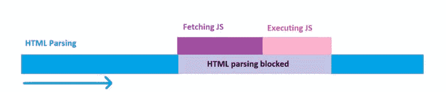
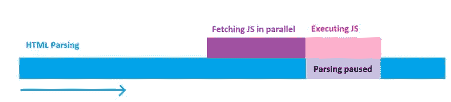
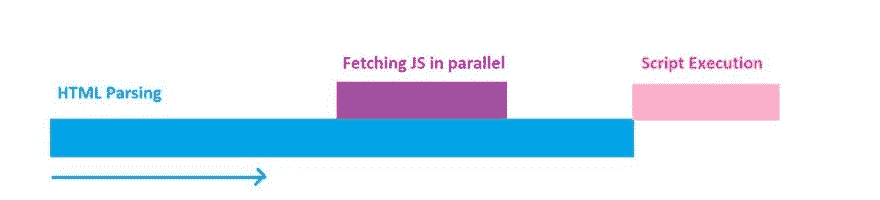

# 优化 javascript

> 原文：<https://dev.to/yashints/optimising-javascript-1f8b>

最近，我有机会在悉尼 NDC 做了一个关于网络性能的演讲，得到了很好的反馈。

这启发了我就我在那次演讲中涉及的每个主题写了一系列的帖子，谁知道呢，也许有一天这些帖子中的每一个都会成为一次单独的演讲😃。

所有其他零件:

[关于 HTML 和 CSS 的第 1 部分](https://dev.to/blog/2018/09/29/web-perf-1)

[第 2 部分使用预加载/预取来增加加载时间](https://dev.to/blog/2018/10/06/web-perf-2)

[第四部分图像优化](https://dev.to/blog/2018/11/12/web-perf-4)

[第五部分网络字体优化](https://dev.to/blog/2018/11/23/web-perf-5)

是时候看看我们能为老朋友 JavaScript 做些什么了。让我们开始吧。

# 切换到 HTTP/2

随着越来越多的主机提供商支持 [HTTP/2](https://en.wikipedia.org/wiki/HTTP/2) ，现在是转而使用这种协议并从其复用特性中获益的好时机。就性能而言，这意味着我们不需要将所有的 JavaScript 捆绑成大的包来减少对服务器的调用次数。

使用为处理大量请求而设计的 **HTTP/2** ，您现在可以增加呈现页面所需的文件数量。不过分:

> 好事过犹不及。

# 异步&延迟

正如我之前提到的，JavaScript 和 CSS 一样是一个**渲染阻塞**元素。这仅仅意味着浏览器需要等待它的加载和执行，然后才能解析`HTML`文档的其余部分。

这极大地增加了我们第一次有意义的痛苦。为了解决这个问题，我们可以使用两个不常用但非常有效的功能。

### 正常执行

当您使用`<script>`加载 JavaScript 文件时，它会中断文档的解析。浏览器获取资源，执行该资源，然后继续配对:

[](https://res.cloudinary.com/practicaldev/image/fetch/s--GjessZ-2--/c_limit%2Cf_auto%2Cfl_progressive%2Cq_auto%2Cw_880/https://yashints.dev/static/d562503683c7b6a3c0ee5ed90085f60c/b4133/normaljsexec.jpg)

### `Async`属性

`Async`属性用于表示该资源可以异步执行。解析不需要暂停，它可以在资源从网络中获取并准备好之后立即进行。

```
<script async src="script.js"> 
```

Enter fullscreen mode Exit fullscreen mode

该属性只能用于外部 JavaScript 文件。文件将被并行下载，一旦下载完成，将暂停解析以执行脚本:

[](https://res.cloudinary.com/practicaldev/image/fetch/s--bk14wi9v--/c_limit%2Cf_auto%2Cfl_progressive%2Cq_auto%2Cw_880/https://yashints.dev/static/7d5975f30349a8282be6f1d8b956cde5/b4133/asyncjs.jpg)

### `Defer`属性

`Defer`属性用于告诉浏览器在解析整个文档后执行这个脚本。

```
<script defer src="script.js"> 
```

Enter fullscreen mode Exit fullscreen mode

像`Async`一样，这个文件被并行下载，但是只有当整个`HTML`文档被解析时才执行:

[](https://res.cloudinary.com/practicaldev/image/fetch/s--hWErzYlO--/c_limit%2Cf_auto%2Cfl_progressive%2Cq_auto%2Cw_880/https://yashints.dev/static/61e576b9875fc024a3679482e7e2398a/b4133/deferjs.jpg)

最后，记得将所有的`script`标签放在`body`的末尾，以防止解析`HTML`时的更多延迟。

至于浏览器支持，幸运的是所有主流浏览器都完全支持这些属性。

# 代码拆分

大多数现代网站会将所有的 JavaScript 捆绑成一个，导致加载时间增加，影响加载性能。

代码分割允许您将应用程序代码分割成单独的块，并在需要时延迟加载它们。这也意味着客户端所需的代码最少，并缩短了页面加载时间。

您可以将代码分为三个部分:

*   供应商代码
*   入口点
*   动态分裂

## 供应商代码

供应商代码，如角度、反作用力、力矩等。可以和你的主代码分开。Webpack 完全支持这种方法和其他方法。这种技术允许您更好地控制包的缓存失效，无论何时您的应用程序或供应商代码相互独立地更改。

这是每个 app 都应该做的。

## 进入点

这种技术通过应用程序中的入口点来分隔代码。当像 webpack 这样的捆绑器构建应用程序的依赖树时，这些点就是它们的起点。

这是迄今为止分割代码最简单的方法，但是它是手动的，并且有一些缺陷:

*   如果入口点之间有任何重复的模块，它们将被捆绑在两个入口点中。
*   它不够灵活，并且不能用于动态拆分代码和应用程序逻辑。

这种技术不适用于客户端路由或者混合了服务器端呈现和单页面应用的情况。

## 动态拆分

使用动态`import`时单独编码。这是单页应用程序的最佳选择。在您的水疗中心为不同的路线设置不同的模块就是一个例子。

## 我甚至需要代码拆分吗？

这是你听到我说视情况而定的许多次之一(毕竟我是一名顾问😉).如果你的应用有很多独立的功能，并且大量使用框架和库，这个答案很可能是 **YES** 。

但是，你可以根据自己对应用结构和代码的理解来决定是否需要它。

# 明智地导入

如果您使用`npm`或其他包管理系统来管理您的依赖项，那么您的 buid 文件夹中会有很多多余的和不需要的文件。

当使用一个框架或者一个库的时候，确保你调查他们是否有你可以导入的独立模块，如果有，只导入你需要的。

例如，让我们假设您使用了[下划线](https://underscorejs.org/)，但是只使用了`groupBy`、`shuffle`和`partition`。大多数人都是这样导入整个库的:

```
import * as _ from 'underscore' 
```

Enter fullscreen mode Exit fullscreen mode

相反，你可以只导入你需要的:

```
import {
  groupBy,
  shuffle,
  partition,
} from 'underscore' 
```

Enter fullscreen mode Exit fullscreen mode

这样你只需要带你需要的东西，打包工会帮你处理剩下的东西。您的总包大小，因此您的页面加载时间将减少。

# 节流和去抖

好了，关于尺寸已经说得够多了，让我们看看还有哪些地方可以改进我们的性能。

很多时候你必须添加一个事件监听器来做一些事情，比如监听页面滚动。然后我们忘记了侦听器在每次事件被触发时触发。

```
window.addEventListener('scroll', function() {
  console.log('page scrolled')
}) 
```

Enter fullscreen mode Exit fullscreen mode

在上面的例子中，每当你滚动时，消息被打印到控制台。假设您在回调函数中有一些繁重操作，这将变成一个很大的性能瓶颈。

如果您不能删除事件监听器并使用不同方法，那么您可以使用`debounce`或`throttle`来缓解这种情况。

## 去抖

该特性强制函数调用在上次调用后过了一段时间后才会发生。例如，如果距离上次调用已经过去了 100 毫秒，则调用该函数。

从下划线开始看这个实现:

```
const debounce = (func, delay) => {
  let inDebounce
  return function() {
    const context = this
    const args = arguments
    clearTimeout(inDebounce)
    inDebounce = setTimeout(
      () => func.apply(context, args),
      delay
    )
  }
} 
```

Enter fullscreen mode Exit fullscreen mode

现在我们可以每隔 100 毫秒去抖一次事件监听器:

```
var efficientScrollListener = debounce(
  function() {
    console.log('page scrolled')
  },
  100
)

window.addEventListener(
  'scroll',
  efficientScrollListener
) 
```

Enter fullscreen mode Exit fullscreen mode

## 油门

节流类似于去抖，但有所不同，因为它将强制一个函数在一段时间内可以被调用的最大次数。例如每 100 毫秒执行一次这个函数。

下面是一个简单的实现:

```
const throttle = (func, limit) => {
  let inThrottle
  return function() {
    const args = arguments
    const context = this
    if (!inThrottle) {
      func.apply(context, args)
      inThrottle = true
      setTimeout(
        () => (inThrottle = false),
        limit
      )
    }
  }
} 
```

Enter fullscreen mode Exit fullscreen mode

现在我们可以调节我们的滚动事件监听器:

```
var efficientScrollListener = throttle(
  function() {
    console.log('page scrolled')
  },
  100
)

window.addEventListener(
  'scroll',
  efficientScrollListener
) 
```

Enter fullscreen mode Exit fullscreen mode

# 那又怎样

我希望我已经给了您足够的信息，让您在使用 JavaScript 时可以集中精力提高应用程序的性能。如果你想讨论其他话题，请在下面评论，我会把它们添加到这里或另一篇文章中。

一如既往，不要忘记分享❤️.