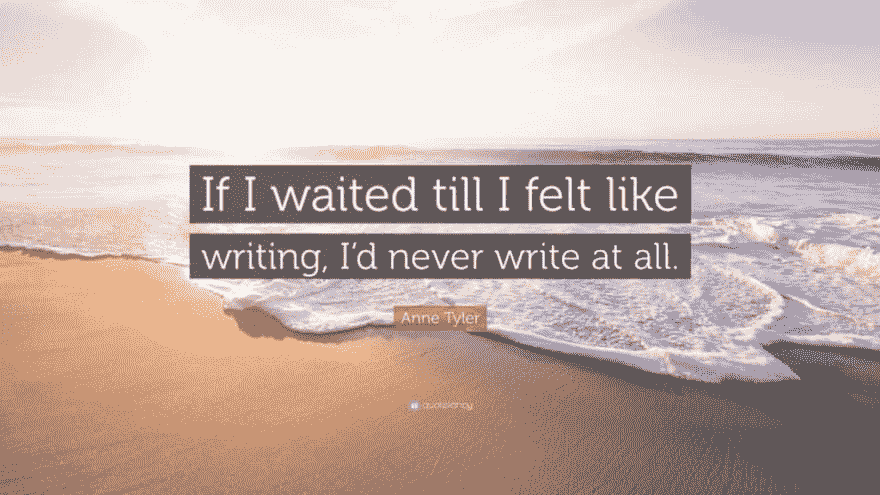

# OrangeScape 著名作家工作室

> 原文：<https://dev.to/bhavaniravi/orangescapes-famous-writers-workshop-5ejg>

作家工作室最初是作为一项实验来发出 Orangescape 工程师的声音。3 车间下来，现在它已经成为我们文化的一部分。我们每 6 个月举办一次研讨会，人们报名参加为期 2 天的研讨会，然后参加# 100DaysChallenge。如果你计划在不久的将来加入 OrangeScape，这是你不应该错过的事情之一。

### 是为了谁？

它是为那些想写作但因为以下原因而没有写作的人准备的

1.  害怕写作
2.  害怕审判
3.  一片空白
4.  不确定写什么
5.  不确定从哪里开始
6.  任何其他阻止他们写的外壳

### 我们从中得到了什么？

#### 闭关两天

研讨会在一个度假胜地举行；离办公室很远很远。这种设置确保了人们不断地感到只写不写的冲动。

#### 丰盛的食物

有了好去处，就有好食物。

#### 一个超级活跃的疯狂大脑

现在，你身边都是一堆激情写作的人。一群在那里帮助你度过难关的人

如果这不能激励你，我不知道还有什么能激励你

#### 很多博客的想法

还记得我跟你说过的超级活跃的大脑吗？它将在整个研讨会中不断提出新的想法。

#### 很多朋友

写作让人卸下防备，暴露出真实自我的一个版本。告诉我，是否有比说“嘿，我看了你的博客，太棒了！”更简单的方法来和别人交谈

#### 一个你从来不知道的自己

这是新的东西。通过写博客和阅读其他人的作品，你的知识基础会增长，你会发现自己正在成为一个更好的人。

### 为什么是作坊？为什么不直接写呢？

就像你一样，我们都有写作的问题。那些强迫自己写作的人很难出版它。发表文章的人很难保持一致。我们每个人都会在某个时候陷入困境。

尼尔·米勒(Neil Miller)竭尽全力传授深刻的见解和快速的技巧，帮助我们克服障碍和自我怀疑。

### 车间有多长？

研讨会从周六上午 10 点开始，一直持续到下午 5 点，在这里，尼尔解构了各种障碍，并提供了克服这些障碍的快速技巧。在会议结束时，人们会想出 30 多个想法来写。他们中的大部分人都已经准备好了他们的第一个博客。

晚上剩下的时间到早上，人们让他们的缪斯工作，尽可能多地写作。因为善用这段时间的人会轻松度过接下来的 100 天。

### 100 天？？？现在怎么办？！

是的，作家工作坊是 100 天写作挑战的开始。在接下来的 100 天里，我们都进了办公室的会议室。在那里，我们集思广益，构思，写作和发布博客。

我现在已经是第二次接受 100 天写作挑战了。第一次， [*它暴露了我身上的一切*](https://twitter.com/i/moments/1033782131342753792) *。这次我希望它能把我塑造成一个更好的人。*