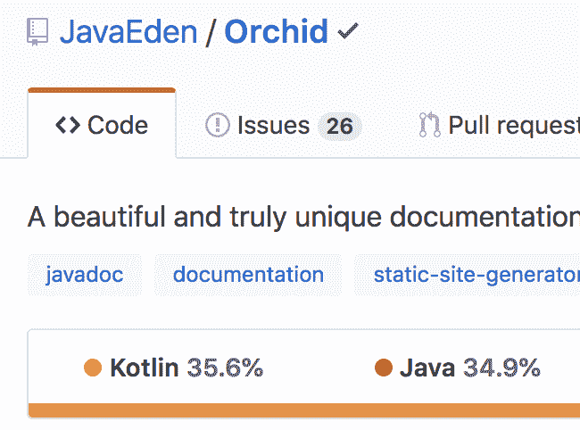

# 兰花现在比爪哇更科特林！

> 原文：<https://dev.to/cjbrooks12/orchid-is-now-more-kotlin-than-java-30bc>

只是想在这里分享一个快速的胜利。经过一年多慢慢地将兰花代码库从 Java 移植到 Kotlin，它正式成为一个 Kotlin 项目，而不是 Java 项目！

在接下来的几天里，我还会分享一些其他的小胜利，敬请关注！

##  [兰花](https://github.com/orchidhq) / [兰花](https://github.com/orchidhq/Orchid)

### 构建和部署与您一起成长的漂亮的文档站点

<article class="markdown-body entry-content container-lg" itemprop="text">

 
**构建和部署与您一起成长的精美文档网站**

* * *

[快速入门](https://orchid.run/wiki/user-manual/getting-started/quickstart)[文档](https://orchid.run/wiki/user-manual/getting-started)[教程](https://orchid.run/wiki/learn)[展示](https://orchid.run/showcase)[支持](https://gitter.im/JavaEden/Orchid)

## 快速启动

*   
*   
*   
*   

## 证明文件

兰花的用户手册将带您了解兰花的主要功能，并让您更深入地了解每个主题和功能。

[文档](https://orchid.run/wiki/user-manual/getting-started)

## 教程

有几个教程旨在引导您从头开始构建一个兰花站点。所有教程的源代码也可以在[或教程库](https://github.com/orchidhq/OrchidTutorials)中找到。

[教程](https://orchid.run/wiki/learn)

## 显示优点的东西

查看陈列柜，看看兰花的行动。

[展示区](https://orchid.run/showcase)

## 支持

### 贡献者

这个项目的存在要感谢所有做出贡献的人。要参与，请见[投稿. md](https://github.com/orchidhq/orchid/blob/dev/.github/CONTRIBUTING.md)

 

### 巴克斯

感谢我们所有的支持者！<g-emoji class="g-emoji" alias="pray" fallback-src="https://github.githubassets.cimg/icons/emoji/unicode/1f64f.png">🙏</g-emoji>

 

### 赞助商

通过成为赞助商来支持这个项目。您的徽标将显示在此处，并带有指向您网站的链接。

          

### 许可证

Orchid 是在 GNU 宽松通用公共许可证(LGPL-3.0)下许可的开源软件。请看 [License.md](https://github.com/orchidhq/orchid/blob/dev/License.md)

### 接触

…

</article>

[View on GitHub](https://github.com/orchidhq/Orchid)