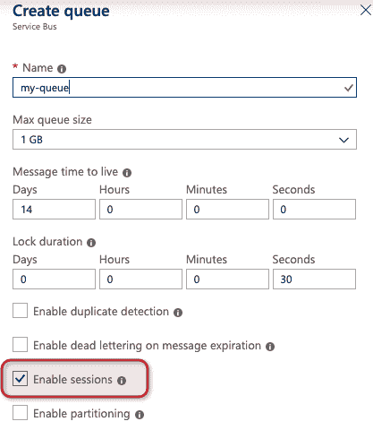

# 具有会话的 Azure 函数中的有序队列处理

> 原文：<https://dev.to/azure/ordered-queue-processing-in-azure-functions-4h6c>

我们聊聊点餐吧。这是我最喜欢的话题之一，也是我在之前已经在博客上广泛讨论过的事情。以前，Azure 函数中的有序处理只适用于像 Azure Event Hubs 这样的事件流，但今天我想展示如何为服务总线队列和主题保持有序。

从表面上看，这似乎很简单:我希望能够按照我收到消息的顺序来处理队列中的消息。对于一个运行在机器上的简单服务来说，这很容易实现。但是，当我想要大规模处理时，如何保持队列消息的顺序呢？有了 Azure Functions 这样的东西，我可能要跨几十个活动实例处理消息，我该如何保持有序呢？

让我们用一个简单的例子来说明一个处理医院病人的消息系统。假设我为每个病人准备了几个事件:

1.  病人来了
2.  分配给病人一个房间
3.  患者接受治疗
4.  病人出院了

我想确保我不会不按顺序处理消息，也不会在处理完病人的治疗之前就让他们出院！

让我们做一些快速实验，看看会发生什么。为此，我将模拟 1000 名患者，每个人发送这 4 条消息(按顺序)并处理它们(最好也按顺序)。

[](https://res.cloudinary.com/practicaldev/image/fetch/s--pBFCUEkL--/c_limit%2Cf_auto%2Cfl_progressive%2Cq_auto%2Cw_880/https://i.imgur.com/OiEKwxX.png)

## 缺省和故障

让我们用一个简单的 Azure 函数来尝试一下，这个函数只在队列上触发。我不打算做任何特殊的事情，只是在队列上触发并将它正在处理的操作推送到 Redis 缓存上的一个列表中。

```
public async Task Run(
    [ServiceBusTrigger("queue", Connection = "ServiceBusConnectionString")]Message message, 
    ILogger log)
{
    log.LogInformation($"C# ServiceBus queue trigger function processed message: {Encoding.UTF8.GetString(message.Body)}");
    await _client.PushData((string)message.UserProperties["patientId"], Encoding.UTF8.GetString(message.Body));
} 
```

Enter fullscreen mode Exit fullscreen mode

将 1000 名患者的数据(每名患者 4 条消息)发送到该队列后，Redis 缓存在处理后会是什么样子？一些病人看起来很好。当我查找患者#4 时，我看到:

```
>lrange Patient-$4 0 -1
1) "Message-0"
2) "Message-1"
3) "Message-2"
4) "Message-3" 
```

Enter fullscreen mode Exit fullscreen mode

太好了！为患者 4 发送了所有 4 个事件，并按顺序进行了处理。但是如果我看病人 2:

```
>lrange Patient-$2 0 -1
1) "Message-1"
2) "Message-2"
3) "Message-0"
4) "Message-3" 
```

Enter fullscreen mode Exit fullscreen mode

在这种情况下，它没有完成处理“患者到达”消息，直到已经处理了另外两个消息。这里发生了什么？Azure Service Bus 确实保证了有序，那么为什么我的消息是无序的呢？

默认情况下，队列触发器会做一些事情。首先，对于每个启动的实例，它将同时处理一组消息。[默认情况下](https://docs.microsoft.com/en-us/azure/azure-functions/functions-bindings-service-bus#hostjson-settings)一个实例并发处理 32 条消息。这意味着它可能会同时处理一个患者的所有 4 条消息，并且它们的完成顺序与发送顺序不同。这似乎很容易解决，让我们将并发限制为 1。

## 反模式:限制向外扩展和并发

这可能是我看到的解决上述问题的最常见的方法。让我们将并发限制为一次只处理 1 条消息，而不是 32 条。为此，我修改了我的`host.json`文件并将`maxConcurrentCalls`设置为 1。现在，每个实例一次只能处理一条消息。我又做了同样的测试。

首先，它是超级慢的。我花了很长时间来研究这 4000 条队列消息，因为每个实例一次只处理 1 条。更糟的是。事后我查结果的时候，有的病人还是乱套了！这是怎么回事？即使我将**实例**并发限制为 1，Azure Functions 还是将我扩展到了多个实例。因此，如果我有 20 个已扩展的函数应用程序实例，我就有 20 条消息被并发处理(每个实例一条)。这意味着我仍然会遇到这样的情况，来自同一个病人的消息可以在同一时间被处理——只是在不同的实例上。我仍然不能保证有序处理。

这里的修复？许多人希望限制 Azure 功能的规模。虽然从技术上来说是可能的，但这会对我的吞吐量造成更大的伤害。现在，一次只能处理全局的一条消息，这意味着在高流量期间，我将有大量积压的患者事件，我的功能可能无法跟上。

## 刘宇出手相救

如果我在这里结束这篇博文，岂不是很悲伤？有更好的办法！以前我说过，这里你最好的选择可能是使用事件中心，因为分区和批处理，[你可以保证排序](https://medium.com/@jeffhollan/in-order-event-processing-with-azure-functions-bb661eb55428)。但是这里的挑战是，考虑到队列的事务性，如重试和死信，有时队列是作业的正确消息代理。现在，您可以使用队列*和*通过服务总线会话进行排序🎉。

那么什么是会话呢？会话使您能够为一组消息设置标识符。为了处理来自会话的消息，您首先必须“锁定”会话。然后，您可以开始单独处理来自会话的每条消息(使用与常规队列相同的 lock / complete 语义)。会话的好处是**即使在多个实例之间进行大规模处理时，它也能让您保持有序。**想想以前，我们有大约 20 个 Azure Function 应用程序实例都在竞争同一个队列。现在，所有 20 个实例都将“锁定”自己的可用会话，并且只处理来自该会话的事件，而不是不扩展到 20 个。会话还确保来自会话的消息按顺序处理。

可以随时动态创建会话。Azure Functions 的一个实例旋转起来，首先询问“有没有会话 ID 没有被锁定的消息？”如果是，它锁定会话并开始按顺序处理。当一个会话不再有任何可用的消息时，Azure 函数将释放锁，并转移到下一个可用的会话。除非首先锁定消息所属的会话，否则不会处理任何消息。

对于上面的例子，我将发送同样的 4000 条消息(1000 名患者的 4 个患者事件)。在本例中，我将把患者 ID 设置为会话 ID。每个 Azure Functions 实例将获取一个会话(病人)的锁，处理任何可用的消息，然后转移到另一个有可用消息的病人。

## 在 Azure 函数中使用会话

会话目前在使用版本> = 3.1.0 的`Microsoft.Azure.WebJobs.Extensions.ServiceBus`扩展中可用，在撰写本文时，这是在预览中。所以首先我会把分机拉进来。

```
Install-Package  Microsoft.Azure.WebJobs.Extensions.ServiceBus  -Pre 
```

Enter fullscreen mode Exit fullscreen mode

然后对我的函数代码做最微小的修改来启用会话(`isSessionsEnabled = true` ):

```
public async Task Run(
    [ServiceBusTrigger("queue", Connection = "ServiceBusConnectionString", IsSessionsEnabled = true)]Message message, 
    ILogger log)
{
    log.LogInformation($"C# ServiceBus queue trigger function processed message: {Encoding.UTF8.GetString(message.Body)}");
    await _client.PushData(message.SessionId, Encoding.UTF8.GetString(message.Body));
} 
```

Enter fullscreen mode Exit fullscreen mode

我还需要确保我使用的是支持会话的队列或主题。

[](https://res.cloudinary.com/practicaldev/image/fetch/s--jNJu6QPv--/c_limit%2Cf_auto%2Cfl_progressive%2Cq_auto%2Cw_880/https://thepracticaldev.s3.amazonaws.com/i/jc4osnmq7q20obk8d5ir.png)

当我将消息推入队列时，我将为我发送的每条患者消息设置正确的`sessionId`。

发布功能后我推送了 4000 条消息。队列很快就被清空了，因为我能够跨扩展实例同时处理多个会话。运行测试后，我检查 Redis 缓存。不出所料，我看到所有的消息都得到了处理，对于我看到的每一个病人，它们都是按顺序处理的:

```
>lrange Patient-$10 0 -1
1) "Message-0"
2) "Message-1"
3) "Message-2"
4) "Message-3"

>lrange Patient-$872 0 -1
1) "Message-0"
2) "Message-1"
3) "Message-2"
4) "Message-3" 
```

Enter fullscreen mode Exit fullscreen mode

因此，有了新的 Azure 函数对会话的支持，我可以按顺序处理来自服务总线队列或主题的消息，而不必牺牲整体吞吐量。我可以动态地将消息添加到新的或现有的会话中，并且确信会话中的消息将按照服务总线接收它们的顺序进行处理。

你可以在[我的 GitHub repo](https://github.com/jeffhollan/functions-csharp-servicebus-sessions) 中看到我用于测试和加载消息的完整样本。`master`分支将全部有序，而`out-of-order`分支是默认的无序实验。