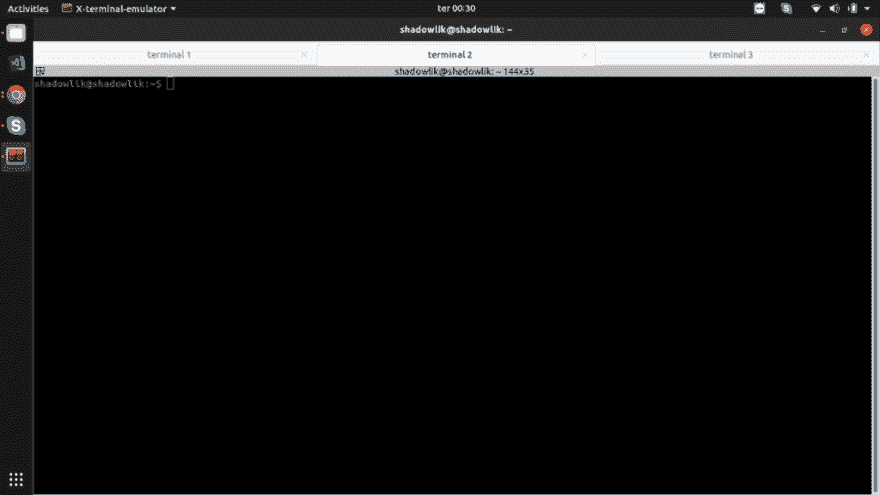
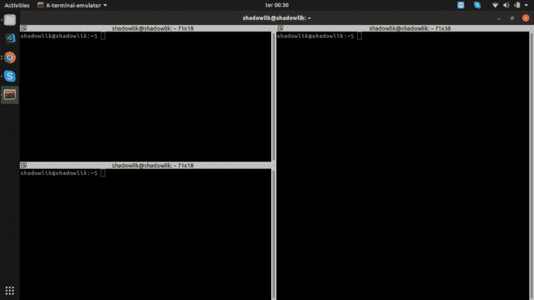
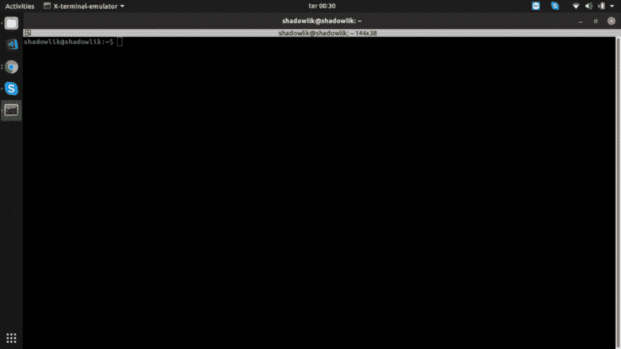
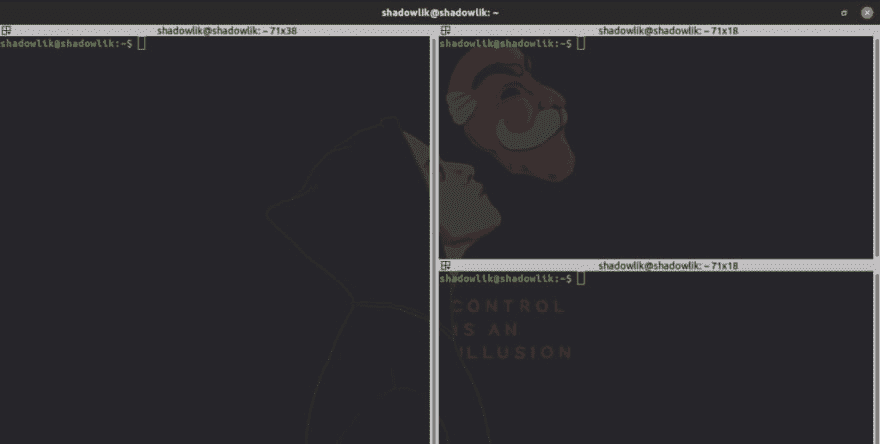
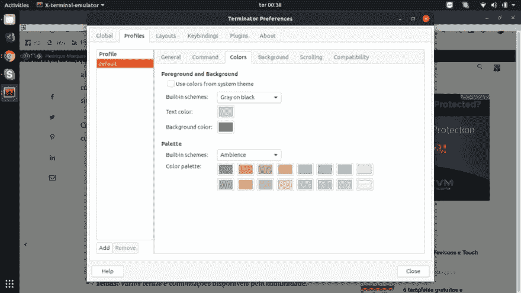
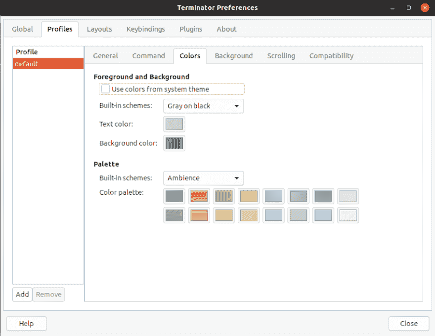

# 优化 seu 终端没有 linux com 终端

> 原文：<https://dev.to/shadowlik/otimize-seu-terminal-no-linux-com-terminator-3ofl>

如果你厌倦了 linux 上的 ralé终端；厌倦了在同一项目的终端之间按 alt+tab；厌倦了在尝试粘贴命令时迷路；了解更强大、组织有序、可定制的终端仿真器 **[【终结器】](https://terminator-gtk3.readthedocs.io/en/latest/)、**[【终端仿真器】](https://terminator-gtk3.readthedocs.io/en/latest/):

*   **多个选项卡:**同一窗口中多个终端选项卡。
*   **终端网格:**将一个标签分割成多个终端，水平和垂直。
*   **自动日志:**用户自动保存会话日志。
*   **拖放&拖放:**将文字、URL 和指令直接拖放到终端上。
*   **搜寻:**使用 Regex 表示式搜寻并反白文字。
*   **主题:**社区提供的各种主题和组合。
*   **E muito mais…**

[](https://marquesfernandes.com/wp-content/uploads/2019/03/Screenshot-from-2019-03-19-00-30-58-1024x576.png)

[](https://marquesfernandes.com/wp-content/uploads/2019/03/Screenshot-from-2019-03-19-00-30-35-1024x576.png)

[](https://marquesfernandes.com/wp-content/uploads/2019/03/Screenshot-from-2019-03-19-00-30-09-1024x576.png)

[](https://marquesfernandes.com/wp-content/uploads/2019/03/terminator-2-1024x517.png)

[](https://marquesfernandes.com/wp-content/uploads/2019/03/Screenshot-from-2019-03-19-00-38-41-1024x576.png)

## 阿斯坦兰度终结者

在大多数 linux 发行版中，可以使用软件包管理器轻松安装终结器。

### Debian/Ubuntu

```
$ sudo add-apt-repository ppa:gnome-terminator $ sudo apt-get update $ sudo apt-get install terminator 
```

### 软呢帽

```
$ sudo dnf install terminator 
```

### CentOS/RHEL

```
$ sudo yum install terminator 
```

## Instalando temas

[](https://res.cloudinary.com/practicaldev/image/fetch/s--UxtdNlnp--/c_limit%2Cf_auto%2Cfl_progressive%2Cq_auto%2Cw_880/https://marquesfernandes.com/wp-content/uploads/2019/03/image.png)

您可以在终结器中安装或创建自己的主题。访问[链接](https://github.com/mbadolato/iTerm2-Color-Schemes)并选择最喜欢的主题，打开所需主题的文件，复制其内容。然后右键单击“终结器”，导航到“首选项”并创建新的配置文件以生成新的主题文件，导航到~/.config/terminator/，然后编辑新创建的配置文件的文件，并将主题内容粘贴到末尾。

## 键盘快捷键

终结器中最常用的缺省快捷方式列表:

*   `F11`:全屏切换。
*   `Ctrl+Shift+O`:将分页分割成水平终端。
*   `Ctrl+Shift+E`将分页分割成垂直终端。
*   `Ctrl+Shift+W`:关闭活动终端。
*   `Ctrl+Shift+T`打开新标签。
*   `Shift+Ctrl+s`:显示/隐藏滚动条。
*   `Ctrl+Shift+f`:在活动终端上搜索文本。
*   `Ctrl+Shift+R`:清洁活动终端。
*   `Super+g`:将所有终端分组为一个标签。
*   `Ctrl+Shift+q`:退出终结者，关闭所有标签。

post [以终结器](https://marquesfernandes.com/2019/03/19/otimize-seu-terminal-no-liux-com-terminator/)优化其 linux 终端，首先出现在 [Henrique Marques Fernandes](https://marquesfernandes.com) 中。