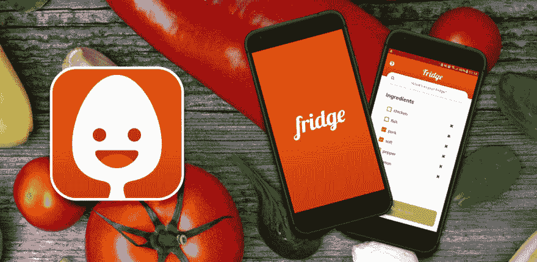

# 我们发布的第一款应用

> 原文：<https://dev.to/arjayosma/our-first-published-app-1nmc>

 
**冰箱** -减少你厨房的浪费

我们最近推出了第一款应用。过去几周，我和我的合作伙伴一直在研究这个想法，我们很兴奋地宣布，我们的第一个应用程序已经发布到野外。
请随意下载应用程序。

[http://bit.ly/FridgeGooglePlay](http://bit.ly/FridgeGooglePlay)谷歌 Play 商店
product hunt:[http://bit.ly/FridgeProductHunt](http://bit.ly/FridgeProductHunt)T5】脸书 Page:[http://bit.ly/FridgeMobile](http://bit.ly/FridgeMobile)

## 关于冰箱

冰箱是一个移动应用程序，可以帮助您重新利用未使用的食材，以减少厨房垃圾。该应用程序将要求你提供你的原料，它会输出可怕的食谱供你参考。

## 发展

该应用程序是使用 [Expo](//expo.io) 的管理工作流开发的。使用这个平台开发应用程序是轻而易举的事情。

## 特性

这款应用的特点如下:

1.  配料搜索
2.  配方搜索(基于选择的配料)
3.  查看配方
4.  共享到不同平台

它还没有丰富的功能，但我们相信我们可以为应用程序提供更多的功能。

## 未来

我们正在考虑将该应用程序部署到 App Store 中，以迎合我们的 iOS 用户。

🙏让我们知道您的想法，如果您有任何问题，请随时给我们发消息！

如果您有与开发相关的问题，请随时在下面评论。