# 我们首次成功的产品发布！🚀

> 原文：<https://dev.to/dinkydani21/our-first-successful-product-launch--9gd>

2019 年 1 月 30 日星期三，我们终于推出了[让我一个人呆着](https://producthunt.com/leave-me-alone-3)——一项以隐私为重点、轻松退订垃圾邮件的服务。

如果你只是想跳到统计数据，你可以在这里找到它们。

## 发射日

启动产品搜寻的最佳时间是旧金山时间 00:01，因为这是新产品搜寻日开始的时间。在这个时候发布会让您的产品获得最大的曝光率和获得投票的时间，因此最有可能获得最重要的第一、第二或第三个当天产品徽章之一。

我们在秘鲁的万卡乔推出了《别管我》,这意味着我们将在凌晨 3 点开始直播。仅仅睡了两个小时(显然太兴奋了)，我们的闹钟就把我们吵醒了。笔记本电脑准备好了，产品搜索、Twitter 和分析工具打开了，我们等待着，然后砰的一声，我们启动了！

### 00:18 -事件 1

我们对登录页面进行了例行检查，并注意到我们的统计数据显示我们**加入了总共取消订阅 0 封垃圾邮件**的 0 个用户。鉴于我们有超过 500 个用户，肯定有问题！

[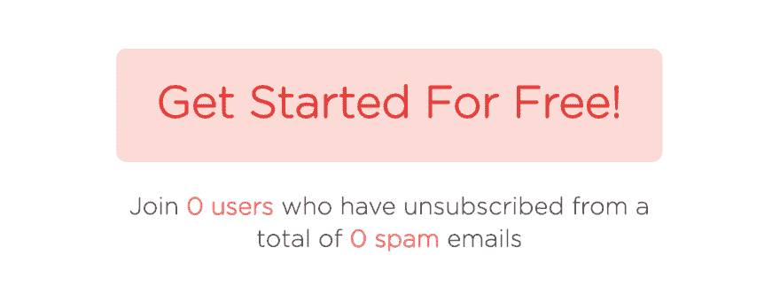](https://res.cloudinary.com/practicaldev/image/fetch/s--Uu2OPPve--/c_limit%2Cf_auto%2Cfl_progressive%2Cq_auto%2Cw_880/https://lh5.googleusercontent.com/Q7icmvv1PNCoc8i9QywY35Bm31M8fXCAwrEh5zRxTkCT1aq0RpWmzZBwbNiFGGm-dJB1UNGylFBRu25w3i_1uVAR356jKU5BVGUfm6Gm2PYLx75njhZzYkxsaHlshF955tWSGBIP)

> “天啊，发生了什么事”

我们部署了一个不可靠的配置文件，应用程序没有连接到实时数据库！幸运的是，我们很早就发现了这一点，并很快修复和部署了它。唷！

### 像星期三早晨一样轻松

第一个小时结束时，我们获得了令人难以置信的 100 张选票。事情在第二小时开始变得更好。我们接触了 24 个在线活跃用户，看到 6-10 个人同时在他们的收件箱里运行扫描。

当我们疯狂地回复产品搜索和 Twitter 上的评论时，服务器保持运行。我们的网站从来没有过这么高的流量——太令人兴奋了！

[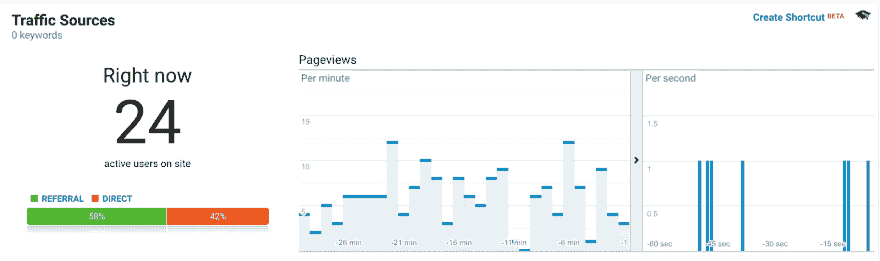](https://res.cloudinary.com/practicaldev/image/fetch/s--IXK2OuAB--/c_limit%2Cf_auto%2Cfl_progressive%2Cq_auto%2Cw_880/https://lh6.googleusercontent.com/Kji54ijh66cfHTxJtcSR-_3n3q9K8i_b-FrCxk6wEvHiHhcLZs3eid-EmgSKsekLU7NyC9jXD-6TW1qLWv7jbkuxypanuF3sqpJFw6YYpztr7-al63p03u9dx7JMZIrtjLofRqrP) 

<figcaption>出发了！</figcaption>

在第 3 个小时，我们获得了前 5 次销售，并获得了 223 张选票——比我们以前的任何一次发布都多！我们与另一个产品并驾齐驱，尽管他们的票数比我们多，我们现在仍然是第一名。

我们看着太阳升起，给[独立黑客](https://www.indiehackers.com/dinkydani/post/5a6f65e88b)发帖。不幸的是，我们也注意到了一个 bug，这个 bug 与我们在移动设备上的产品搜索横幅有关，它导致了整个标题导航的聚集和消失。我动力通过，并着手解决这个问题，而詹姆斯认为这一切都太早了，打了个盹-我肯定不高兴，当我叫醒他部署我的解决方案时，他也不高兴！

然后我们宿舍的互联网就死了！我们试图使用我们的移动数据，但没有加载，我开始恐慌。

快到早上 8 点了，所以我们抓起笔记本电脑，冲出去寻找网络和早餐。我们已经在我们的冲浪小镇找到了网络(和食物)最好的咖啡馆，所以直接去了我们最喜欢的一家- [巧克力秘鲁咖啡馆](https://goo.gl/maps/SbaeDoCKrdQ2)如果你曾经去过那里并且需要一个工作的好地方！

显然，他们没有按时开放，所以我们在外面用他们的 wifi 露营，饿死了，渴望一杯咖啡，试图部署移动修复。

[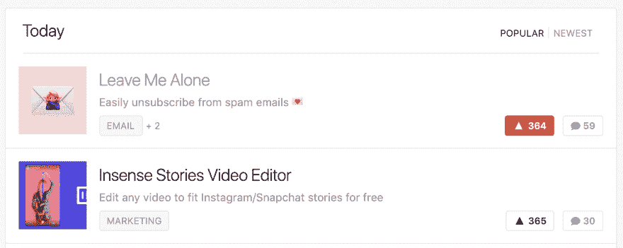](https://res.cloudinary.com/practicaldev/image/fetch/s--vsYUqXf2--/c_limit%2Cf_auto%2Cfl_progressive%2Cq_auto%2Cw_880/https://lh6.googleusercontent.com/Q9vwKgcGdKb_L9mWWl2r64m7kZX6tcjMeVCDkZfs-Ey9mZKaZuaG3l7uWrYPB1iZ4IryTehAdKsQ8iXcOwZIovmVL7O3vIYo9QC5CzWumrQQuXlJNEW7VAt3-Pjwy4LLtXYdWo-p) 

<figcaption>仍在争夺最多票数！</figcaption>

### 07:00 -事件 2

我很久以前就修复了 PH 横幅的样式错误，但我们无法在交通中找到一个窗口来部署。在任何正常的日子里，这都是一个好问题，但在发布日却不是！由于 bug 是前端的，我们可以通过在本地构建代码并复制它来部署修复，而无需重启服务器。

这工作得非常出色，直到我们意识到我们已经用我们本地的 Stripe API 密匙构建，并且我们已经中断了支付。

> “AAAAH OMG。我太饿了，做不了这个。需要咖啡”

这一次更严重，我们有数十个活跃用户和运行扫描的人。幸运的是，这是一个快速的复制粘贴修复，危机在 5 分钟内得以避免。又来了！

### 销售滚滚而来

到了第八个小时，销售额开始强劲快速地增长。我们每隔几分钟就会收到数字海洋带宽警报，接下来的几个小时我们都在刷新产品搜索，观看谷歌分析，管理两个 Twitter 账户上的数百个通知，并庆祝每一个 Stripe 支付通知！

[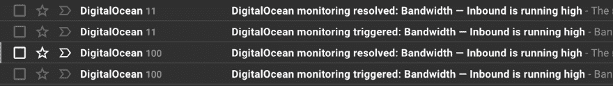](https://res.cloudinary.com/practicaldev/image/fetch/s--7SKpc8KV--/c_limit%2Cf_auto%2Cfl_progressive%2Cq_auto%2Cw_880/https://lh6.googleusercontent.com/7TUOklUHPH8oVqh-usln6Yo3TlmP3rLGm--4Zzk3aDs4G493bSSZLO95291jaRUOfIEtASqeoC0zrPiyaJg0QHOOcoJGIw7pCOb3LoROZ29DzxrbXgRqSRJnyqEGXlTR4IzMKKAn)

### 黑客新闻效果

我们计划在旧金山时间上午 9 点发布到黑客新闻，但是完全忘记了！我们在 09:45 左右发布到了 HN 的一个展览上，并与创客社区的一些人分享，试图建立一些早期的牵引力。众所周知，无法预测一个帖子是否会出现在黑客新闻的头版，所以我们不指望会成功。你可以在这里看到[的帖子。](https://news.ycombinator.com/item?id=19037399)

[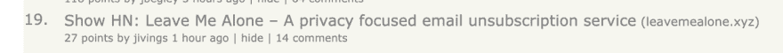](https://res.cloudinary.com/practicaldev/image/fetch/s--LAOjQ4h---/c_limit%2Cf_auto%2Cfl_progressive%2Cq_auto%2Cw_880/https://lh3.googleusercontent.com/pMIoQbIKzJbiTgHunBTuhmcFG6iKqMvDqpsLhVeAjF9WPJLA39KhWNujQPvMaL6jZ63NgzhLqvDAgEvnaqGDea07-eoxCzuh_eCUwSynyxoprq82gzdBBLypX69dKswig_-JoR5n)

然后它开始往上爬。越来越多的用户登陆该网站。每次数字增加时，我都认为这将是峰值，并截图。我们点击了首页，看到现在活跃用户已经攀升到 70 人，而服务器还在那里。

[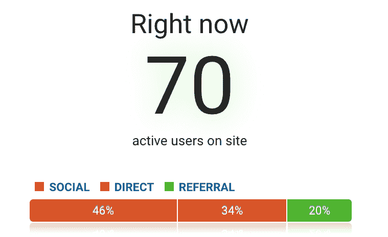](https://res.cloudinary.com/practicaldev/image/fetch/s--_Z5TjunH--/c_limit%2Cf_auto%2Cfl_progressive%2Cq_auto%2Cw_880/https://lh4.googleusercontent.com/_qEqgdD2NR5UDg6VBsUCA279JWyN80FW8ebeO92fPbMXBM44CxL9h3BmIDTiaW3lfTWsLAMrpXc7kDu8I48i6bwJiUJ3vq1EYJlR2c735h1w4p9ELhIkZmjiZgmuPvokQKlbS7G6) 

<figcaption>相对较小的数字对于我们黑客新闻的头版可是足够了！</figcaption>

詹姆斯非常擅长回答评论。他非常老练，而且实际上很享受！我把我的努力集中在 PH 和 Twitter 上，我不太擅长处理困难的评论！

### 11:00 -事件 3

黑客新闻的效果是令人兴奋和疲惫的。然后灾难降临了！我们遇到了第一次停机，服务器停机了大约 15 分钟。

> “这个。是。不好。”

我们不确定发生了什么，但我们的数据库崩溃了，重启有困难。这一次詹姆斯来救援，并执行了一些闪电般的快速开发，以修复 Mongo 并使我们重新上线，而我只是摆弄我的拇指，反复问他是否已经修好了。

### 半路杀出一千

谢天谢地，这标志着我们的事件结束了，因为我们达到了 500 upvotes 和 1,000 Leave Me Alone 用户。在接下来的几个小时里，流量一直保持在 60-70 个活跃用户，第一批支持请求开始到来。

没有大问题，大部分问题是扫描没有完成或需要很长时间运行，因为服务器负载太重。

[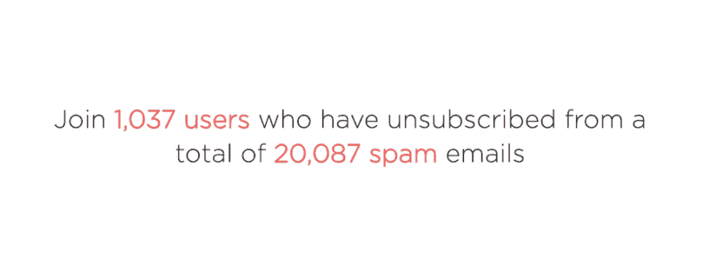](https://res.cloudinary.com/practicaldev/image/fetch/s--cKbRO9jE--/c_limit%2Cf_auto%2Cfl_progressive%2Cq_auto%2Cw_880/https://lh4.googleusercontent.com/m_hM7X6janzFekS7zHBGESALEErLz-gY0MIQBJ0-Go4acvqqKBxpMTH0xjKEwMqqYoFIJL5mdx4ymn7CwY_jJgJfWezr7-WR_b9uzGHYP5fNISOSc6DojcwCWZhRXmzoPr8fh--H) 

<figcaption>大里程碑！1000 名用户和 20000 封垃圾邮件退订</figcaption>

### 黑客新闻降级

现在是秘鲁时间下午 5 点 14 分。2 小时的睡眠开始产生影响，我们都感到有点神志不清。

我们也被从黑客新闻的首页上撤了下来，从第 28 位瞬间降级到第 238 位。有传言称，如果评论数量与投票数量过于接近，帖子将被降级。这可能是巧合，但我们有 48 票和 47 条意见时，被删除。你可以在这里看到我们的排名进度[http://hnrankings.info/19037399](http://hnrankings.info/19037399)(感谢[莱安德罗](https://twitter.com/Leandro8209)分享链接)。

[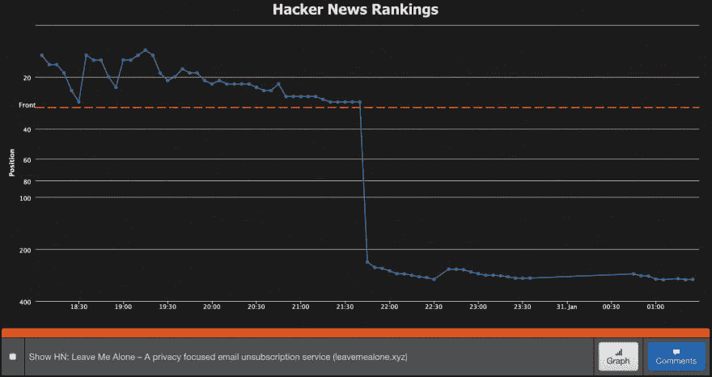](https://res.cloudinary.com/practicaldev/image/fetch/s--7BhUKIlT--/c_limit%2Cf_auto%2Cfl_progressive%2Cq_auto%2Cw_880/https://lh3.googleusercontent.com/lZIM3eolECiCleISzgtex3xb3wo96IDrJ2LOP77PrefmcllwKKyehw1EXq0tKwP0UKa4RTt9dhVN1ZylFfCcYEvdZlaLVlFX_NT-E6A2J2zYQM6sTQgZS48gwXB_MfHGqCYiqAI0) 

<figcaption>就这样</figcaption>

### 啤酒时间

《黑客新闻》头版的删除使我们的流量回到了可管理的水平。我们有点失望，但老实说也松了一口气。

现在是下午 6 点 30 分，我们已经在同一家咖啡馆吃了三顿饭。是时候进行腿部伸展和技术休息了。从冲浪小镇出发的好处之一是我们可以喝几瓶当地啤酒，在海滩上看日落！

[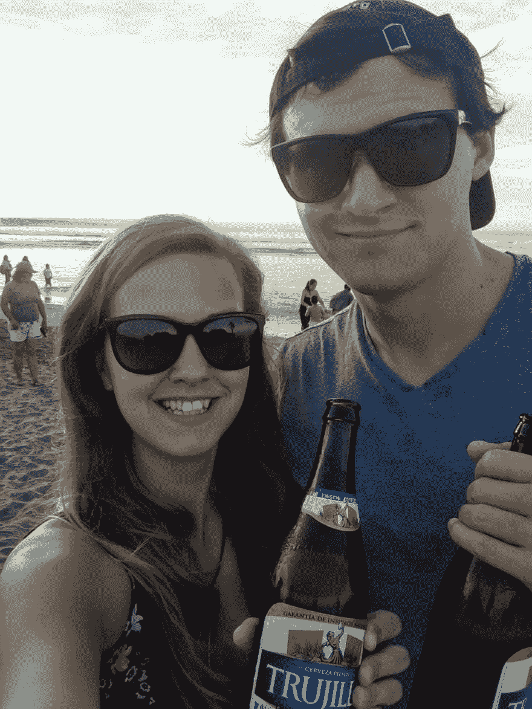](https://res.cloudinary.com/practicaldev/image/fetch/s--HKEG1c28--/c_limit%2Cf_auto%2Cfl_progressive%2Cq_auto%2Cw_880/https://lh6.googleusercontent.com/w6hQZRV2C37UKS_-bYPrBkYIxRk_V4gNQUOvymOMERUSBvJpykoGXF9d8zJwItOIUdyT8vmDrBaQeFVjEXJ8DwbPBrCneiq6r-TVBtXscxSPKa8MUhVbuS8zxVwCXaF4ewFu2Hq6) 

<figcaption>沙滩啤酒！</figcaption>

### 睡觉时间

发射时间 20 小时就要到了，交通仍然稳定。我们呆在宿舍里，处理了更多的支持请求，但我们都筋疲力尽了。我希望我们能看到完整的 24 小时，但我们现在肯定太老了，不能做那样的特技了！

我们以 821 票和当天的第一名产品结束了我们的一天。我们希望醒来时发现我们呆在那里！

[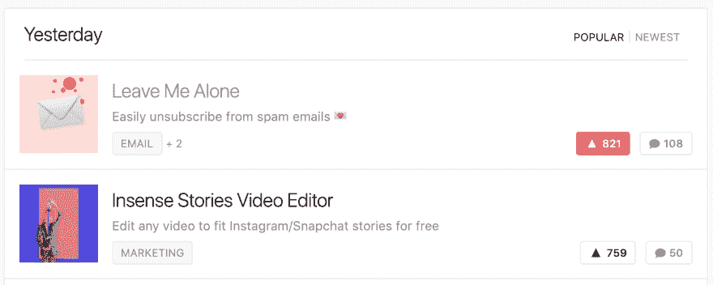](https://res.cloudinary.com/practicaldev/image/fetch/s--AdY7yLGy--/c_limit%2Cf_auto%2Cfl_progressive%2Cq_auto%2Cw_880/https://lh3.googleusercontent.com/GpO7mtRm8GWtXTmKgzlAiP-LMtiOcvfgFkciK-B-AgKkVi9VJLR4BJR1ThNMzcPlAJaNdTDiazH7WD4d6Z8ANRZMF-9gBoiVqkxz5Bp0jjcBCL3hCYZiIqNQdfdRZJwjl3PGcIkC) 

<figcaption>上床时还挺亲密的</figcaption>

### 🥇 🎉第一！！🎉 🥇

我们醒来后拿起手机，发现我们获得了当天的第一名，并获得了近 1000 张选票！！

> 丹妮尔@🇵🇪@丁克丹尼 21我睡得像个婴儿！👶
> 稍后将发布大数据推文。我们醒来时的快速统计:
> 
> 🔼963 张赞成票
> 🥇 [@ProductHunt](https://twitter.com/ProductHunt)
> 当日排名第一的产品🤑144 销售
> 🚨111 服务器带宽警告
> ❓ 6 支持请求
> 
> 发起 [@LeaveMeAloneApp](https://twitter.com/LeaveMeAloneApp) 被🤩激动人心，😓压力山大，&🤯成功了！2019 年 1 月 31 日下午 14:2411190

发射进行得比我们想象的还要好。我们不仅成功维持了巨大的流量，取得了惊人的销售额，而且我们的产品也得到了很多令人难以置信的反馈和支持。

[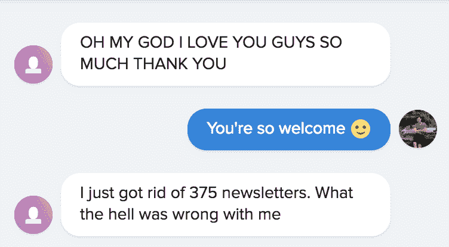](https://res.cloudinary.com/practicaldev/image/fetch/s--TaPfmna_--/c_limit%2Cf_auto%2Cfl_progressive%2Cq_auto%2Cw_880/https://lh5.googleusercontent.com/mCcvcBHCtzzInaBv6fiNu8UL2Y_J92YirHVIL56atafMjIq5PQs8yZh1GiAjuVAdsa_1E6cvjXrz2F4rCaHR3Ba5CHE4IQuJUzqgqZkRqqFl9qs7mhBERJYKl9E0UqXIB3xePny1) 

<figcaption>这样的反馈让一切都值了😍</figcaption>

大多数评论、推文和信息都是积极的，我们非常高兴和感激每一个人——我们的每一个用户——让我一个人呆着。

> 丹妮尔@🇵🇪@丁克丹尼 21🚀 [@LeaveMeAloneApp](https://twitter.com/LeaveMeAloneApp) 发布统计🚀
> T15】👀9803 次页面浏览
> 🏀52.91%的跳出率
> 🇺🇸 62%来自美国
> 😻40%来自 [@ProductHunt](https://twitter.com/ProductHunt)
> 😱27%来自 [@newsycombinator](https://twitter.com/newsycombinator)
> 的 4 小时头版💳166 销售
> 💰1186 美元收入
> 
> 感谢大家对🥰的支持，bug 报告🙈，和 MAKER LOVE！！💛💛2019 年 2 月 01 日下午 16:4327226

### 爱情不断到来

发布后的第二天，流量仍然很高，我们非常高兴达到了 1000 次投票的里程碑。我们出现在[产品搜寻每日简讯](https://www.producthunt.com/newsletter/2473)中，产生了更多的流量，我们的销售额几乎和实际发布日一样多！

[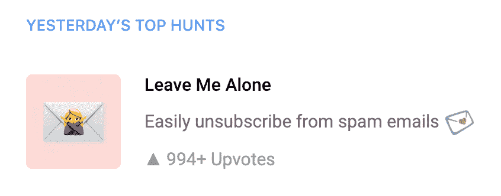](https://res.cloudinary.com/practicaldev/image/fetch/s--j_6tstF5--/c_limit%2Cf_auto%2Cfl_progressive%2Cq_auto%2Cw_880/https://lh4.googleusercontent.com/kXkJcLOlSnRP4uEhyaUe0CJL1PU67Xu1zThvAoeF1ArL7iVlvDt7Rf0vovdX-aBixKUxulfwuL96JCZf4mceIq2i7fTDdxafDKRoyD1UNpU3MLP-0bxOwVMFXhkSmxqb8OKufIiG) 

<figcaption>这个功能推了我们 1000 多票！！</figcaption>

5 天后,[产品搜寻周简讯](https://www.producthunt.com/newsletter/2502)将“让我一个人呆着”列为本周最佳搜寻！这又一次带来了更多的流量，我们看到了另一个销售高峰！

[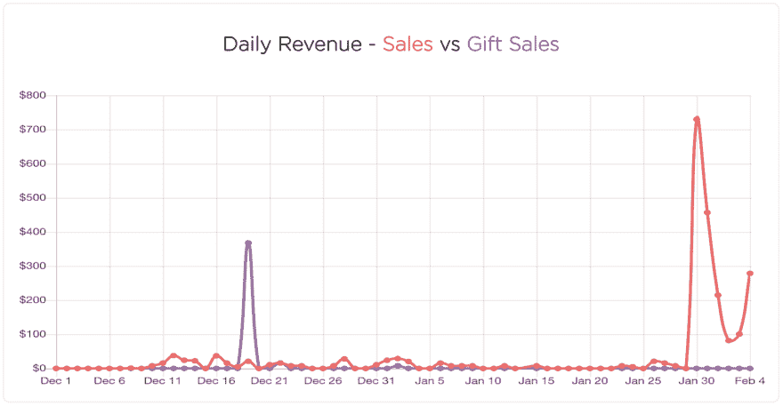](https://res.cloudinary.com/practicaldev/image/fetch/s---s9IebL1--/c_limit%2Cf_auto%2Cfl_progressive%2Cq_auto%2Cw_880/https://lh4.googleusercontent.com/ECR6CZZImVSeT7hmN_P-aMenpYN7YySwdB-UU58iLR9Ln8xVV9rGwCJq1AplpT0Qpn3mfPniP3EiXb6ed1GXur2qagXmXC-4Pdn1-TFgvCWCfig9IA8fNZLsrJLDdf016NePCLDJ)

我们希望能够保持发布后的势头。如果我们一天能赚 50 美元(税后大约 10 个 6 月的扫描销售额)，我们将达到我们的目标[拉面盈利](http://www.paulgraham.com/ramenprofitable.html)，这将是疯狂的！

> 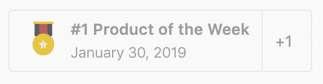丹妮尔@🇵🇪@丁克丹尼 21😱😱😱😱😱😱😱😱
> 又一成就解锁！
> 🎉🎉🎉🎉🎉🎉🎉🎉
> 
> cc:[@ product hunt](https://twitter.com/ProductHunt)[@ LeaveMeAloneApp](https://twitter.com/LeaveMeAloneApp)2019 年 2 月 04 日下午 17:20247

### 所有数据

 

<figcaption>发射日统计</figcaption>

[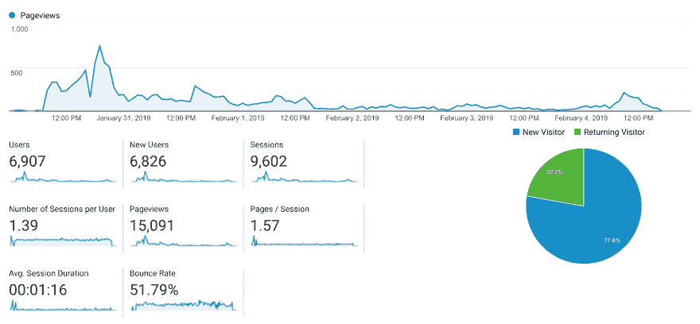](https://res.cloudinary.com/practicaldev/image/fetch/s--Yh-I7ZHj--/c_limit%2Cf_auto%2Cfl_progressive%2Cq_auto%2Cw_880/https://lh6.googleusercontent.com/X6mNPB7xXruUBSG0tHbBu6V_Wn88dn3coqLmSugHbzmIt2dORtjk2enz48OZ2gdQfar1DM9AJqT9CCXd8AH4z08HLS9wlRAOpEIrEUoQVZy7jC-aZ2ifEBw_JhQ1ynmN-qHGz9cn) 

<figcaption>过去 5 天的统计数据</figcaption>

## 接下来是什么？

在接下来的几个月里，我们计划了很多改进和特性！我们首先关注的是性能和用户体验的改善。

然后，我们将开始大的东西；除了 Gmail 之外，增加对更多电子邮件提供商的支持，并推出[企业月度订阅定价计划](https://leavemealone.xyz/enterprise)，帮助雇主清除整个公司的垃圾邮件！

在发布期间，我们收到了几个用户要求删除他们的账户和数据的请求。出于隐私和透明度的考虑，我们发布了一个新的个人资料页面，您可以在其中查看您之前的所有扫描和发票，清除您的“别管我”浏览器数据，并停用您的帐户，这将删除您的所有数据并撤销您的 API 密钥。

> 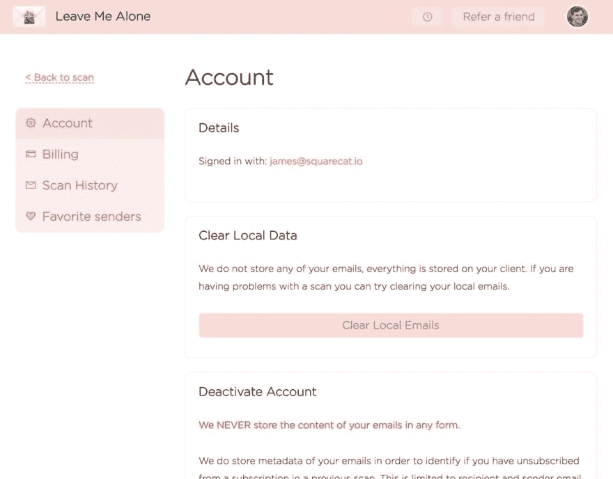詹姆斯·艾文斯🇵🇪@詹姆斯·艾文斯我们刚刚给 [@LeaveMeAloneApp](https://twitter.com/LeaveMeAloneApp) 添加了一个时髦的新设置页面。本着开放和隐私的精神，你现在就可以；
> 
> 💵查看您之前的所有扫描和发票
> 📧清除您所有的 LMA 浏览器数据
> 💥终止您的账户并销毁您所有的 LMA 数据2019 年 2 月 04 日 21:26 点426

我们将继续构建“让我一个人呆在户外”,您的反馈比以往任何时候都更重要。我们希望您能继续关注我们的旅程！

感谢所有支持我们发布的人。我们非常感谢所有的爱，困难的问题，错误报告，以及在令人眩晕的 72 小时里让我们保持理智。

 

<figcaption>很荣幸能拥有这两枚徽章！恭喜 [Cleanmock](https://www.producthunt.com/posts/clean-mockups) 也获得了本月第一名！</figcaption>

## 为什么我们认为这次发射是成功的

在过去的两年里，我们制造并推出了一些产品，但没有一个非常成功。我们希望《别烦我》的发布会与众不同，所以我们对整个过程采取了不同的方法，包括发布会。

### 验证是关键

我们在 7 天内制作了第一个原型，并询问人们是否愿意加入封闭测试版。我们最初在 2018 年 11 月底在 Twitter 和创客社区进行了接触。该应用程序是基本的，但这个概念的反馈非常积极

很明显，这个产品是有需求的——测试版用户已经验证了我们的想法。这激励我们继续构建，但是我们小心不要包含太多不必要的特性。

尽管我们不断想出好主意来添加新东西，但我们确保“别管我”很好地执行了它的核心功能——为用户取消订阅垃圾邮件

其他一切都在“下一个版本”的任务列表中结束了。我们希望保持第一个版本的精简。

第一课:不要浪费时间在没有确认需求的情况下开发产品。

### 建在空旷的地方

让我一个人呆着是一个开放的创业公司，这意味着我们分享我们所有的指标，包括用户，收入和流量。

这也意味着[我们通过在](https://dev.to/dinkydani21/building-a-startup-completely-in-the-open-8gp-temp-slug-2579355)[推特](https://twitter.com/leavemealoneapp)上不断分享我们的进展，要求用户对重要决策的输入，要求反馈，并诚实地面对高潮和低谷，完全建立在公开的中。你可以在这里阅读更多关于我对做一个开放的创业公司的想法[。](https://blog.squarecat.io/what-does-it-mean-to-be-an-open-startup/)

事实证明，这是开发服务的一个非常好的方法。没有我们的用户，就不会有《别管我》,所以他们应该是指导产品的人，这是完全合理的。

有些人已经表达了对随着产品增长管理反馈的担忧- [这里有一个关于 dev.to](https://dev.to/codemouse92/comment/7m0l) 的具体评论。现在太多的反馈是一个好问题。一年后再问我们对此有何感想！

第二课:问用户他们想要什么，而不是浪费时间猜测和构建多余的功能——用户喜欢给出反馈。

### 发布与用户

测试版用户帮助我们找到了一些我们没有预料到的严重错误，主要来自畸形的电子邮件标题或不可靠的退订链接。一旦我们解决了这些问题，我们考虑推出，但决定先试推出，并试图让更多的人使用该应用程序，以确保它足够强大，足以公开推出。

几周后，我们再次在 Twitter 和 maker 社区上发帖，宣布我们已经退出测试版，但还没有准备好被猎杀。

> 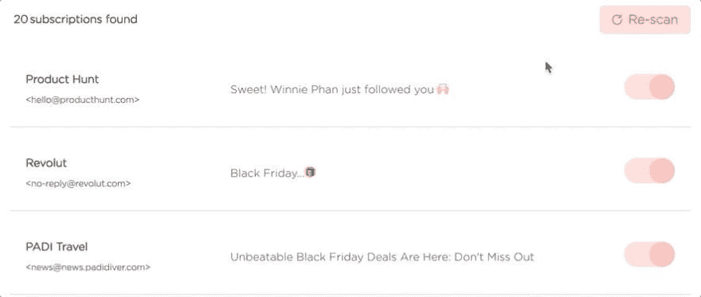<video loop=""><source src="https://video.twimg.com/tweet_video/DuK7opvW0AE7KZ7.mp4" type="video/mp4"></video>别管我@ leavemealoneapp🤩别管我已经软软的发动了！🤩
> T24】🔐隐私优先电子邮件退订服务🔐
> 
> 📃在一个地方查看您的所有订阅电子邮件
> ☝️一键退订垃圾邮件
> 🕵️‍♀️知道您的数据不会被窃取或出售
> 💌享受更干净的收件箱
> 
> Go go go👉[leavemealone . XYZ](https://t.co/UyLjvO3iOs)2018 年 12 月 11 日 22 点 56 分723

我们的长长的功能列表被优先排序，我们专注于改进现有的功能。受 PixelMe 创始人[马克西姆](https://twitter.com/Maxberthelot)的这篇博客文章的启发，我们创建了一个[公共路线图](https://leavemealone.xyz/roadmap)，用户可以在这里投票选择他们希望我们下一步做什么。对于我们来说，这是一个很好的方法来确定什么对用户最重要，并避免实现不必要的功能。

我们开始获得更多的兴趣和稳定的用户群。就在圣诞节前，我们收到了一个巨大的推动，当两个客户非常喜欢离开我，他们购买了整个公司的礼物扫描。非常感谢斯蒂芬和[凯利](https://twitter.com/KellyFMill)！！

我们为自己设定了一月底前发布的目标，在应用程序和社交媒体推广方面都非常努力，甚至在正式发布之前就成功达到了一些令人难以置信的里程碑！

> 别管我@ leavemealoneapp扫描了 50 万封邮件！我们已经到达了一个多么伟大的里程碑🤯。你会加入 [#cleaninbox](https://twitter.com/hashtag/cleaninbox) 活动并帮助我们达到一百万吗？[twitter.com/JamesIvings/st…](https://t.co/wpkXzYcZRo)💯扫描了 50 万封电子邮件🤯 💌所有这些电子邮件中有 7.2%是订阅邮件🙅约 30%的‍♀️用户取消订阅(平均每个用户有 21 个未订阅者)⏳我们已经为用户集体节省了 20 个小时310

**第三课**:在发布前建立用户群，并在社交媒体上大肆宣传

### 完了，完了

我们已经阅读了数百篇关于如何成功推出产品搜索的文章。有些提示肯定是有用的，但重要的是要注意，没有什么魔术或商业秘密。大量的社区追随者可以帮助你获得第一的位置，但是为了长期的成功或增长，产品必须是好的，人们必须使用它！

和平和世界上所有的爱！

✌️❤️

*   丹妮尔&詹姆斯

* * *

*原载于 2019 年 2 月 5 日*[*【makermag.com】*](https://makermag.com/2019/01/13/couple-nomad-makers-1/)*。*