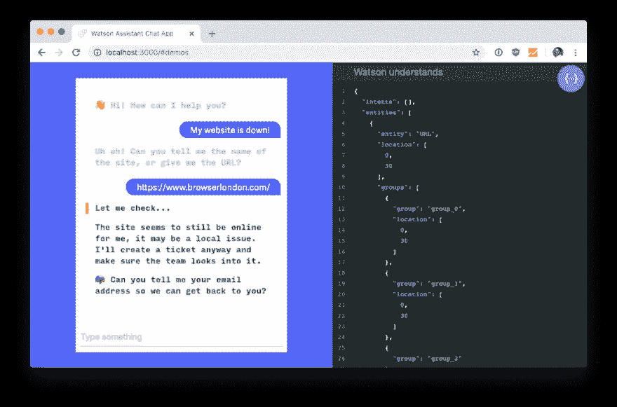
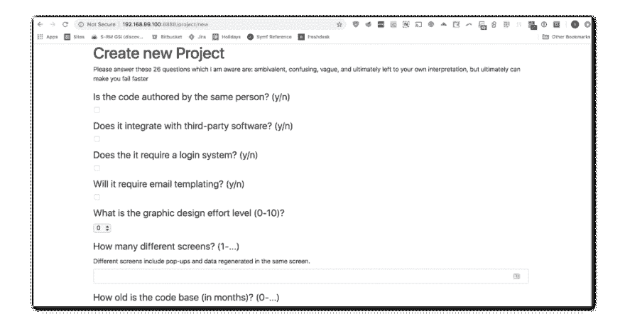

# 我们的冬季堵塞黑客马拉松综述

> 原文：<https://dev.to/browserlondon/our-winter-jams-hackathon-roundup-4l0f>

每年两次，我们会和朋友们在 Twine 举办为期两天的 JAMS hackathon 活动。这些会议让我们的团队有时间去做[小的、有趣的、可破解的项目](https://www.browserlondon.com/blog/2018/10/23/interagency-hackathon/)，并且被设计成从日常办公室中脱离出来，作为学习新技能或涉足新平台或技术的一种方式。

我们最近举行了我们的冬季果酱会议，所以这里有一个我们做了什么的快速纲要。

## 戴安娜

聊天机器人目前是一个有趣的领域，所以我们的前端开发人员之一 Jay 挑战自己，使用 IBM Watson 平台构建了一个基本的客户服务机器人。

结果是一个带有上下文文本识别的简单聊天程序，允许用户报告网站的问题或缺陷。Diana 能够回复回复，然后根据她认为的优先级自动对回复进行分类。

## 浏览器应付

我们喜欢写关于我们在 Browser 上做了什么的博客，但在过去，我们没有很好地在内部分享或在网络上宣传它们。

浏览器 COPE(以激发该项目的 [create once publish everywhere 理念](https://www.programmableweb.com/news/cope-create-once-publish-everywhere/2009/10/13)命名)旨在改变这种情况。首先，它汇集了一堆 WordPress 插件，允许我们直接从[我们的网站](https://www.browserlondon.com/blog/)向我们选择的社交媒体渠道发布内容。

其次，它使用大量的[自动化服务](https://zapier.com/)将关于博客帖子的信息直接发布到我们公司 Slack，让我们的员工可以看到正在制作的博客内容，已经发布的内容，甚至[这些帖子有多受欢迎](https://statsbot.co)。

## 大概

曾经需要快速估计一个开发项目需要多长时间吗？这就是棒球场的由来。回答 26 个关于任务性质和范围的简单问题，它会给你一个项目需要多少天的粗略估计。

这是我们的后端开发人员 Rod 已经研究了一段时间的一个项目，团队很高兴测试了这个应用程序，并看到了估计值与现实的接近程度。我们希望能找到时间整理一下界面，这样我们就可以共享这个工具了。我们认为这对其他开发者来说是一个有趣的工具。

## 花冠

在完成制药行业的一个项目后，我们认为我们注意到了一个机会，可以改善制药公司内部以及与指定供应商之间的沟通和资产共享方式。

JAMS hackathon 是快速调查机会的完美环境，所以我们三个人组成的团队开始研究产品的外观，并模拟出一个简单的用户界面来展示工作流程。

Coronis 诞生了，这是一个将数字资产管理与内部监管和外部合规工作流相结合的制药通信平台。显然，这个平台只不过是几个模型。目前是 jpegs，但在新的一年，我们希望将项目移交给我们的创新团队，以获得更完整的工作原型。

## 简单球体

我们经常在办公室闲聊，随着直运的兴起，建立一个只不过是一个网站的企业应该是可能的，这个网站将中国装满现成产品的仓库与英国的客户联系起来。

作为他的 JAMS 项目，Rob 决定通过战争游戏为 Simple Sphere，一家卓越的竹牙刷零售商制定一份商业计划，来研究这是否实际可行。

这是一个有趣的项目，他的收获是利润微薄，你真的需要有效地进行追加销售(有人要木炭牙膏吗？)让生意有意义。即使不持有任何库存，不开发任何产品，找客户还是很贵的！

## 麻

Twine 的许多团队成员希望更好地了解 T2 的谷歌数据工作室，因此利用 JAMS 会议建立了一个商业智能仪表板，从公司各处收集数据。

为了做到这一点，他们大量使用了 [Zapier](https://zapier.com/) ，既通过标准 zaps 从他们的[果壳 CRM](https://www.nutshell.com/) 中提取数据，也通过定制的 webhooks 从 Twine 和谷歌灯塔中提取数据。

仪表板显示了作为概念验证的真正前景，团队承诺继续开发它。中期目标是，该项目将变成一个可以在办公室屏幕上显示的商业仪表板。

## ESSH

我们已经将我们的遗留项目迁移到一个基于亚马逊 ECS 的托管环境中，但是我们并不总是在第一次运行时为每个站点设置日志。这可能意味着我们需要通过获得对新运行的容器的命令行访问来快速调试运行时问题。

对于我们的技术总监 Jim 来说，这是一个令人沮丧的过程，因为它需要多次登录和大量导航才能找到他需要的容器。他还需要在 ECS 终止损坏的容器并将其移动到不同的主机实例之前完成所有这些工作，从而将该过程变成计算机中的打地鼠游戏。

这就是为什么在 JAMS hackathon 上，他花时间创建了 ESSH(弹性 SSH ),通过阅读我们的本地 AWS 配置文件列表并提供对正在运行的集群、服务和容器的快速命令行访问，缩短了这个烦人的过程。如果您已经知道客户机概要文件、区域和集群的名称，您可以在几秒钟内从命令行进入一个正在运行的容器。

吉姆已经有了巧妙利用 ESSH 的计划，下一步建设是直接进入一个集装箱。如果你有兴趣观看或使用 ESSH，可以通过[吉姆的 GitHub 账户](https://github.com/jimblizz/essh)获得。

* * *

帖子[我们的冬季堵塞黑客马拉松综述](https://www.browserlondon.com/blog/2018/12/13/winter-2018-jams-hackathon-roundup/)首先出现在[浏览器伦敦](https://www.browserlondon.com)上。