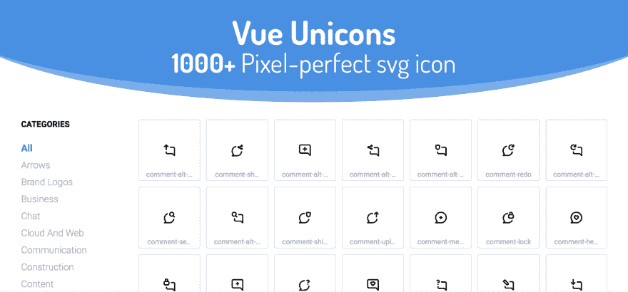

# Vue 上有超过 1000 个漂亮的开源图标

> 原文：<https://dev.to/antonreshetov/pack-of-more-than-1000-beautiful-open-source-icons-on-vue-of9>

Vue Unicons 是一个由 1000 多个漂亮的开源 unicon[作为 Vue 组件的包。](https://github.com/iconscout/unicons)

为了方便起见，图标被分成不同的类别。

尽情享受吧！🙂

[https://antonrshetov . github . io/view-unions/](https://antonreshetov.github.io/vue-unicons/)