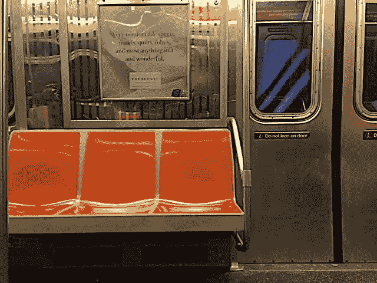

# 用 CSS 绘画

> 原文：<https://dev.to/bnevilleoneill/painting-with-css-3a8o>

[](https://res.cloudinary.com/practicaldev/image/fetch/s--OR7-RyIb--/c_limit%2Cf_auto%2Cfl_progressive%2Cq_auto%2Cw_880/https://cdn-images-1.medium.com/max/640/1%2AyeyD17xaqRMKdOAd2YfAKQ.jpeg)

我经常画油画，主要是创作城市风景。一个实验闪过我的脑海，试图只用 CSS 来重现这些画。令人惊讶的是，用 CSS 作画的过程和用油作画非常相似；从粗线条开始，向下到更多的细节，然后一次又一次地重构。

从上面显示的 F 火车照片开始，我将通过一些我在 CSS 中重新创建这个图像的过程中学到的重要步骤。这里是[成品供参考](https://codepen.io/danielwarren/pen/ejObVq)。

[](https://logrocket.com/signup/)

### 设置

我建立了一个. paper 类来包含这幅画的所有部分。

```
<div class="paper"></div>

\* {
  box-sizing: border-box;
}

body {
  margin: 0;
  padding: 0;
  height: 100vh;
  width: 100vw;
  background: #fff;
  display: flex;
  flex-direction: column;
  justify-content: center;
  align-items: center;
  font-family: 'Nanum Gothic Coding', monospace;
  font-size: 11px;
}

.paper {
  height: 50vmin;
  width: 70vmin;
  background: #cc0000;
  position: relative;
  z-index: -1000;
} 
```

对于主体，我使用视口单位将高度和宽度设置为 100vh 和 100vw，这是相对于浏览器窗口的百分比宽度。我用 flexbox 把纸居中。

我设置的高度和宽度。将纸张设置为横向尺寸，设置 z-index 以确保它始终是底部元素，并将其位置设置为相对，以便纸张成为所有绘画作品附着的基线。

最后，我给了背景一个红色，这样我就能知道什么是背景，什么不是(因为会有很多不同的颜色)。你也可以添加溢出:隐藏，这样任何多余的元素都不会从纸上掉下来，但我选择创建一切来适应。

### 接近

我使用 SCSS 变量使生活变得更容易。因为我是从照片开始工作的，所以我使用了 Mac 的数字色度计来创建颜色变量。我试图命名所有的颜色来代表物理对象，比如$floor 和$seat，而不仅仅是$grey 和$red。这一点非常重要，尤其是当你的画越来越大的时候。

开始从背景到前景绘画，否则，你的头会因为重新排序 div 和修补 z-index 而爆炸。这可能并不总是可行的，你最终不可避免地不得不四处洗牌，但是要记住从后向前的方法。

我对待 CSS 就像对待一幅画一样。我把一切都分解成模块——地板、地板阴影、座椅、墙壁等等。想象一下每件作品只用一种颜色，就像丝网印刷机或雕版印刷机那样。在有意义的地方，我以父/子的形式将片段组合在一起，例如，我有一个后壁容器，所有的后壁片段都在其中。

### 绘画

基本方法是这样的:

```
<div class="paper">
<div class="floor"></div>
</div> 
```

然后是 CSS:

```
.floor {
  position: absolute;
  height: 4vmin;
  width: 70vmin;
  background: linear-gradient(to right, #222, #222, $floor);
  right: 0vmin;
  bottom: 0vmin;
  z-index: -2;
} 
```

我将位置设置为绝对位置，所以它使用纸张作为其导向。对于每一块，我开始给它一个任意的背景颜色(一些容易看到的颜色，比如绿色)，然后根据图像目测尺寸。我用了 vmin，宽度或高度的百分比，以较小者为准。在这种情况下，对我来说，地板看起来大约 4 英尺高，贯穿了整幅画的宽度。

接下来，我在纸上定位地板。在这个例子中是在右下角。大多数都是试错法，你最终会像玩俄罗斯方块一样移动棋子，直到它们进入正确的位置。最后，我使用我的$floor 颜色变量和一个线性渐变来创建一点阴影。

### 前后

我使用了:before 和:after 来给一些元素添加高光或阴影。伪元素选择器的好处是它们允许相对于自身定位另一个元素。对于地铁门上的“不要靠在门上”的标志(我从来没有见过有人真正遵循它)，我创建了标志背景，然后使用:after 来创建白色的顶部边框线。我选择不添加标志文本。下面是 CSS:

```
.door-sign {
  position: absolute;
  width: 10vmin;
  height: 1.25vmin;
  background: $door-sign;
  right: 8.75vmin;
  top: 22vmin;
}

.door-sign:after {
  content: ' ';
  position: absolute;
  width: 9vmin;
  height: .15vmin;
  background: $door-sign-border;
  left: .5vmin;
  top: .2vmin;
  opacity: .5;
} 
```

我像其他元素一样设置了门的标志，包括高度、宽度、背景，并将其放置在纸上。接下来，我使用了:after，将内容设置为空字符串(我们不想添加任何内容，只是一个形状)。然后，我相对于门牌定位白色边框。这使得绘制某些元素更容易，因为您不必重新考虑元素在整个页面上的位置，因为它是从其父元素继承的。

### 形状复杂

显然，不可能所有东西都是正方形、长方形或圆形，所以我不得不使用边框和变换来创建各种不同的形状。这里有一个来自 CSS-Tricks 的[伟大资源](https://css-tricks.com/the-shapes-of-css/)来理解如何使用前/后和边界创建复杂的形状。

对于更复杂的形状，例如，中间座位的顶部，我不得不使用其他形状，并将它们叠加在顶部，以创建所需的效果。

座位的这一部分是一个矩形，在顶部和右侧有一个边界半径。为了在左上方和右上方创建锥形效果，我创建了一个三角形“垫片”，并使其与座椅底座的背景相同:

```
.seat-tri-1 {
  position: absolute;
  width: 0; 
  height: 0; 
  border-left: .75vmin solid transparent;
  border-right: .75vmin solid transparent;
  border-top: 10vmin solid $seat-base;
  top: 25.5vmin;
  left: 13.95vmin;
  z-index: 10;
} 
```

为了创建三角形，我将宽度和高度设置为 0，然后设置三个边界，其中两个是透明的，一个是彩色的，这取决于三角形的方向。最后，我把垫片放在一号和二号座位之间。如果你找不到垫片，把边框顶部的颜色改成可见的颜色，比如绿色。

### 重构

我们可以使用 mixin:
来重构这幅画，使代码更加可重用

```
@mixin paint($height, $width, $background, $left: auto, $right: auto, $top: auto, $bottom: auto) {
  height: $height;
  width: $width;
  background: $background;
  left: $left;
  right: $right;
  top: $top;
  bottom: $bottom;
} 
```

然后这样用这个 mixin】

```
.door-sign {
  @include paint(1.25vmin, 10vmin, $door-sign, right: 8.75vmin, top: 22vmin);
} 
```

paint mixin 使用高度和宽度、背景颜色和位置来创建 paint 元素。为了避免语法错误，我必须将 left、right、top 和 bottom 设置为 auto。

起初，这种方法似乎更好，但随着时间的推移，我发现它太抽象了，并决定我喜欢明确地陈述每个元素，特别是因为我必须不断地回头参考这幅画的其他部分。通常情况下，重构总是好的(尽管太多可能是坏的)，但在这种情况下，我对最终结果比对编写干净的代码更感兴趣。

### 问题

我遇到了一些关于视窗长度的小问题。首先，vmin 越小，它似乎越不准确。尽量避免使用像 4.15vmin 这样的数字，而是尽量接近四分之一宽度，比如 4.25vmin 或 4.75vmin。

其次，偶尔在使用 vmin 时，当页面变大或变小时，更精确的度量似乎会有轻微的变化。我不确定这是否是浏览器特有的，或者当使用较小的视窗长度时是否会发生，但这似乎与我上面提到的第一个问题有关。总的来说，这些是我遇到的唯一问题。

### 结论

这个练习让我对 CSS 有了更广泛的理解。在完成了几幅这样的画之后，我注意到我处理 CSS 的方式有点不同，采取了一种更艺术的方式，但是也真正地将页面上的每一部分都看作是它自己的模块(而不是整个页面)。这让我的 CSS 好了很多。

如果你创造了一些很酷的东西，留下评论，让我知道你在这个过程中学到了什么。

### Plug: [LogRocket](https://logrocket.com/signup/) ，一款适用于网络应用的 DVR

[](https://logrocket.com/signup/)

<figcaption>[https://logrocket.com/signup/](https://logrocket.com/signup/)</figcaption>

LogRocket 是一个前端日志工具，可以让你回放问题，就像它们发生在你自己的浏览器中一样。LogRocket 不需要猜测错误发生的原因，也不需要向用户询问截图和日志转储，而是让您重放会话以快速了解哪里出错了。它可以与任何应用程序完美配合，不管是什么框架，并且有插件可以记录来自 Redux、Vuex 和@ngrx/store 的额外上下文。

除了记录 Redux 操作和状态，LogRocket 还记录控制台日志、JavaScript 错误、堆栈跟踪、带有头+正文的网络请求/响应、浏览器元数据和自定义日志。它还使用 DOM 来记录页面上的 HTML 和 CSS，甚至为最复杂的单页面应用程序重新创建像素级完美视频。

免费试用。

* * *