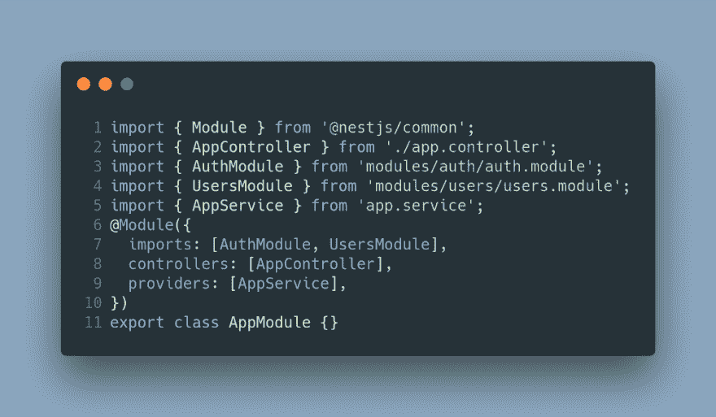
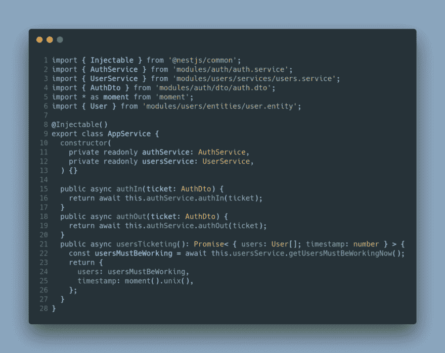

# 第四部分。上下班打卡系统-基本后端(III) -应用模块

> 原文：<https://dev.to/carlillo/part-4-clock-inout-system---basic-backend-iii---appmodule-5anb>

这篇文章是我正在描述的一个上下班打卡系统的系列文章的一部分
如果你想了解更多，你可以阅读下面的文章:

*   第一部分。上下班打卡系统:图表。
*   第二部分。上下班打卡系统:基本后端— AuthModule。
*   第三部分。上下班打卡系统:基本后端—用户模块。
*   第四部分。上下班打卡系统:基本后端应用模块。
*   第五部分。打卡系统:种子数据库和迁移数据
*   第六部分。上下班打卡系统:基本前端。
*   第七部分。打卡/下班系统:使用 docker/docker-compose 部署后端(nestJS)。
*   第八部分。上下班打卡系统:使用环境部署前端(角度 2+)。
*   第九部分。测试:后端测试—单元测试—服务
*   第十部分。测试:后端测试—单元测试—控制器
*   第十一部分。测试:后端测试— E2E 测试
*   第十二部分。测试:前端测试—单元测试
*   第十三部分。测试:前端测试—集成测试

在上一篇文章中，我介绍了用于管理用户信息的模块 UserModule。所以，我推荐你在这之前先看第一个帖子
，因为你可以了解整个系统。

这篇文章将介绍用于从角度前端管理用户请求
的**应用模块**。这个模块只有一个服务、
控制器和模块。AppService 从模块 **UsersModule** 和 **AuthModule** 中注入两个服务: **UserService**
和 **AuthService** 。这个
服务被用作使用这两个服务的包装器。

所以，第一步是显示 **AppModule** 代码:

你可以看到这个模块导入了 **AuthModule** 和 **UsersModule** ，这
非常重要，因为 **AppService** 注入了 **AuthService** 和
**UsersService** 。

因此，下一步是开发控制器，它包含两个与调用 AppService(将调用
AuthService)的打卡和打卡相关联的
路由，以及一个从服务器获取必须是
正在工作的用户列表和时间戳的路由关联(以接近实时，这将
调用**用户服务**)。

因此，最后一步是开发使用前面提到的两个服务的 AppService。

### 简历

‌In 在这篇文章中，我解释了我的 AppModule，它非常简单，因为我在编码中使用了
干净的代码。该模块用于客户端
(Angular)和服务器端的通信。该模块导入 AuthModule 和 UsersModule，
导出它们的服务。这些服务用于保存关于
上下班打卡的信息，并获取所有必须工作的用户。

目前，我们已经开发了一个具有三个模块和不同
端点的基本后端。在下面这篇关于后端的文章中，我们将解释关于数据库和测试的种子
。然而，在本系列的后续文章中，我们
将解释如何使用 Angular 和 RxJS 构建一个基本的前端。

* * *

原载于[www . carloscaballero . io](https://carloscaballero.io/part-4-clock-in-out-system-basic-backend-iii-appmodule/)2018 年 12 月 14 日。