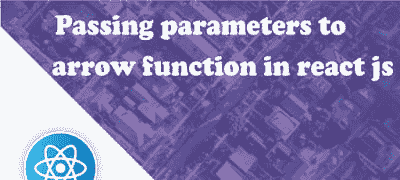

# 向 react js 中的箭头函数传递参数

> 原文：<https://dev.to/skptricks/passing-parameters-to-arrow-function-in-react-js-25pi>

-

## 来源:[向 react js 中的箭头函数传递参数](https://www.skptricks.com/2019/02/passing-parameters-to-arrow-function-in-react-js.html)

本教程解释了如何在 react js 应用程序中向 arrow 函数传递参数。在 react 应用程序中，向 arrow 函数传递参数的实现略有不同。让我们看看下面的例子，它有助于建立对箭头函数的更多理解。

在箭头函数中传递单参数:
one parameter = a =>e =>{
alert(a)；
}；

在箭头函数中传递两个参数:
twoParameter = (a，b)=>e =>{
alert(a+b)；
}；

