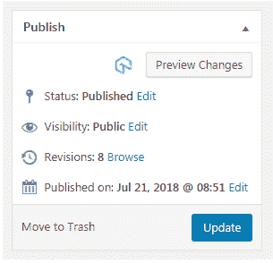
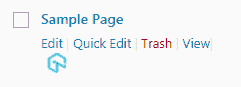
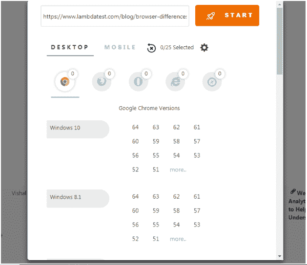
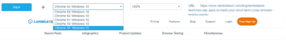

# 使用 LambdaTest WordPress 插件执行简单的跨浏览器测试

> 原文：<https://dev.to/lambdatestteam/perform-easy-cross-browser-testing-with-lambdatest-wordpress-plugin-3ejn>

在互联网上所有可公开访问的网站中，大约 30%是由 WordPress 支持的。它拥有 59%的 CMS 市场份额，平均每天新增 500 个基于 wordpress 的网站。

随着如此多的开发者使用 wordpress 作为 CMS 的选择，我们 LambdaTest 决定通过开发一个用于跨浏览器测试的 WordPress 插件来使 WordPress 开发者的生活变得更容易。

LambdaTest 中的这个全新的 wordpress 插件允许你直接从你的 wordpress 仪表盘上截图来测试你的网页的跨浏览器兼容性

## LambdaTest WordPress 插件是用来做什么的？

LambdaTest wordpress 插件可以用来从 wordpress 管理面板中截取不同桌面和移动浏览器上的文章和页面的完整页面截图。这些截图将有助于 WordPress 上的网页和网站的跨浏览器兼容性测试。

你可以直接从 wordpress 仪表盘上截图，无论是页面、文章还是编辑文章的时候。通过点击 LambdaTest 的图标并使用 LambdaTest 选择配置，您可以一次对多达 25 个不同的浏览器和操作系统配置进行直接截图。
[T3】](https://goo.gl/8AQHP8)

让我们看看如何使用 [LambdaTest wordpress 插件](https://goo.gl/E6QGH1)。

## 如何使用 LambdaTest WordPress 插件？

现在你可以通过一个可下载的 zip 文件来安装插件。基于 wordpress.org 的插件将很快上线。安装后，你会在你的页面、文章和文章编辑器上看到 LambdaTest 的图标，通过它你可以在 WordPress 页面上启动插件。

点击图标，会有一个 lightbox 弹出窗口在 WordPress 页面上打开，帮助你选择要截图的浏览器。您一次最多可以选择 25 个浏览器，并且您可以选择桌面和移动浏览器。

一旦你选择了浏览器，点击 launch，LambdaTest 将开始在运行所选配置的真实机器上截取你的页面截图。你也可以点击截图配置旁边的下载图标，从你的 wordpress 账户下载截图。

点击列表视图中的缩略图将在整页视图中打开屏幕截图。在此视图中，您可以通过在下拉列表中选择所需的组合来查看所有不同的截图。

您还可以通过从下拉菜单中更改显示百分比来根据屏幕大小调整屏幕截图的宽度。
[T3】](https://res.cloudinary.com/practicaldev/image/fetch/s--41_RLqcG--/c_limit%2Cf_auto%2Cfl_progressive%2Cq_auto%2Cw_880/https://www.lambdatest.com/blog/wp-content/uploads/2018/07/Capture6.png)

此外，还有一个测试日志功能，你可以看到你到目前为止参加的所有测试。它将帮助您保存所有截图的历史记录。

WordPress 插件只是一个开始。

我们非常积极地为平台带来越来越多的用户功能，这个 WordPress 插件只是一个起点。

要了解它是如何一步一步工作的，请参考我们关于使用 LambdaTest 的 WordPress 插件进行跨浏览器测试的教程。请在下面的评论区告诉我们您的反馈！

你可以在这里观看完整的视频

[https://www.youtube.com/embed/hZ2npbUyz38](https://www.youtube.com/embed/hZ2npbUyz38)

测试愉快。

原文出处:[lambdatest.com](https://goo.gl/yT43QZ)

