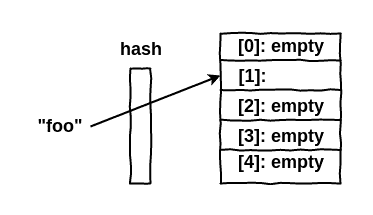
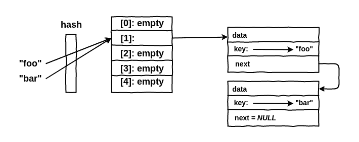

# PHP 内部 hashtable 简介

> 原文：<https://dev.to/omarkdev/php-internals-introducao-a-hashtable-2lc3>

最近，我开始了一个关于 **PHP Internals** 的研究行程，主要是关于 PHP 5 到版本 7 的变化。不幸的是，今天关于这个问题的内容很少，而且很容易用葡萄牙语写，所以我感到有动力开始写这个问题，以传播关于这个问题的知识，以及谁知道我们会因此产生更多关于这个问题的话题。

### 什么是 HashTable？

基本上，我们可以说 HashTable 是一个将搜索键与值关联起来的无处不在的数据结构。为了简单起见，我们可以说在 PHP 中 ***阵列相当于* HashTables** 。

对于曾经接触过 c 语言的人来说，你知道我们无法在数组中创建值，键是除**之外的任何类型的数据，这在 PHP 中已经不同了，因为我们的键可能是**既然 PHP 在 c 和 c 中，事情就不一样了？就在这时 HashTable 进来了。****

 **HashTable 的概念非常简单，当定义一个复杂值(如字符串)的键时，该键通过一个返回整数的函数 **hash** 。因此，此整数将用作数组的索引，因为在 c 中，我们无法将字符串作为数组键放置。结构会是这样的:

<figure> 

<figcaption>例 de 散列表无 PHP</figcaption>

</figure>

在此范例中，我们要配置阵列中具有金钥 **foo** 的值，此金钥会传递函数 **hash** 以传回整数 **1** ，这将是用来配置值**的索引**

使用这样的结构，我们有一些问题，其中之一是两个**字符串**可以返回相同的整数，因为字符串几乎是无限的，而散列受整数大小的限制。因此 HashTables 需要实现某种解决冲突的方法。

为了解决此冲突问题，PHP 将具有相同索引的元素存储在链接列表中。因此，当我们搜索键时，PHP 会计算出“**hash**”然后遍历值的链接列表，直到找到相应的值为止。链表中的项目称为**桶**。

### 木桶

HashTable 的存储桶结构如下所示:

<figure> 

<figcaption>例 de HashTable com Bucket ' s no PHP</figcaption>

</figure>

在此范例中，当您输入键为 **bar** 的值时，**hash**函数会传回与键 **foo** 相同的整数，因此元素会新增至链结清单中，而桶 **foo**

存储桶的列表只是所有碰撞的列表，这是一个优势，因为我们不需要为每个碰撞分配内存，而是需要为整个列表分配大量内存。此外，存储桶的顺序与输入的键无关。

当我们在阵列内存储值时，除了存储桶外，还需要存储其他信息，例如，元素总数，我们称之为**和**使用的元素数****

 **插入元素时，有和**年轮(使用的元素数】并无多大意义，但从我们开始从阵列中删除元素起，此信息就变得很重要。想像一下，如果我们在阵列中储存 5 个项目，则插槽「T4」【0】**【a】****正在使用中，因此我们有值为 5e】**的**【取消订阅】****

 **### 墓碑

当我们从桶列表中删除一个项目时，我们首先要做的，正如我们已经看到的那样，就是减少 Hashtable 中的值**【nonmoptions】**，然后我们将桶标记为已删除，这种标记称为**【tombstone】**。但我们为什么不把桶从桶里删除呢？

想象一下，在一个应用程序中，我们有一个包含 1000 个元素的数组，并且我们删除了第二个元素，如果我们删除了该存储桶元素，我们将不得不将所有其他 998 个元素重新定位到以前的位置，这将不会有什么性能，而只是将它标记为已删除，并且在浏览列表时，我们只筛选了所有不存在的元素

### 结论

这只是对 PHP 中 HashTable 概念的工作原理的介绍，如果您有兴趣了解更多信息，我建议您阅读以下文章和演讲:

*   palestra:[PHP 7——内部有什么变化？—尼基塔·波波夫—论坛 PHP 2015](https://youtu.be/zekEqhaPmag?t=767)；
*   Artigo: [PHP 新的哈希表实现](https://nikic.github.io/2014/12/22/PHPs-new-hashtable-implementation.html) —尼基塔·波波夫；
*   Artigo: [PHP 7 数组:散列表—](http://blog.jpauli.tech/2016/04/08/hashtables.html) [朱利安保利科技生活](http://blog.jpauli.tech/)；
*   Artigo: [PHP 散列表—内部手册。](http://www.phpinternalsbook.com/hashtables.html)

**推特**:[*https://twitter.com/omarkdev*](https://twitter.com/omarkdev)

***Github:***[*https://github.com/omarkdev*](https://github.com/omarkdev)

* * *******