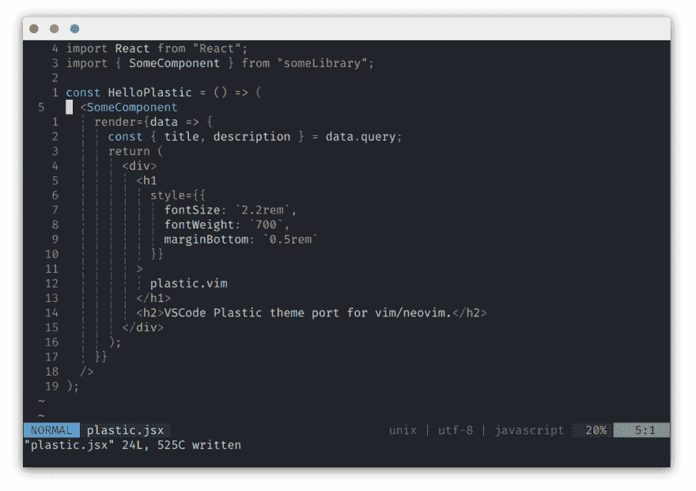

# plastic . vim——vim/neo vim 的深色配色方案，用于长时间编码会话的低对比度颜色

> 原文：<https://dev.to/flrnd/plastic-vim-a-dark-colorscheme-for-vim-neovim-with-low-contrast-colors-for-long-coding-sessions-5g0g>

塑料是我最喜欢的 Visual Studio 代码配色方案之一。

因为我使用 neovim 作为我的主要编辑器，所以我决定为 vim/neovim 创建一个端口。

## [flrnd](https://github.com/flrnd)/[plastic . vim](https://github.com/flrnd/plastic.vim)

### 用于 vim/neovim 的 VSCode 塑料主题端口。

<article class="markdown-body entry-content container-lg" itemprop="text">

[](https://github.com/flrnprz/plastic.vim/blob/master/plastic-vim-screen.png)

# 塑料. vim

[vs code Plastic](https://github.com/will-stone/plastic)vim/neo vim 主题端口。

## 安装

1.  使用您选择的插件管理器并将`flrnprz/plastic.vim`放入您的。vimrc 文件。或者
2.  将这个目录克隆到您的 vim/plugged 目录中

```
" important:
set termguicolors

set background=dark
syntax on
colorscheme plastic

" Lightline
let g:lightline = { 'colorscheme': 'plastic' }
```

Enter fullscreen mode Exit fullscreen mode</article>

[View on GitHub](https://github.com/flrnd/plastic.vim)

它具有相同的简单语法突出的设计原则。我希望你喜欢它！

编码快乐！