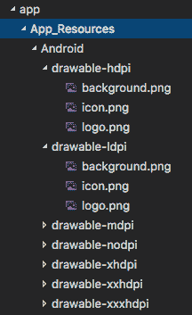

# 使用 NativeScript 进行特定于平台的开发

> 原文：<https://dev.to/progress/platform-specific-development-with-nativescript-dd1>

从第一天起， [NativeScript](https://www.nativescript.org/) 就允许你利用一个代码库来为包括网络在内的多个平台([)创建原生移动应用。](https://blog.angular.io/apps-that-work-natively-on-the-web-and-mobile-9b26852495e7))。不可否认，编写一次代码并为 iOS 和 Android 生成原生应用程序可以节省大量时间。NativeScript 的健壮的[模块](https://docs.nativescript.org/core-concepts/modules)抽象出特定于平台的实现，并提供一种简洁而简单的方式来编写跨平台的应用。

许多 NativeScript 开发人员经历的一个现实是(特别是随着应用变得越来越复杂)，每个应用可能会针对每个平台进行至少一些独特的调整——无论是 UI 定制还是访问仅在特定平台上可用的功能(即 iOS 上的 [3D Touch](https://developer.apple.com/ios/3d-touch/) )。

幸运的是，NativeScript 足够灵活，允许我们为特定的移动平台定制应用程序的几乎每个方面。让我们仔细看看:

*   [定制您的用户界面](#customizing-ui)
*   [定制您的应用风格](#customizing-styles)
*   [定制](#customizing-logic)背后的 JavaScript/TypeScript 代码
*   [特定于平台的资源](#platform-specific-resources)

## 定制您的用户界面

NativeScript 允许您创建真正的本机 UI，并且您可以使用 XML 语法构造您的 UI 标记。有时，您可能希望为每个移动平台表达不同的 UI 元素，或者 UI 元素的不同属性。

### 单独的 UI 视图

如果您想通过平台完全分离您的 UI 视图，您只需使用这个不言自明的文件名语法:

```
 myview.ios.xml
    -- and --
    myview.android.xml 
```

Enter fullscreen mode Exit fullscreen mode

视图的名称(当在您的应用程序中引用时)仍然是`myview`，但是只有 iOS 或 Android 版本的 UI 会在构建时加载到应用程序中(基于文件名中列出的平台)。

### 视图内的标记块

拥有完全独立的 UI 视图可能有点大材小用，而且您将在不同平台之间重用更多的 UI 标记。

一个稍微现实一点的用例是在一个视图中为每个平台指定标记块，就像这样:

```
 <Page>
        <ios>
            <Label...
        </ios>
        <android>
            <Label...
        </android>
    </Page> 
```

Enter fullscreen mode Exit fullscreen mode

使用`<ios>`和`<android>`标签允许 NativeScript 编译器根据设备来包含或移除这些标记块。很简单！

### UI 元素属性

更细粒度地，您可以指定 UI 元素的特定于平台的属性，比如:

```
 <Button ios:text="I'm an iOS button!" android:text="I'm an Android button!" /> 
```

Enter fullscreen mode Exit fullscreen mode

> 每个 UI 元素属性都可以基于平台进行定制！

在 [NativeScript 入门指南](http://docs.nativescript.org/angular/start/introduction.html)中有一个巧妙的技巧，可以隐藏 iOS 上 listview 项目上的垃圾桶图标(因为 iOS 实现使用“滑动删除”):

```
 <ListView.itemTemplate>
        <GridLayout columns="*, auto">
            <Label text="{{ name }}"/>
            <Image src="res://ic_menu_delete" ios:visibility="collapsed" col="1" tap="delete" />
        </GridLayout>
    </ListView.itemTemplate> 
```

Enter fullscreen mode Exit fullscreen mode

## 定制您的应用风格

NativeScript 使用 CSS 的[子集来设计应用程序的 UI。就像基于 XML 的视图标记一样，您可以按平台定制 CSS 样式:](https://docs.nativescript.org/ui/styling)

### 单独的 CSS 文件

是的，你可以使用上面介绍的相同的文件命名语法拥有完全独立的 CSS 文件:

```
 myapp.ios.css
    -- and --
    myapp.android.css 
```

Enter fullscreen mode Exit fullscreen mode

然而，更有可能的是，您将拥有一个具有通用样式的 CSS 文件(全局的或特定视图的),以及两个独立的、特定于平台的 CSS 文件。那么我们如何将三个样式表合并成一个呢？

很简单，在主 CSS 文件中使用`@import`命令。例如，我们的`myapp.css`文件可能看起来像这样:

```
 @import { url('~/myapp.ios.css') }
    @import { url('~/myapp.android.css') }

    .button {
        border-color: #b2b2b2;
        background-color: #f8f8f8;
        ... 
```

Enter fullscreen mode Exit fullscreen mode

特定于 iOS 的样式只能在 iOS 上导入，而特定于 Android 的样式只能在 Android 上导入。

### 一个 CSS 文件，多个平台

如果您不想维护单独的样式表，您仍然可以在一个 CSS 文件中为每个平台创建不同的样式选项。使用来自 [Nathanael Anderson](https://twitter.com/CongoCart) 的 [nativescript-platform-css 插件](https://github.com/NathanaelA/nativescript-platform-css)最容易实现这一点。

这个插件将平台类添加到你的样式表中，这样你就可以编写如下代码:

```
 <Page>
        <Label class="color-me" text="Hello World!">
    </Page>

    .ios .color-me { color: blue; }
    .android .color-me { color: green; }
    .windows .color-me { color: red; } 
```

Enter fullscreen mode Exit fullscreen mode

在这个例子中，在 iOS 上,`.color-me`类将提供蓝色文本。其他的将被忽略。

> 与此相关的是另一个插件，你可以通过设备的[方向来定制样式。](https://github.com/NathanaelA/nativescript-orientation)

## 自定义后面的 JavaScript/TypeScript 代码

每个 NativeScript 视图在 JavaScript 文件后面都有相应的代码来处理应用程序的逻辑。

### 分离 JavaScript 文件

就像 XML 和 CSS 文件一样，你可以为每个平台拥有完全独立的 JavaScript 文件:

```
 myview.ios.js
    -- and --
    myview.android.js 
```

Enter fullscreen mode Exit fullscreen mode

### 代码块

您可能只需要对 JavaScript 代码进行分段，以确保以正确的方式公开特定于平台的功能。例如，如果你想在你的 iOS 设备上设置标题栏文本颜色，你不想在 Android 上运行这个代码:

```
 if (page.ios) {
        var navigationBar = frameModule.topmost().ios.controller.navigationBar;
        navigationBar.barStyle = UIBarStyle.UIBarStyleBlack;
    } 
```

Enter fullscreen mode Exit fullscreen mode

如果不明显，这里的关键是`page.ios`(和`page.android`)，它只是返回一个布尔值来告诉你应用程序运行在哪个平台上。

## 特定平台的资源

`App_Resources`目录是您可以为您的应用程序存储特定于平台的资产的地方。最常见的是，您将在该目录中存储不同像素密度的图像。

例如，要在你的应用程序中显示一张图片，你可以使用这样的标记:

```
 <Image src="res://logo" /> 
```

Enter fullscreen mode Exit fullscreen mode

前缀`res://`告诉 NativeScript 从`App_Resources`目录获取资源。不仅如此，它实际上利用了本地方法来加载当前显示密度的最佳图像！

### 安卓资产

Android 资源存储在`App_Resources/android`文件夹内的`drawable-`文件夹中:

[](https://res.cloudinary.com/practicaldev/image/fetch/s--vGpBfdP2--/c_limit%2Cf_auto%2Cfl_progressive%2Cq_auto%2Cw_880/https://raw.githubusercontent.com/rdlauer/articles/master/nativescript/platform-specific/android-drawable.png)

### iOS 资产

iOS 资源保存在`App_Resources\ios`文件夹中。请注意，您需要使用@1x、@2x 和 [@3x](https://dev.to/3x) 前缀来定位特定设备:

*   @1x ==非视网膜
*   @2x ==视网膜
*   [@3x](https://dev.to/3x) == iPhone 6/7/8/X

如果您还没有这样做，请使用我们的免费分步教程来了解一下 NativeScript，包括 [TypeScript/Angular](http://docs.nativescript.org/angular/tutorial/ng-chapter-0) 、[普通 JavaScript](http://docs.nativescript.org/tutorial/chapter-0) 或 [Vue.js](https://nativescript-vue.org/en/docs/getting-started/playground-tutorial/) ！