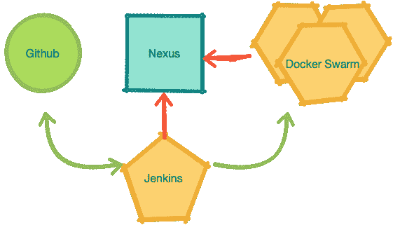
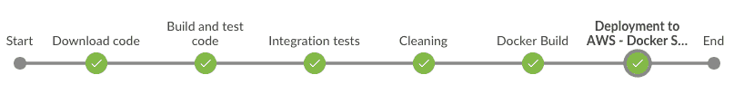

# 普莱托姆管道

> 原文：<https://dev.to/playtomic/playtomic-s-pipeline-4bfk>

# 简介

您的持续集成(CI)管道是您在业务中可以拥有的最重要的软件之一:每当您的代码发生变化时，它都会运行。

在 Playtomic 的后端团队，我们为我们的 CI 渠道感到非常自豪。它不仅每天管理几十个分支的集成，还管理我们开发和生产环境的部署。它目前正在处理大约 35 个项目，而且完全无人监管。开发分支的每一个变化都直接指向开发环境。每一次对 master 的更改都直接应用到生产中。

Ruben 告诉我们 Playtomic 的堆栈看起来像 T1。在本帖中，我们想就我们在构建管道时的想法给出一些提示。这不是很详尽，但我认为这是一个很好的近似。如果你能和我们分享你的 CI 是如何运作的，那将会很棒！

# 我们期待的是什么？

建造管道时，有几点你必须注意。它必须是:

*   快速:构建、测试和部署必须快速。多少钱算快？1 分钟？两分钟？这取决于你的要求，但低于 2 分钟对我们的团队来说已经足够了。
*   可靠:几个同时进行的构建不能互相干扰(例如:随机测试端口)。
*   可复制的:基于相同提交的构建必须产生相同的制品。

开发和掌握的推送总是在代码审查之后执行(我们使用 github 的拉取请求)。
更多:

*   持续部署:开发的推动力直接指向开发环境。一推硕士去生产。没有问题。
*   减少开发和生产之间的偏差:将几个小的变化部署到 pro 中比少数几个大的变化更安全。
*   很容易知道哪个版本部署在哪里:如果构建是绿色的，那么它已经部署了。构建包括提交哈希。在我们这样的微服务架构中非常重要。

# 软件组件:

[](https://res.cloudinary.com/practicaldev/image/fetch/s--aoX3i5Kt--/c_limit%2Cf_auto%2Cfl_progressive%2Cq_auto%2Cw_880/https://thepracticaldev.s3.amazonaws.com/i/6dewxhq0i2oey6kz6vdu.png) 
这些是构成我们管道的组件:

*   git repo: github
*   一个 CI 系统:詹金斯
*   人工制品商店:nexus
*   一个应用容器:docker swarm

# 流水线步骤:

[](https://res.cloudinary.com/practicaldev/image/fetch/s--uVeWJt_b--/c_limit%2Cf_auto%2Cfl_progressive%2Cq_auto%2Cw_880/https://thepracticaldev.s3.amazonaws.com/i/89adznjvf4mlso3uap98.png)

*   下载代码(显然！)
*   验证(主:不接受快照)
*   构建+单元测试
*   集成测试
*   码头工人建造
*   码头推送
*   码头部署
*   干净(善待你的同事)

一些片段。我跳过了 config 类的内容，但是我觉得还是很清楚的。

下载代码(java 节点):

```
stage('Download code') {
    deleteDir()
    checkout scm
    env.COMMIT_HASH = lastLocalCommitHash()
    env.POM_VERSION = mavenVersion()
} 
```

Enter fullscreen mode Exit fullscreen mode

验证(java 节点):

```
if (config.isMasterBranch(env.BRANCH_NAME) || (env.CHANGE_ID && config.isMasterBranch(pullRequest.base))) {
    stage('Validating project') {
        sh "mvn validate -Denforcer.skip=false"
    }
} 
```

Enter fullscreen mode Exit fullscreen mode

构建+单元测试(java 节点):

```
stage('Build and test code') {
    sh "mvn clean package -DskipITs"

    sendNotificationOk(config, 'Build and unit tests: OK')
} 
```

Enter fullscreen mode Exit fullscreen mode

集成测试(java 节点):

```
stage('Integration tests') {
    sh "mvn verify"
}
sendNotificationOk(config, 'Integration tests: OK') 
```

Enter fullscreen mode Exit fullscreen mode

Docker 构建(docker 节点):

```
stage('Docker Build') {
    sh "DOCKER_REPOSITORY=${dockerRepository} SERVICE_VERSION=${version} docker-compose -f docker-deploy/docker-compose.yml build"
} 
```

Enter fullscreen mode Exit fullscreen mode

Docker 部署(docker 节点):

```
stage("Deployment to AWS - Docker Swarm ${environment}") {
    DOMAIN = config.getPublicDomain()

    // no suffix for production
    if (environment != "pro") {
        DOMAIN = DOMAIN + "-${environment}"
    }

    // default for develop and features environments
    REPLICAS = 1

    // This is a ElasticIP
    DOCKER_HOST = config.getDevelopDockerHost()
    DOCKER_CERT_PATH = config.getDevelopDockerCert()

    profile = environment
    switch(environment) {
        case "develop":
            break
        case "pro":
            profile = "amazon-pro"
            REPLICAS = 2
            DOCKER_HOST = config.getProDockerHost()
            DOCKER_CERT_PATH = config.getProDockerCert()
            break
    }

    DOCKER_REPOSITORY = dockerRepository
    SERVICE_VERSION = version

    // Remember that:
    // 1\. We need docker login to access docker repository
    // 2\. We need --with-auth-registry to pass these docker credentials to the docker host (in order that it can access to docker repository)
    // 3\. If we launch docker deploy in the remote machine, how does it access to the docker repo?
    // 4\. Conclusion: we are launching a ssh tunnel, and launching the docker deploy in this machine.

    // See: https://unix.stackexchange.com/questions/83806/how-to-kill-ssh-session-that-was-started-with-the-f-option-run-in-background
    // -L opens a ssh tunnel. -f goes to the background.
    // This command opens the tunnel for 5 secs, but tunnel is not killed while it is used.
    // So that, immediately after that we launch docker deploy which uses
    sh "ssh -i ${DOCKER_CERT_PATH}/cert.pem -f -L localhost:2374:/var/run/docker.sock docker@${DOCKER_HOST} sleep 5; DOCKER_REPOSITORY=${dockerRepository} SERVICE_VERSION=${version} SPRING_PROFILES_ACTIVE=${profile} JAVA_ENABLE_DEBUG=${debug} SERVICE_DOMAIN=${DOMAIN} REPLICAS=${REPLICAS} docker -Hlocalhost:2374 stack deploy ${DOMAIN} --with-registry-auth -c docker-deploy/docker-compose.yml"

    sendNotificationOk(config, "Deployed to ${DOMAIN}")
} 
```

Enter fullscreen mode Exit fullscreen mode

清理(docker 节点):

```
dir('docker-deploy') {
    sh "rm -rf target/"
} 
```

Enter fullscreen mode Exit fullscreen mode

## 出此帖:

*   图书馆和服务的不同管道。
*   库:开发=快照；主=释放。
*   Auth:如何用 github，nexus，docker swarm 对 jenkins 进行 auth？jenkins 和 swarm 之间的授权在*部署*步骤中概述。

## 提示:

使您的命令显式化，即使用命令指定所有环境变量。这样，如果出现问题，您可以通过在日志中查找命令，在您的机器上重放它们。

## 下一步步骤:

一些我们想要整合或改进的东西:

*   系统测试:在 docker swarm 中搭建一个测试环境。
*   质量关:最好作为预检来实施，而不是在管道中实施。如果在管道中实现，不要在 master 中实现(合并后构建会中断)。
*   多级 docker 作为管道(优点:不需要特定的 jenkins 节点。缺点:较慢:每次构建都必须下载依赖项。