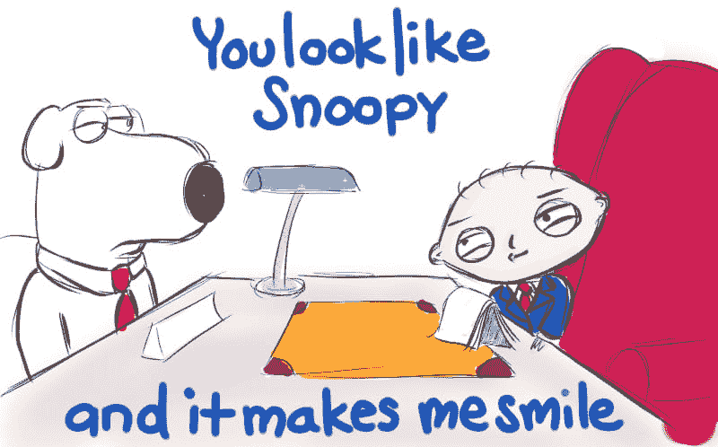

# 代码评审中的礼貌还是直率？彻底解决这件事

> 原文：<https://dev.to/daedtech/politeness-or-bluntness-in-code-review-settling-the-matter-once-and-for-all-2ip>

这些天来，我以制作内容为生(或者，越来越多地，[运营内容运营](https://www.hitsubscribe.com/))。因此，社交媒体和博客对我来说更多的是一种广播操作，而不是一种信息来源。尽管如此，我最近还是有机会从我的泡泡中走出[，观察一场关于代码审查礼仪的辩论。](http://daedtech.com/slice-life-money-works/)

### 代码评审礼仪难题

以下是这场辩论的两个方面，我尽量不带主观偏见地转述了一下。

*   代码评审可能会让被评审者感到压抑和沮丧，所以一定要包含一些积极的反馈。
*   制造赞美是光顾，所以只要坚持事实和行动项目。

在这篇文章的剩余部分，我将使用“微妙与直接”的相对价值中立的框架来指代这些相对位置，并认为它们之间存在某种连续体。

这个化身只是最近的一次。这些年来，我已经看到了很多这样的争论，而且我以前也谈到过代码审查:

*   [摆脱烦人的评论者](https://daedtech.com/insufferable-code-reviewer/)。
*   [尽可能实现自动化，最大限度地减少主观人为因素](https://blog.submain.com/aggressively-trying-automated-code-review/)。
*   [代码审查文化如何变得有毒](https://daedtech.com/how-to-use-a-code-review-to-execute-someones-soul/)。

因此，正如你可能推断的那样，我更有可能接受辩论中的第一点:礼貌。那不仅仅是我天生的偏好(礼貌或者只是不做它们)，而是我个人背景和文化的产物。这是一个强有力的声明，所以让我们先简要说明一下，然后再详细解释。

### 我们假设微妙与直接的问题是个人风格的有意识的选择

看了这个帖子的前提，你大概马上就开始形成内心独白了。"哪怕就做一次好人，你真的会死吗？"或者也许是，“我们为什么要浪费大量的时间用不真诚的游戏兜圈子？”

然后，这段独白就变成了正确的做事方式。“令人讨厌和持续的负面情绪会导致公司更替，并使我们的行业有毒，所以我们应该停止。”或者，“所有这些游戏浪费时间，冲淡审查过程，伤害我们的生产代码。”所以，想一想这个主题的片段就像[这个](https://www.cbsnews.com/news/spare-me-the-compliment-sandwich-please/)关于“别给我恭维三明治。”你很自然地认为你的风格是正确的，然后试图争辩说其他人都应该采用你的正确方法。

### 代码审查变得琐碎:飞机坠毁的种族理论

这看起来很像我们推理和争论编码风格的方式。但是微妙与直接根本不是那么回事。这是非常文化化的。

几年前，我听了一本名为《离群者》的有声读物，作者是马尔孔·格拉德威尔。这是一本引人入胜的书，但与此相关的是它的第七章([在此详细总结](https://www.litcharts.com/lit/outliers/chapter-7-the-ethnic-theory-of-plane-crashes))。现在，每当我听到这样关于代码审查的争论，我就会想起格拉德威尔的书和哥伦比亚飞行员。

哥伦比亚飞行员在微妙营地激烈着陆。纽约 JFK 机场的空中交通管制员非常直接。一个完全可以避免的悲剧随之而来，因为阻抗不匹配，可以说，在这些相互作用模型之间。

哥伦比亚飞行员告诉空中交通管制员，他们的燃料越来越少，他们需要降落。但他们没有说(或喊)他们有**紧急情况，事实上，他们有。因此，空中交通管制员推断，事实上，没有紧急情况，并继续推迟他们的降落。飞机燃料耗尽，坠毁了。**

 **如果这种方法不能在生死关头找到简单的解决方案*，我们对 Github pull 请求或投影在会议室平面屏幕上的 IDE 还有什么希望呢？*

 *### 不同的文化在微妙和直接的光谱上处于非常非常不同的位置

当我想到关于代码审查直言不讳的争论和这篇文章的开头时，我开始漫不经心地搜索。我似乎记得(虽然我面前没有这本书)格拉德威尔谈了很多关于不同的国家出现在这个连续体的不同地方。果然，坊间的谷歌搜索似乎表明了这一点。

对于感兴趣的人，这里有一些有趣的读物:

*   Quora 上一个关于以色列人为何如此直言不讳的问题。回应的人(大概是以色列人)认为这是一种正确的做事方式。“你为什么要拐弯抹角？”
*   关于相对直率的美国人和墨西哥文化中较为间接的一面之间的文化冲突的轶事。“恰当”的做法不是让某人吸烟，而是说吸烟“伤害了你”,并相信对方接受了这一社交暗示。
*   这里有一篇关于[为什么德国人如此直言不讳](https://howtoguide.org/why-are-germans-so-blunt/)的文章。它比较详细地讲述了德语在表达思想方面是一种更加字面化/精确化、更少歧义的语言。
*   这篇文章解释了为什么美国文化(中庸的直言不讳)会震惊日本国民，他们来自一种非常微妙的文化。很明显，日本人不想向主人表达饥饿是不礼貌的，而美国人认为，如果他们饿了，他们会直说。
*   这篇文章谈的是对印度企业文化的理解，并不是所有肯定的答案都意味着肯定。毫不犹豫地回答是，就意味着是。犹豫，然后说好，表示不情愿。这是因为对某人说“不”(尤其是上级)表示不尊重。

### 异质微妙-直接环境是现实政治的地雷

我列出所有这些是为了提醒大家注意，这不是你可以做出的某种决定，就像制表符或空格一样。你在自己的文化中长大，这在很大程度上决定了你是用巧妙还是直接的方式交流。遇到完全不同的文化方式会造成文化冲击。

含蓄的人可能会认为直率的人粗鲁。对直接的人来说似乎正常的互动模式会触动微妙的互动模式，就像他们问“我能看着你去洗手间吗？”由此产生的想法是，“你有什么毛病，你这个野蛮人？！“同样，一个直接的人问，“你介意我在我们讨论这个问题的时候吃点东西吗？”可能会相当合理地照字面意思做出同意的回答。所以当会议的另一方到处告诉人们他是一个没文化的穴居人时，他可能会想“好一条*蛇*

这不是一个正确方式或错误方式的结果，也不是人好坏的结果。这是不同文化有潜意识互动舞蹈和规则的结果。而当你发现自己处于一个陌生的领域时，你自然会感到沮丧，你周围的人都疯了。

### 代码评审礼仪与微妙-直接连续体密切相关

在很早的时候，我提到了我自己的文化经历，这是我的代码评审意见的来源。我是一个天生的冲突回避者，曾经把自己描述成一个无赖。我[也是一个内向的人](https://daedtech.com/why-social-situations-exhaust-introverts-a-programmers-take/)。虽然这其中可能有些是遗传，但我认为大部分是文化教养。

小时候在我家，你不会在公司面前和其他家庭成员争论。“如果你没有什么好听的话要说，那就什么也别说”绝对是普遍流行的指导智慧。你不会主动给别人提供意见，尤其是那些直接批评的意见。我所受的教育是一直努力保持礼貌，避免紧张和争论，保持生活平静。当我去朋友家，观察家庭成员之间的比赛时，我会惊讶地看着。

这当然影响了我对代码评审的方法和偏好。

### 我自己的代码评审方法是适度微妙的一个例子

如果你不问我的意见，我是不会提供的。如果你把东西发给我进行代码审查，我会非常具体地表述。就是我不会给你下命令，也不会把我的意见当成事实来表达。“我不会这样做”而不是“改变它，这是错误的。”我更喜欢通过提问而不是戳洞来引导人们发现可能的错误。我肯定会尽可能地赞美别人，以消除批评的锋芒。这并不是因为我想要同样的事情发生在我身上(我不在乎),而是因为对我来说,*开始无节制的消极是错误的。*

但我也认识到这只是我的偏好。

人们过去曾要求我更直接，或者给他们“残酷的诚实”我试过，但那不是我。老实说，我宁愿把不重要的缺点留在代码库中，也不愿冒着与敏感的人关系受损的风险，或者觉得自己很粗鲁。我们可以在以后修改代码。

### 你在异质微妙-直接团队代码评审中的行为对你的职业生涯意味着什么

如果你来自比我更微妙的文化，我可能会发现自己偶尔会被激怒。如果你从一个极其直率的地方向我走来，我可能会开始把你视为敌人和障碍，我会通过，比如说，转移或者[写一个关于你的流行帖子系列和书籍](http://daedtech.com/how-developers-stop-learning-rise-of-the-expert-beginner/)(假设你和你的直率一样勉强胜任)。

我并不孤单。你也会有这些冲动，就像你周围的每个人一样，不管他们有什么微妙-直接的背景。

所以作为一个人，我建议你做的第一件事就是理解这一点。是的，其他人和你有不同的癖好。是的，这些癖好会让人感觉怪异到不正常的程度。但请理解这一点，并努力达成一致。直言不讳地告诉你直言不讳的同事，他们的直言不讳让你感到不舒服。即使你鼓励对你直言不讳并请求他们的耐心和不冒犯，也要对你微妙的同事做出微妙的反馈。

但抛开这一点，这里还有另一个因素在起作用——现实政治因素。

浏览这些文化差异和偏好不仅仅有助于像代码评审这样普通的 IC 活动顺利进行——它还会对你的职业生涯产生重要影响。你要求每个人都遵从你的文化习惯，你自己承担风险。

### 代码审查是权力剧场

我的书和[金字塔形公司的考试](http://daedtech.com/defining-the-corporate-hierarchy/)的读者可能希望我以这样的方式结束。当您将代码评审视为一项活动时，它在两个层面上运行:

1.  不要想多了。这是一种相对保守的提高代码质量的策略。
2.  从组织上来说，这也是一个非常小的山头的山头之王的游戏。没有桌面赌注的扑克，为纽扣而玩。(这就是热尔韦法则所说的游戏对话中的失败者语言)。

用我的话来说，代码评审倾向于成为熟练工理想主义者的熔炉，建立一个除了开发团队之外没有人关心的等级秩序。但是在开发团队中，它决定了你是一个受欢迎的运动员还是一个书呆子，我猜...？(我不知道如何让这个类比不具有讽刺意味)

在团队代码评审的孤立文化中，权力动态建立了自己。在最基本的层面上，这将默认地遵循资历。在公司工作时间较长的人比新手更有影响力(对于某些可疑的定义来说)，这意味着资深人员通常会“对”新手“进行”代码审查。

### 喜欢直言不讳是一种权力攫取，而喜欢微妙是一种权力让渡

当你把微妙-直接的文化考虑加入其中时，你会碰到一个被称为权力-距离的概念。你可以[在这里](https://www.andrews.edu/~tidwell/bsad560/HofstedePowerDistance.html)阅读更多相关内容，但出于我们的目的，要理解这些不同的文化对组织结构、权力和行为有不同的看法。“直接”文化倾向于假设从 CEO 到 IC 的每个人都会说出自己的想法。“微妙”文化坚信角色决定行为、顺从和社会互动。

因此，当你在一个异类群体中“直言不讳”时，你不仅仅是“说出你的想法，伙计。”你在声明你是负责人。微妙之处使得顺从成为自我实现的预言。

换句话说，这种“友好或直率”的选择不仅仅是关于你如何喜欢你的反馈。这是你声称你的权力或缺乏它。

### 您的代码评审方法可能有组织上的利害关系，即使代码评审没有

正如我所说的，这是一种非常小规模的能源。它相当于您组织中的堆栈溢出标记。请注意，没有副总裁来给你一间办公室，因为在代码审查时你有最好的 Linus Torvalds 模仿。

默认情况下，直言不讳是声称“高级”，含蓄是声称“初级”([我讨厌这个术语](http://daedtech.com/junior-developer-never-accept/))。该组织甚至可能在某个时候让这种预言自我实现。但是要认识到，从任何适度规模的组织的角度来看，高级开发人员和初级开发人员是一回事。

经过一堆年和有争议的代码审查，你可能会在开发人员的轨道上获得更多的钱和吹牛的权利。但是，如果你是一个机会主义者或者有抱负的机会主义者，那不是你想要的。这没关系。您对代码评审的行为和方法仍然很重要——只是不像对熟练工理想主义者那样重要。

### 你不想成为格雷格·豪斯，也不想成为他的好友威尔逊

我提到了 Linus Torvalds，我认为他是软件世界的 T2 Gregory House。格雷戈里·豪斯的前提是，他是一名医生，在诊断学方面是如此卓越的天才，以至于他的医院原谅了所有可怕的、招致责任的行为。他是个瘾君子，藐视法律，不听任何人的话，等等，但他实在太好了，以至于世界上伟大的精英阶层都屈尊原谅了这一切，以至于可以沐浴在他的光辉中。

但是这个世界不是这样运作的，当然也不是企业界。格雷格·豪斯在医院坚持不了 3 天，莱纳斯·托沃兹自己也不需要，因为他更像一个行为艺术家，而不是公司的常客。当风险大于收益时，公司不会容忍这种原型。

现在退后一步，想想生硬的代码审查者。对上升的和被安置的机会主义者来说，这个原型看起来像一个幻想成为豪斯/莱纳斯的熟练的理想主义者。在这种情况下，“我没有时间对我的反馈保持礼貌”听起来滑稽可笑。言下之意是，“你就像莱纳斯·托沃兹，但没有成就。”

另一方面，你有豪斯的陪衬敏感的易受影响的威尔逊博士。威尔逊绝对是恭维三明治之王，是底层微妙文化类型的化身。你也不想变成那样。如果你让 House/Torvalds 把你踩在脚下，你就注定进不了权力的殿堂。机会主义者操纵(熟练工)理想主义者——他们不会在他们面前畏缩不前，要求被调走。

### 人的方法:使用被评审者喜欢的方法

让我提供一个简短的插曲，用马基雅维利的术语来谈论这如何影响你的职业生涯。作为一个体面的合作者和普通人，你应该做的是了解你的同事，做他们喜欢的事情。

这场辩论无一例外地有很多特点:“这就是我****喜欢的，所以我们作为一个群体应该做我喜欢的事情，因为我喜欢的是最好的。”当你寻找文化背景时，这就变得不可原谅的幼稚。当你开始了解他人，包括他们的个性和文化倾向时，你可以开始以他们喜欢的方式*向他们提供反馈，无论是直言不讳还是恭维，直接还是微妙。这是最体面的事，也是最有可能得到结果的事。*****

 ****### 现实政治方法:解决代码评审争论，这样机会主义者就不必关心了

现在，让我们从职业角度来看。你认为团队之外的人会关心你是否使用复合模式来管理导航菜单吗？让我们更进一步。你认为在讨论这个细节的时候，你的团队之外的任何人会关心你是否提供了称赞三明治吗？

这种东西对企业来说并不重要。句号。

因此，当你争论代码、代码审查，以及你是否应该直言不讳时，任何被这些争论困扰的人都会认为双方都是争论的输家。就机会主义者的信誉而言，这是一项确保相互毁灭的政策。无论你是去找经理谈论某人，还是他们谈论你，或者你们两个都是一决雌雄，你们都输了。

因此，出于外交原因，您的代码审查方法应该首先是人的方法。但是也应该在你的团队中建立一个人类代码评审霸权，并且要明显地这样做。开发团队之外没有人关心这个问题，所以如果你明显地让它对每个人来说都不是问题，你就会赢得一个关键的胜利。

从广义上来说，这可能意味着建立共识，或者可能意味着像自动化整个代码审查过程这样简单的事情。不过，不管是什么，它都会以消除机会主义者头痛的形式出现。

### 最终，正确的答案是一种算法，而不是一种风格

如果你从这篇文章中得到了什么，我希望它能让你认识到，对于代码评审(或者一般的协作)反馈风格的问题，没有正确的答案。即使你神奇地为你的团队找到了一个，它也不会被翻译。团体由不同的人组成，来自不同的国家，不同的背景和不同的倾向。这并不是老生常谈——我们从出生起就对代码评审应该如何进行有着不同的看法。

因此，不要试图决定哪一个是正确的策略，开始认识到正确的策略是你根据你的听众调整的策略。并认识到正确的策略是阻止这个问题浪费人们的时间，让他们的日子充满了裁决儿童如何争夺玩具的模拟。这种认可有利于你的日常快乐，也有利于你的职业生涯。*******